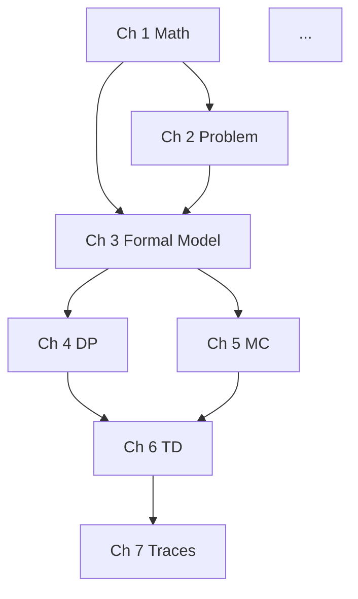

# Phase 0 — Syllabus design

A syllabus is the spine. Get it right and every later phase has a
clear next step. Get it wrong and you'll find yourself rewriting
chapter ordering, juggling dependencies, and discovering halfway
through Chapter 12 that Chapter 9 was actually the prerequisite.

## What a good syllabus looks like

Three things per chapter:
1. **A title that names the *topic*, not the *technique*.** "Temporal-
   Difference Learning" not "TD(0) and SARSA". The chapter can cover
   multiple techniques; the title should name what they have in common.
2. **A one-paragraph "why this chapter exists" answer.** What does the
   reader gain from this chapter that they can't get from the preceding
   ones? What would they NOT understand if they skipped it?
3. **An explicit dependency list.** Which prior chapters does this one
   assume? This becomes the [chapter dependency graph](#dependency-graph)
   and drives ordering decisions.

## Generating a syllabus from a topic

If the user comes in with just a topic ("I want to learn X"), don't
guess the chapter list. Run this process:

1. **Find 2-3 authoritative textbooks** on the topic. For RL: Sutton &
   Barto, Szepesvári. For ML: Bishop, Murphy, Goodfellow. For category
   theory: Riehl, Mac Lane. The point is to *anchor* your chapter list
   against a respected reference's table of contents.
2. **Steal their TOC.** Copy the chapter list. Don't paraphrase yet.
3. **Identify *additions* the user's specific application needs.**
   Sutton & Barto have a great Ch 6 on TD; the user's RL textbook
   might also need a Ch 17 on "long-horizon credit assignment" because
   that's where their simulator chokes. Add chapters for the gaps.
4. **Identify *omissions* the user can skip.** Sutton & Barto Ch 12
   on eligibility traces with average reward is gorgeous theory but
   probably skip for an applied book.
5. **Reorder by dependency.** If Chapter X uses concepts from Chapter
   Y, X comes after Y. Period.

The resulting syllabus is something like:

```markdown
# Course Syllabus

## Part I — Foundations (Chapters 1-3)

### Chapter 1 — Mathematical Foundations
**Why this chapter exists:** Every later proof relies on three
techniques: contraction mappings, geometric convergence, and
Hoeffding-style bounds. This chapter is the prerequisite refresher.

**Depends on:** None (entry point).

### Chapter 2 — The X Problem
**Why:** ...

**Depends on:** Chapter 1.

...
```

## Dependency graph

For a 12-18 chapter book, draw the dependency graph as a Mermaid
diagram in the index page. Readers consult it to know they can
skip Chapter 14 if they only need Chapter 17 (because 17 only
depends on 7, not 14).



A topological sort of this graph is your chapter order. Cycles are
bugs: you have two concepts that mutually depend on each other, and
one of them needs to be split.

## When to expand the syllabus

Don't expand chapters into prose yet. The syllabus is iterative:

- Write all chapter goals first
- Sanity-check dependency ordering
- Iterate on chapter granularity (sometimes a 50-page chapter should
  be split into two 25-page chapters)
- THEN start expanding chapters one at a time

The number-one mistake is writing Chapter 1 fully before checking
Chapters 14-18 against the dependency graph. You'll discover Chapter
1 is missing some primitive Chapter 18 needs, and have to backtrack.

## Output of this phase

A single markdown file at the root of the textbook:
`docs/textbook/<topic>_syllabus.md` (or similar). Linked from the
index. This is the "what to read and in what order"; later chapters
are the "explanation."

## Time budget

For an 18-chapter book: ~4 hours of focused work on the syllabus.
This includes reading the TOCs of 2-3 textbooks, iterating on chapter
granularity, and drawing the dependency graph. Don't shortcut it.
