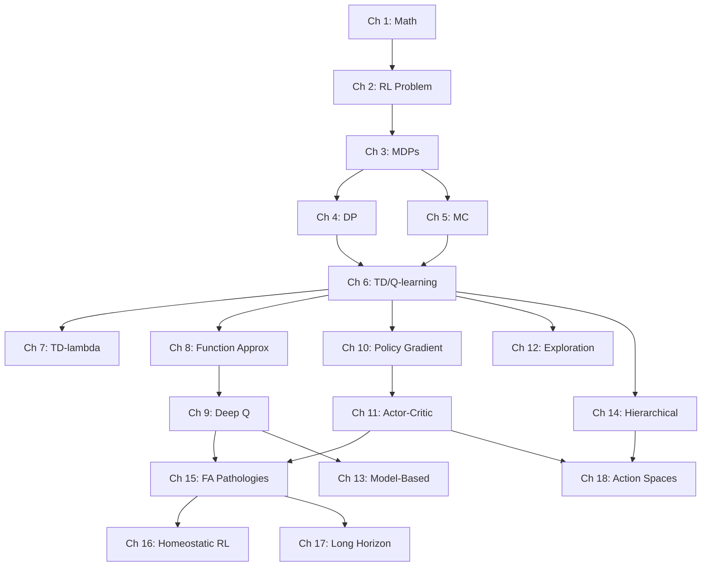

# Reinforcement Learning & Foundational AI
### A self-study course, anchored in a real simulator

---

## What this is

A self-study compilation I assembled to learn reinforcement learning.
**There is no author** — the content is restated and condensed from
primary sources written by actual experts (Sutton & Barto, Szepesvári,
Bertsekas, and the papers listed in [`bibliography.md`](bibliography.md)).
Read the originals for authority; this exists to be the explanation I
wished I had while working through them.

The 18 chapters are grounded in the [Simulator project](https://github.com/falahat/simulator/blob/main/README.md)
— every algorithm is illustrated against real code in
`crates/engine/q_learning/`, real validation tests in
`crates/sim/app/tests/{tasks,curricula,pathologies}/`, and real bugs (like the
[Q-bias bootstrap pathology](17_fa_pathologies.md))
this project has actually encountered.

Order and scope follow the
[`reinforcement_learning_syllabus.md`](reinforcement_learning_syllabus.md)
(~34 weeks: 22 core + 12 extension weeks on feature engineering,
action spaces, credit assignment, and project-specific topics).

## How to read this book

> Read in order. Each chapter assumes the ones before it. The earlier chapters
> are *mandatory* — they build the mathematical and conceptual vocabulary
> every later chapter draws on.

Three pieces of advice:

1. **Don't skip the math.** Chapter 1 is a working refresher of probability,
   linear algebra, optimization, and one theorem (Banach fixed-point) that
   appears in every convergence proof in the entire field. Skim if you've
   seen it; do the exercises if you haven't.
2. **Read the project tie-ins.** Each chapter ends with a section pointing
   to specific files in `crates/cognition/` that implement (or fail to
   implement) the chapter's ideas. Reading these against the chapter is the
   fastest way to make the abstractions concrete.
3. **Do the exercises.** RL is one of those fields where the proofs look easy
   on the page and become illuminating when you work them yourself.

## Notation and conventions

Throughout the book:

| Symbol | Meaning |
|---|---|
| $s$, $s'$ | State, next state |
| $a$, $a'$ | Action, next action |
| $r$ | Reward |
| $\gamma$ | Discount factor, $\gamma \in [0, 1)$ |
| $\alpha$ | Learning rate / step size |
| $\epsilon$ | Exploration probability |
| $\lambda$ | Eligibility trace decay |
| $\pi$ | Policy: a map (or distribution) from states to actions |
| $V^\pi$, $Q^\pi$ | State-value and action-value under policy $\pi$ |
| $V^{\star}$, $Q^{\star}$ | Optimal value functions |
| $\mathbb{E}[\cdot]$ | Expectation |
| $G_t$ | Return (discounted sum of future rewards) from time $t$ |
| $\mathcal{S}$, $\mathcal{A}$ | State and action spaces |
| $P(s' \mid s, a)$ | Transition probability |
| $R(s, a, s')$ | Reward function |
| $\delta$ | TD error |
| $\phi(s)$ | Feature vector for state $s$ |
| $\theta$, $w$ | Learnable parameters |

LaTeX-style math is rendered inline (e.g. $V^\pi(s) = \mathbb{E}[G_t \mid s_t = s]$)
and in display blocks:

$$
Q^{\star}(s, a) = \mathbb{E}\Big[ r + \gamma \max_{a'} Q^{\star}(s', a') \,\Big|\, s, a \Big]
$$

Mermaid diagrams render the agent-environment loop and similar
structural pictures:


Code blocks appear in Rust (the project's language) and occasionally Python
(for didactic examples):

```rust
fn td_update(q: &mut f32, alpha: f32, reward: f32, gamma: f32, max_next_q: f32) {
    let td_error = reward + gamma * max_next_q - *q;
    *q += alpha * td_error;
}
```

> **Definition boxes** look like this — used for first-encounter definitions.

## Table of contents

### Part I — Foundations

- **[Chapters 1-3 — Foundations](01_linear_algebra.md)** — probability, linear algebra, optimization, contraction mappings, the Banach fixed-point theorem. The math toolkit every later chapter draws on.
- **[Chapter 4 — The Reinforcement Learning Problem](04_the_rl_problem.md)** — the agent-environment loop, why RL is different from supervised learning, returns and discounting, the exploration-exploitation tension.
- **[Chapter 5 — Markov Decision Processes](05_mdps_and_bellman_equations.md)** — the formal model: $\mathcal{S}, \mathcal{A}, P, R, \gamma$. Policies, value functions, the Bellman expectation and optimality equations. POMDPs.

### Part II — Solving known MDPs (Dynamic Programming)

- **[Chapter 6 — Dynamic Programming](06_dynamic_programming.md)** — policy evaluation, policy iteration, value iteration. Convergence proofs via contraction. Why DP doesn't apply directly to the Simulator.

### Part III — Model-free learning

- **[Chapter 7 — Monte Carlo Methods](07_monte_carlo_methods.md)** — learning from sample episodes. On-policy and off-policy MC. Importance sampling. The variance problem.
- **[Chapter 8 — Temporal Difference Learning](08_temporal_difference_learning.md)** — the most important chapter. TD(0), SARSA, Q-learning, Expected SARSA, Double Q-learning. The Watkins-Dayan convergence proof. Bias-variance tradeoff. Cliff walking. Project tie-in: `learning_rate.rs`, `policy.rs`.
- **[Chapter 9 — Eligibility Traces and TD($\lambda$)](09_eligibility_traces.md)** — interpolating between TD(0) and Monte Carlo. The forward and backward views. True online TD($\lambda$). Why this matters for long-horizon credit assignment.

### Part IV — Function approximation (the realistic setting)

- **[Chapter 10 — Linear Function Approximation & Tile Coding](10_function_approximation.md)** — when tables don't scale. Semi-gradient methods. Tile coding deeply (CMAC). The Simulator's 251-dim observation and the joint-tiling collapse.
- **[Chapter 11 — Deep Q-Learning and Beyond](11_deep_q_learning.md)** — DQN, experience replay, target networks, Double DQN, Dueling DQN, Prioritized Experience Replay, Rainbow. The deadly triad.

### Part V — Policy-based methods

- **[Chapter 12 — Policy Gradient](12_policy_gradient.md)** — direct policy optimization. REINFORCE. The policy gradient theorem. Baselines and the advantage function.
- **[Chapter 13 — Actor-Critic Methods](13_actor_critic.md)** — A2C/A3C, GAE, TRPO, PPO. Why advantage learning fixes pathologies that pure value methods can't.

### Part VI — Advanced topics

- **[Chapter 14 — Exploration](14_exploration.md)** — beyond $\epsilon$-greedy. Bandits, UCB, Thompson sampling, intrinsic motivation, count-based exploration, RND, ICM.
- **[Chapter 15 — Model-Based RL](15_model_based_rl.md)** — Dyna, MCTS, AlphaGo/AlphaZero, MuZero, World Models. Why the Simulator's deleted forward-search planner failed.
- **[Chapter 16 — Hierarchical RL & Options](16_hierarchical_rl.md)** — the options framework, option-critic, FeUdal nets, HIRO, HAC. Mapping the Simulator's recipes to options.
- **[Chapter 17 — Function Approximation Pathologies](17_fa_pathologies.md)** — the deadly triad. Baird's counterexample. Q-bias bootstrap. **The full debugging story of the Simulator's Q-bias bug.**

### Part VII — Specific to grounded simulation agents

- **[Chapter 18 — Homeostatic RL and Multi-Objective Reward](18_homeostatic_rl.md)** — the Keramati-Gutkin homeostatic framework. Wanting vs liking. MORL scalarization. The Simulator's PrimaryReward dissected.
- **[Chapter 19 — Long-Horizon Credit Assignment](19_long_horizon_credit.md)** — HER, potential-based reward shaping, successor features and GPI, RUDDER, Hindsight Credit Assignment. Why $\gamma^{500} \approx 0$ defeats naïve TD on the L-suite.
- **[Chapter 20 — Action Spaces Beyond Discrete](20_action_spaces.md)** — parameterized actions (PA-DDPG, P-DQN, MP-DQN, H-PPO), large discrete spaces (Wolpertinger, Act2Vec), skill discovery (Option-Critic, DIAYN), action masking. Mapping `Strike{force}`, `Vocalize{volume}` to PAMDP theory.

## Chapter dependency graph



A reasonable reading order: 1 → 2 → 3 → 4 → 5 → 6 → 7 → 8 → 9 → 10 → 11 → 12
→ 13 → 14 → 15 → 16 → 17 → 18, but Chapters 12–14 can be read in any order
once you have Chapter 13.

## Project tie-in roadmap

| Project file | Chapter |
|---|---|
| [`crates/engine/q_learning/src/lib.rs`](https://github.com/falahat/simulator/blob/main/crates/engine/q_learning/src/lib.rs) | 6 (TD/Q-learning) |
| [`crates/engine/q_learning/src/learning_rate.rs`](https://github.com/falahat/simulator/blob/main/crates/engine/q_learning/src/learning_rate.rs) | 6 |
| [`crates/engine/q_learning/src/action_template.rs`](https://github.com/falahat/simulator/blob/main/crates/engine/q_learning/src/action_template.rs) | 3 (action space) |
| [`crates/engine/q_learning/src/tile_coding/`](https://github.com/falahat/simulator/blob/main/crates/engine/q_learning/src/tile_coding) | 8 |
| [`crates/cognition/planner/src/policy.rs`](https://github.com/falahat/simulator/blob/main/crates/cognition/planner/src/policy.rs) | 6, 12 |
| [`crates/cognition/planner/src/perception.rs`](https://github.com/falahat/simulator/blob/main/crates/cognition/planner/src/perception.rs) | 3 (POMDP) |
| [`crates/sim/sim_config/src/learning.rs`](https://github.com/falahat/simulator/blob/main/crates/sim/sim_config/src/learning.rs) | 6, 7, 8 |
| [`crates/sim/sim_config/src/reward.rs`](https://github.com/falahat/simulator/blob/main/crates/sim/sim_config/src/reward.rs) | 3, 16 |
| [`crates/sim/app/tests/tasks/hungry_consume.rs`](https://github.com/falahat/simulator/blob/main/crates/sim/app/tests/tasks/hungry_consume.rs) | 6, 11, 16 |
| [`crates/sim/app/tests/tasks/threat_response.rs`](https://github.com/falahat/simulator/blob/main/crates/sim/app/tests/tasks/threat_response.rs) | 11 (advantage metric) |
| [`crates/sim/app/tests/tasks/navigation.rs`](https://github.com/falahat/simulator/blob/main/crates/sim/app/tests/tasks/navigation.rs) | 6, 15 |
| [`crates/sim/app/tests/curricula/long_horizon_harvest.rs`](https://github.com/falahat/simulator/blob/main/crates/sim/app/tests/curricula/long_horizon_harvest.rs) | 15, 17 |

## Conventions for the project tie-in sections

Each chapter has a **Project tie-in** subsection (toward the end). It always
contains:

1. **Where this chapter's ideas live in the Simulator.** Specific files and
   lines.
2. **Where they're *not* used.** Often the more illuminating case — e.g.
   "this codebase uses no policy gradient because…"
3. **What test exercises (or fails to exercise) the chapter's claims.**
4. **What would need to change in the Simulator** to apply the chapter's
   modern variant.

This is what makes the textbook *for this project* rather than a generic
textbook with the Simulator awkwardly bolted on.

## Citations and bibliography

This textbook draws extensively on published academic sources. **All
borrowed claims, proofs, examples, and exercises are cited inline using
the form `[Author Year]`** linking to the master
[bibliography](bibliography.md), which lists every source in full with
DOIs and URLs.

For example:

> Q-learning's tabular convergence is proved by [Watkins & Dayan 1992].
> The cliff-walking example is reproduced from [S&B 2018, Sec. 6.5].

Each chapter ends with a **References** section listing the specific
bibliography entries cited in that chapter, plus a **Further reading**
table for non-cited supplementary material.

The bibliography also lists the [six graduate RL course syllabuses
consulted](bibliography.md#course-syllabuses-consulted) (Stanford
CS234, Berkeley CS285, CMU 10-703, MIT 6.7920, Princeton ECE 524,
Georgia Tech CS 7642) — the "consensus structure" of topic ordering
reflects their convergent spine, not lifted slide content.

The bibliography's [Attribution notes](bibliography.md#attribution-notes)
section explicitly lists which specific items are *reproduced* from
which primary sources (e.g. Jack's car rental from [S&B 2018, Ex. 4.2],
Banach's theorem proof from [Szepesvári 2010, Appendix]).

## A note on philosophy

This textbook tries to balance three things:

- **Mathematical rigor.** Theorems are stated precisely with named conditions.
  Proofs are sketched when they're short and illuminating, left as exercises
  when they're standard.
- **Intuition.** Every theorem comes with a "why this is true" paragraph
  before the formalism.
- **Practice.** Every chapter ends with project tie-ins, exercises, and
  recommendations for what to read next.

When these conflict, I prioritize understanding over slickness. The proof
of a theorem in this textbook may be longer than the one in Sutton & Barto
because it spends extra words on why each step is taken. That's deliberate.

---

**Next:** [Chapters 1-3 — Foundations](01_linear_algebra.md)
