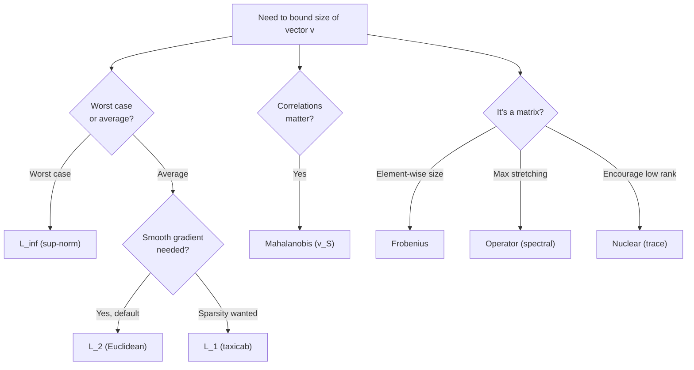

# Chapter 1 — Linear Algebra

> **Prerequisites:** comfort with high-school algebra and a willingness to
> visualise in 2D and 3D. We rebuild geometric intuitions from scratch
> where they're load-bearing.

> **Citations:** in-line citations use `[Author Year]` keyed to the master
> [bibliography](bibliography.md). This chapter draws on
> [Goodfellow, Bengio & Courville 2016 (Ch. 2)] for the
> machine-learning-flavored treatment of matrices, and
> [Trefethen & Bau 1997] for the numerical-linear-algebra picture of
> eigenvalues and SVD.

> **Learning objectives:**
> 1. See a vector simultaneously as a point and as an arrow.
> 2. Read a matrix as a geometric transformation — stretch, rotate, shear, project.
> 3. Pick the right norm for the problem (and know why $\ell_\infty$ rules RL).
> 4. Recognise when a matrix is invertible / symmetric / positive-definite / stochastic.
> 5. **Understand eigenvalues and eigenvectors deeply enough that they stop
>    feeling like magic** — both algebraically (the equation $Av = \lambda v$)
>    and geometrically (the axes the transformation leaves alone).

## Why this chapter exists

Function approximation (Chapter 10), policy gradients (Chapter 12), the
diagnostic vocabulary of *why neural networks misbehave* (Chapter 17),
and the convergence proofs of value iteration and TD-learning all live
in linear algebra. The single most important concept — the one that
appears in PageRank, PCA, quantum mechanics, the stability of bridges,
and the convergence rate of value iteration — is **eigenvalues and
eigenvectors**. We give that section the depth it deserves.

If you've used linear algebra recently, skim. If it's been a while,
read carefully. The eigen section in particular will reward time
spent staring at the pictures.

## Table of contents

- [1.1 Vectors: two ways to see them](#11-vectors-two-ways-to-see-them)
- [1.2 Dot product: alignment](#12-dot-product-alignment)
- [1.3 Matrix as a function](#13-matrix-as-a-function)
- [1.4 Span, rank, and "effective dimensionality"](#14-span-rank-and-effective-dimensionality)
- [1.5 Norms — measuring "how big"](#15-norms--measuring-how-big)
- [1.6 Eigenvalues and eigenvectors: the geometric heart](#16-eigenvalues-and-eigenvectors-the-geometric-heart)
- [1.7 Symmetric matrices and the spectral theorem](#17-symmetric-matrices-and-the-spectral-theorem)
- [1.8 Positive-definite matrices: quadratic bowls](#18-positive-definite-matrices-quadratic-bowls)
- [1.9 Stochastic matrices and Markov chains](#19-stochastic-matrices-and-markov-chains)
- [1.10 Project tie-in](#110-project-tie-in)
- [1.11 Exercises](#111-exercises)
- [1.12 References and further reading](#112-references-and-further-reading)

---

## 1.1 Vectors: two ways to see them

A **vector** $v \in \mathbb{R}^n$ is an ordered tuple of $n$ real numbers
$(v_1, v_2, \ldots, v_n)$. There are two complementary pictures, and both
are needed:

1. **Vector as a point.** Each $v$ names a single location in
   $n$-dimensional space. The Simulator's observation vector lives in
   $\mathbb{R}^{251}$ ([`observation.rs`](https://github.com/falahat/simulator/blob/main/crates/engine/q_learning/src/observation.rs)) —
   one agent at one tick is one point in this space.
2. **Vector as an arrow.** Each $v$ also names a displacement: "go $v_1$
   units along axis 1, $v_2$ units along axis 2, …". Addition concatenates
   arrows; scaling stretches them.

Both pictures are correct. The "point" picture answers *"where is the
agent in feature space?"*; the "arrow" picture answers *"by how much did
the parameters change after one SGD step?"*.

## 1.2 Dot product: alignment

The **dot product** of $u, v \in \mathbb{R}^n$ is

$$u \cdot v = u^{\top} v = \sum_i u_i v_i = \|u\|\, \|v\|\, \cos\theta$$

where $\theta$ is the angle between them. It measures how aligned two
directions are:

- $u \cdot v > 0$: they point in similar directions.
- $u \cdot v = 0$: they are **orthogonal** (perpendicular).
- $u \cdot v < 0$: they point in opposite directions.

In RL we constantly write $Q(s, a) \approx \theta^{\top} \phi(s, a)$ — the
estimated value is the alignment between the learned weights $\theta$ and
the feature vector $\phi(s, a)$. The entire enterprise of **linear function
approximation** (Chapter 10) is: find a $\theta$ such that $\theta^{\top}\phi$
is well-aligned with the true value across the states that matter.

### Try it: linear combinations and span

<div id="ch1-linear-combo-widget" class="textbook-widget"></div>
<script type="module" src="./widgets/linear_combo/widget.js"></script>

Drag the two basis vectors v₁ and v₂; slide α and β to scale them.
The big primary arrow is the linear combination w = αv₁ + βv₂. Turn
"show span" on: the cloud of dots is *every* vector you can reach with
some choice of (α, β) — that's the span. Make v₂ a multiple of v₁
(set v₂ = 2·v₁) and the cloud collapses to a line; the readout flips
to "linearly dependent." Two independent vectors span the whole plane;
two dependent ones span only a line.

### Try it: dot product as projection

<div id="ch1-dot-projection-widget" class="textbook-widget"></div>
<script type="module" src="./widgets/dot_projection/widget.js"></script>

Drag u (yellow) and v (blue). The green arrow is the **projection** of
u onto v — the "shadow" of u along v's direction. Its length is
(u·v)/‖v‖; the dashed line is the perpendicular from u down to that
shadow. When u·v > 0 the projection points along +v (green); when
u·v < 0 it points along −v (red); when u·v = 0 the projection
collapses to the origin and u is exactly perpendicular to v. The
readout shows that u·v and ‖u‖‖v‖cos θ agree — that's the *geometric*
formula for the dot product.

## 1.3 Matrix as a geometric transformation

A matrix $A \in \mathbb{R}^{m \times n}$ has $m$ rows and $n$ columns.
It maps a length-$n$ vector to a length-$m$ vector via

$$(Av)\_i = \sum\_j A\_{ij} v\_j.$$

Think of $A$ as a **function** $\mathbb{R}^n \to \mathbb{R}^m$. It is
**linear** because $A(\alpha u + \beta v) = \alpha A u + \beta A v$: it
commutes with scaling and addition.

### What "linear" buys you

Linearity has one consequence that does almost all the work later:

> A linear map is completely determined by where it sends the basis
> vectors.

If you know $Ae_1, Ae_2, \ldots, Ae_n$ — where the axes go — you know
where *every* vector goes, because

$$Av = A\!\left(\sum\_j v\_j e\_j\right) = \sum\_j v\_j (A e\_j).$$

And conveniently, $Ae_j$ is exactly the $j$-th column of $A$. So:

> **The columns of $A$ tell you where the axes land. That is the matrix.**

This is the single most useful sentence in linear algebra. Re-read it
until it feels obvious. Once it does, you can read every matrix
geometrically: scan its columns, see where they take the axes, and
the picture of the transformation snaps into focus.

### The unit square picture

In 2D, the standard basis is $e_1 = (1, 0)$ and $e_2 = (0, 1)$. The
**unit square** is the parallelogram they span: corners at $(0,0)$,
$(1,0)$, $(1,1)$, $(0,1)$.

A 2×2 matrix $A$ sends this unit square to a (possibly degenerate)
parallelogram whose sides are the columns of $A$:

```
       e_2 = (0, 1)                A e_2 = (a_12, a_22)
         |                              ╲
         |     unit square     A→        ╲     A(unit square)
         |____________ e_1                ╲_______________
                       (1, 0)               A e_1 = (a_11, a_21)
```

**The signed area of that output parallelogram is $\det A$**. If
$\det A > 0$, $A$ preserves orientation (the e₁→e₂ rotation stays
counter-clockwise). If $\det A < 0$, $A$ flips orientation (mirror
reflection). If $\det A = 0$, the parallelogram collapses to a line
or a point — $A$ is singular and loses a dimension.

### Try it: determinant as signed area

<div id="ch1-det-area-widget" class="textbook-widget"></div>
<script type="module" src="./widgets/det_signed_area/widget.js"></script>

Edit the four entries of A. The yellow and blue arrows are the columns
of A — the images of e₁ and e₂. The shaded parallelogram is their
span, the unit square's image. **The number det A IS the signed area
of that parallelogram.** Try (a, b, c, d) = (2, 0, 0, 3): a 6-unit
rectangle, det = 6. Then try (1, 1, 1, 1): collapses to a diagonal
line (det = 0; singular). Then swap a column with its mirror, e.g.
(0, 1, 1, 0): area = 1 but det = −1 — orientation flipped, fill
colour turns red.

### The five canonical 2D transformations

Every 2D transformation can be built from compositions of these five.
Memorise the pictures; they recur in every neural-network discussion.

### Try it: pick a transformation, watch the matrix

<div id="ch1-transformation-zoo-widget" class="textbook-widget"></div>
<script type="module" src="./widgets/transformation_zoo/widget.js"></script>

Pick a transformation from the dropdown — identity, uniform scale,
axis scale, rotation, horizontal / vertical shear, reflection across
the x-axis / y-axis / diagonal, projection onto an axis, or a
rotation-and-scale composition. The widget shows three things at once:

1. **The matrix** A on the left, with the parameter (angle / scale /
   shear factor) substituted into its entries so you can see the
   symbolic form land on real numbers.
2. **The plane**, with the faint background grid showing the
   identity and the bright grid showing where every line lands after
   A. The unit square's image is outlined in orange — its signed area
   equals det A.
3. **Three example vectors** (u, v, w — edit their components to put
   them wherever you like). Each shows up twice: a faint arrow at its
   pre-image and a bold arrow at its image A·v. Watching the three
   move together is the fastest way to internalise "what this
   transformation does to space."

Slide the parameter and the matrix entries, the grid, and every
arrow update live. The readout at the bottom names the transformation,
shows det A, and flags geometric features (rotation preserves length;
shear has only one eigenvector; projection is singular and idempotent;
reflection flips orientation).

Compare with the `det_signed_area` and `grid_transform` widgets:
this one trains *kind → matrix*, those train *matrix → picture*. Read
the list below as the catalogue this widget lets you visit.

**1. Identity** — does nothing.

$$
I = \begin{pmatrix} 1 & 0 \\\\ 0 & 1 \end{pmatrix}.
$$

Columns are $e_1, e_2$. Every vector maps to itself.
$\det I = 1$.

**2. Scaling** — stretch each axis independently.

$$
S = \begin{pmatrix} a & 0 \\\\ 0 & d \end{pmatrix}.
$$

$Se_1 = (a, 0)$, $Se_2 = (0, d)$. The $x$-axis is stretched by $a$,
the $y$-axis by $d$. Unit square becomes an $a \times d$ rectangle.
$\det S = ad$ (the new area).

When $a = d$ this is **uniform scaling** — every vector scales by the
same factor, no distortion. When $a \neq d$ it is **anisotropic**:
circles become ellipses, the "long" axis is whichever of $a, d$ is
bigger.

**3. Rotation** by angle $\theta$ — turn the plane around the origin.

$$
R\_\theta = \begin{pmatrix} \cos\theta & -\sin\theta \\\\ \sin\theta & \cos\theta \end{pmatrix}.
$$

Columns are $(\cos\theta, \sin\theta)$ and $(-\sin\theta, \cos\theta)$ —
the unit vectors at angles $\theta$ and $\theta + 90°$. Lengths
preserved, angles preserved, areas preserved.
$\det R_\theta = \cos^2\theta + \sin^2\theta = 1$.

> **Aside.** Rotations are the canonical example of "no real
> eigenvectors": no real-valued direction is preserved (unless
> $\theta = 0$ or $\pi$). We come back to this in §1.6.

**4. Reflection** — flip across a line through the origin. Reflection
across the $x$-axis:

$$
M\_x = \begin{pmatrix} 1 & 0 \\\\ 0 & -1 \end{pmatrix}.
$$

The $x$-axis stays put ($Me_1 = e_1$); the $y$-axis flips
($Me_2 = -e_2$). Orientation reverses, so $\det M_x = -1$.

Reflection has obvious eigenvectors: the axis it reflects across
($\lambda = +1$) and the perpendicular direction ($\lambda = -1$).
The eigenvalues tell you the geometry directly.

**5. Shear** — slide each row by an amount proportional to its height.
Horizontal shear with factor $k$:

$$
H\_k = \begin{pmatrix} 1 & k \\\\ 0 & 1 \end{pmatrix}.
$$

$He_1 = e_1$ (the $x$-axis is fixed), but $He_2 = (k, 1)$ — the top of
the unit square slides right by $k$. The square becomes a parallelogram.
Areas are preserved ($\det H_k = 1$).

Shears are the simplest example of **defective** matrices — they have
only one eigenvector direction, not two. The $x$-axis is fixed
($\lambda = 1$) but there is no second independent eigendirection;
$H_k$ has a repeated eigenvalue 1 with geometric multiplicity 1.
This is the algebraic source of "Jordan blocks" — see §1.6's note on
repeated eigenvalues.

**6. (Bonus) Projection** — collapse onto a subspace. Projection onto
the $x$-axis:

$$
P\_x = \begin{pmatrix} 1 & 0 \\\\ 0 & 0 \end{pmatrix}.
$$

$Pe_1 = e_1$, $Pe_2 = (0, 0)$. The $y$-component is killed. The unit
square collapses to a unit segment on the $x$-axis. $\det P_x = 0$ —
**projection is singular**. Eigenvalues are 1 (in the image direction)
and 0 (in the kernel direction). $P^2 = P$ is the algebraic signature
of a projection ("idempotent").

### Concrete example: combining transformations

Let

$$
A = \begin{pmatrix} 2 & 0 \\\\ 0 & 3 \end{pmatrix}.
$$

Then $A e\_1 = (2, 0)$, $A e\_2 = (0, 3)$. So $A$ stretches the
$x$-axis by 2 and the $y$-axis by 3. It maps the unit square to a
$2 \times 3$ rectangle.

Now compose with a 45° rotation $R_{\pi/4}$:

$$
R\_{\pi/4} A = \begin{pmatrix} \tfrac{1}{\sqrt 2} & -\tfrac{1}{\sqrt 2} \\\\ \tfrac{1}{\sqrt 2} & \tfrac{1}{\sqrt 2} \end{pmatrix}
\begin{pmatrix} 2 & 0 \\\\ 0 & 3 \end{pmatrix}
= \begin{pmatrix} \tfrac{2}{\sqrt 2} & -\tfrac{3}{\sqrt 2} \\\\ \tfrac{2}{\sqrt 2} & \tfrac{3}{\sqrt 2} \end{pmatrix}.
$$

First $A$ stretches the unit square into a $2 \times 3$ rectangle;
then $R_{\pi/4}$ rotates that rectangle 45° counter-clockwise.

**Composition is matrix multiplication.** $(BA)v = B(Av)$: apply $A$
first, then $B$. The order matters: $R_{\pi/4} A \neq A R_{\pi/4}$
(rotating *then* stretching gives a different shape than stretching
*then* rotating).

This is *why* matrix multiplication is associative but not commutative.
Function composition is associative: $(f \circ g) \circ h = f \circ (g \circ h)$.
But $f \circ g \neq g \circ f$ in general: cook-then-eat is not
eat-then-cook.

### Transpose and symmetry

**Transpose**: $A^{\top}$ has rows and columns swapped: $(A^{\top}) _{ij} = A _{ji}$.

Geometrically, the transpose answers a different question than $A$
itself. $A$ tells you what happens to vectors *in the input space*;
$A^\top$ acts on vectors *in the output space*, pulling them back.
For an orthogonal matrix (preserves angles and lengths) $Q$,
$Q^{-1} = Q^\top$ — the inverse is the transpose. Rotations and
reflections are orthogonal.

A matrix is **symmetric** if $A = A^{\top}$ (so it must be square, and
the off-diagonal entries equal their reflections across the diagonal).
Symmetric matrices have the cleanest possible structure — see §1.7.

**Matrix-matrix product**: $(AB)\_{ik} = \sum\_j A\_{ij} B\_{jk}$.
This is composition of linear maps: $(AB)v = A(Bv)$. Order matters:
$AB \neq BA$ in general.

### Try it: matrix multiplication step-by-step

<div id="ch1-matmul-widget" class="textbook-widget"></div>
<script type="module" src="./widgets/matrix_multiplication/widget.js"></script>

Watch C = A × B fill in one cell at a time. The row of A and the
column of B that contribute to each C[i,j] are highlighted; the dot
product accumulates term by term. Try changing the matrix dimensions
to see how the algorithm scales.

## 1.4 Span, rank, and "effective dimensionality"

The **span** of vectors $v_1, \ldots, v_k$ is the set of all linear
combinations $\sum_i \alpha_i v_i$. They are **linearly independent** if
no $v_i$ lies in the span of the others. The **rank** of a matrix is the
number of linearly independent columns (equivalently, rows).

Rank is the formal version of *intrinsic dimensionality*. The Simulator's
251-dim observation has 251 *nominal* dimensions, but its data lives near
a much lower-rank manifold: drives co-move, emotion channels couple,
episodic-memory slots are largely zero (only 16 actually populated at any
time, each with 9 reals). This is why a 251-dim **table** is hopeless
(combinatorial blow-up) but a 251-dim input to **tile coding** works:
the tile coder only attends to dimensions that actually vary across
states an agent sees.

## 1.5 Norms — measuring "how big"

A **norm** $\|\cdot\|$ assigns each vector a non-negative size. Formally,
a function $\|\cdot\|: \mathbb{R}^n \to \mathbb{R}_{\geq 0}$ is a norm if:

1. $\|v\| = 0 \iff v = 0$ (positive definite).
2. $\|\alpha v\| = |\alpha|\,\|v\|$ for any scalar $\alpha$
   (absolute homogeneity).
3. $\|u + v\| \leq \|u\| + \|v\|$ (the **triangle inequality** —
   the straight-line distance is no longer than the detour).

Different norms = different geometries. Picking the right one is half
the art of analysis.

### The $p$-norm family

For $p \geq 1$, the **$\ell_p$-norm** is

$$\|v\|_p = \left(\sum_i |v_i|^p\right)^{1/p}.$$

This formula is one of those gems that contains many things at once.
Plug in different $p$:

| $p$ | Name | Formula | Geometry of unit ball $\{v : \|v\|_p = 1\}$ |
|---|---|---|---|
| $1$ | **Taxicab / Manhattan** | $\sum_i \lvert v_i \rvert$ | Diamond / "tilted square" |
| $2$ | **Euclidean** | $\sqrt{\sum_i v_i^2}$ | Round circle (n-sphere) |
| $3, 4, \ldots$ | rounded-corner squares | $\sqrt[p]{\sum_i \lvert v_i\rvert^p}$ | Approaches a square as $p$ grows |
| $\infty$ | **Maximum / sup / Chebyshev** | $\max_i \lvert v_i \rvert$ | Axis-aligned square |

The unit ball gets *boxier* as $p$ grows. At $p = 1$ it's a diamond
(corners touch the axes); at $p = 2$ it's smoothly round; at
$p \to \infty$ it's a square (sides touch the axes).

### Try it: norms in 2D

<div id="ch1-norm-widget" class="textbook-widget"></div>
<script type="module" src="./widgets/norm/widget.js"></script>

Drag the dot. Two curves are drawn:

- the **solid** curve is the unit ball $\{x : \|x\|_p = 1\}$ — its
  shape depends only on $p$. A diamond at $p = 1$, a circle at
  $p = 2$, a square at $p \to \infty$.
- the **dashed** curve is the $\|v\|_p$-ball $\{x : \|x\|_p = \|v\|_p\}$
  — the same shape, scaled so the vector's tip lies on it. Drag the
  vector to watch it grow or shrink: its radius **is** the norm.

#### Why is it called the "infinity norm"?

Because it is literally the limit of $\|v\|_p$ as $p \to \infty$. To
see this, suppose one coordinate $v_k$ has the largest absolute value
$M$. Then

$$\|v\|\_p = M \cdot \left(1 + \sum\_{i \neq k} (\lvert v\_i\rvert / M)^p\right)^{1/p}.$$

As $p \to \infty$, each ratio $\lvert v_i\rvert / M \leq 1$ raised to
the $p$ either stays at 1 (if $\lvert v_i\rvert = M$) or shrinks to 0
(if $\lvert v_i\rvert < M$). The sum inside is bounded; raising to
$1/p$ pushes it to 1. So $\lim _{p \to \infty} \|v\| _p = M = \max_i \lvert v_i\rvert$.
That is **why $\ell _\infty$ is the "limit" or "infinity" norm.**

#### What each norm is *for*

| Norm | Headline use | Why it's the right choice |
|---|---|---|
| $\ell_1$ | **Sparsity**: LASSO regression, $L_1$ regularization | The diamond's corners are on the axes, so optimizing under an $\ell_1$ budget *prefers solutions with zero entries* (the corners). $\ell_2$ rounds them off; $\ell_1$ keeps them sharp. |
| $\ell_2$ | **Default geometry**: SGD step sizes, weight decay ("L2"), Euclidean distance | Smoothly differentiable; rotation-invariant; the only $p$-norm that comes from an inner product. |
| $\ell_\infty$ | **RL convergence proofs**, robust optimization | "The worst coordinate is no worse than $\epsilon$" — exactly how value-function convergence is phrased. |
| $\ell_p$ with $p \in (0, 1)$ | **Compressed sensing**, hyper-sparsity | Not a true norm (violates triangle inequality) but used as a "norm-like" penalty for stronger sparsity than $\ell_1$. |

#### The $\ell_\infty$ norm in RL — why we keep returning to it

When you read a convergence theorem like
"$\|V_k - V^{\star}\| _\infty \leq \gamma^k \|V_0 - V^{\star}\| _\infty$",
the $\ell _\infty$ is doing a job no other norm can: it says **every state's
value is close to optimal**, not just on average.

- $\ell_2$ error: $\sqrt{\frac{1}{n}\sum_s (V_k(s) - V^{\star}(s))^2}$
  — RMS across states. One state can be wildly wrong as long as others
  are close. Useless for safety.
- $\ell_\infty$ error: $\max_s |V_k(s) - V^{\star}(s)|$ — worst state.
  This is the only norm in which contraction $\gamma$ for the Bellman
  operator is automatic and clean. Banach's theorem (Chapter 3) gives
  $\ell_\infty$ convergence rate $\gamma$ for free.

That's why the project's
[`hungry_consume.rs`](https://github.com/falahat/simulator/blob/main/crates/sim/app/tests/tasks/hungry_consume.rs)
asserts `td_max < 5.0` rather than `td_rms < 1.0` — a worst-case
state with TD error 50 is much more concerning than a thousand states
with mild error, even if the RMS is the same.

#### Exotic norms you will meet

The $\ell_p$ family is the most common, but several specialty norms
show up in machine learning:

**Mahalanobis distance.** Generalizes Euclidean by a positive-definite
matrix $S$:

$$\|v\|_S = \sqrt{v^{\top} S\, v}.$$

- **Why?** It accounts for *correlations* among coordinates. If $S$ is
  the inverse covariance, $\|v - \mu\|_S$ measures "how surprising is
  $v$ given the data distribution," correcting for variance and
  correlations.
- **Used in:** Gaussian discriminant analysis, anomaly detection,
  trust-region methods in RL (TRPO uses the inverse Fisher matrix as
  $S$ — see Chapter 13).

### Try it: a weird ruler in 2D

<div id="ch1-mahalanobis-widget" class="textbook-widget"></div>
<script type="module" src="./widgets/mahalanobis/widget.js"></script>

Drag the v sliders and edit the symmetric matrix S (the off-diagonal is
auto-mirrored). The dashed blue circle is the Euclidean unit ball; the
green ellipse is the Mahalanobis unit ball $\{v : v^\top S v = 1\}$. The
two readouts $\|v\|_2$ and $\|v\|_S$ disagree because S stretches space
along its eigenvectors — try $S = \mathrm{diag}(4, 1)$: the ellipse is
short along x and tall along y, so a horizontal v has $\|v\|_S = 2\|v\|_2$
while a vertical v has $\|v\|_S = \|v\|_2$. *Same vector, two different
lengths*. That's the whole point of Mahalanobis: distance is a property
of geometry, not just the vector.

**Frobenius norm.** A norm on matrices:

$$\|A\|\_F = \sqrt{\sum\_{i, j} A\_{ij}^2}.$$

Treats $A$ as a flat vector of its entries. Equivalent to the
$\ell_2$ norm of $\mathrm{vec}(A)$.
- **Used in:** weight-matrix size, "energy" of a matrix, low-rank
  approximation error.

**Operator (spectral) norm.** Also on matrices:

$$\|A\|\_\text{op} = \sup\_{\|v\|\_2 = 1} \|Av\|\_2 = \sigma\_\text{max}(A),$$

the largest singular value.
- **Why?** It measures the largest stretching $A$ can do to any unit
  vector. Crucial for stability analyses (a contraction in $\ell_2$
  means $\|A\|_\text{op} < 1$).
- **Used in:** Lipschitz constants of neural-network layers, generative
  adversarial networks' spectral normalization, the deadly triad
  analysis (Chapter 17).

**Nuclear (trace) norm.** Sum of singular values:

$$\|A\|_* = \sum_i \sigma_i(A).$$

- **Why?** It is the "tightest convex relaxation" of *rank*. Minimizing
  $\|A\|_*$ encourages $A$ to be low-rank.
- **Used in:** matrix completion (Netflix prize), collaborative
  filtering, low-rank regularization in deep learning.

### Try it: operator vs Frobenius vs nuclear norm

<div id="ch1-matrix-norms-widget" class="textbook-widget"></div>
<script type="module" src="./widgets/matrix_norms/widget.js"></script>

Edit the entries of A; the orange ellipse is the image of the blue unit
circle under A. Its semi-axes are the singular values σ₁ ≥ σ₂.
‖A‖_op = σ₁ is just the longest axis; ‖A‖_F = √(σ₁² + σ₂²) is the
"diagonal" of the σ box; ‖A‖_* = σ₁ + σ₂ collapses both into a sum.
Watch a near-singular A flatten the ellipse and pin σ₂ ≈ 0.

**Total-variation norm.** For probability distributions $p$ and $q$:

$$\|p - q\|_\text{TV} = \tfrac{1}{2} \sum_x |p(x) - q(x)|.$$

- **Why?** It measures the largest possible difference in probability
  assigned to any event. Strongest distance between distributions.
- **Used in:** Markov-chain mixing time bounds, sample-complexity
  analysis in RL, the bandit literature (§14.3 uses TV as the
  performance metric for hypothesis testing).

**Kullback-Leibler (KL) divergence** — *not technically a norm* (it is
asymmetric and violates the triangle inequality), but used like one:

$$D_\text{KL}(p \| q) = \sum_x p(x) \log \frac{p(x)}{q(x)}.$$

- **Used in:** TRPO (constrains KL divergence between old and new
  policies), entropy regularization, variational inference.

#### Which norm to pick

A pragmatic flowchart:



In RL specifically, you'll see $\ell_\infty$ in convergence proofs,
$\ell_2$ in SGD updates, Frobenius/operator/nuclear in matrix
regularization, KL in trust-region methods, and TV in mixing bounds.

## 1.6 Eigenvalues and eigenvectors: the geometric heart

Here is the single most important linear-algebra concept for what
follows, and where most rusty intuitions live. Take it slowly —
there is no benefit to skimming this section. We are going to build
up from "what does a matrix do, geometrically?" to "every iteration
in RL is secretly an eigenvalue computation."

### Setting up the question: what happens to a generic vector?

Pick any 2×2 matrix that isn't a pure scaling, say

$$
A = \begin{pmatrix} 3 & 1 \\\\ 0 & 2 \end{pmatrix}.
$$

Apply it to a few unit vectors and see where they land:

| Input direction | Input $v$ | Output $Av$ | What happened? |
|---|---|---|---|
| Along $x$-axis | $(1, 0)$ | $(3, 0)$ | Stretched ×3, same direction. |
| Along $y$-axis | $(0, 1)$ | $(1, 2)$ | Rotated *and* stretched. |
| Along $45°$ | $(\tfrac{1}{\sqrt 2}, \tfrac{1}{\sqrt 2})$ | $(\tfrac{4}{\sqrt 2}, \tfrac{2}{\sqrt 2})$ | Rotated *and* stretched. |

The first input direction is special: it came out pointing the same
way it went in (just longer). The other two got *rotated*: the input
direction and output direction don't agree.

> A generic 2D matrix rotates almost every direction. Only *special*
> directions — the **eigenvectors** — survive without rotation.

That's the question this section answers: **which directions does $A$
leave alone (up to scaling)?**

### The eigenvalue equation

> **Definition.** A non-zero vector $v$ is an **eigenvector** of $A$ if
>
> $$
> A v = \lambda v
> $$
>
> for some scalar $\lambda$. The scalar $\lambda$ is the corresponding
> **eigenvalue**.

Read the equation out loud: "$A$ applied to $v$ gives the same vector
back, scaled by $\lambda$." Three pieces of intuition pack into this:

1. **Direction preserved.** $v$ and $Av$ point along the same line
   (the *eigendirection*). $A$ may stretch, shrink, or flip $v$ along
   this line — but it does not rotate $v$ off the line.
2. **Stretch factor.** $\lambda$ is the *signed* scaling: $\lambda > 1$
   stretches, $0 < \lambda < 1$ shrinks toward zero, $\lambda = 0$
   collapses $v$ to the origin, $\lambda < 0$ flips $v$ to the opposite
   direction (still on the same line).
3. **The "axes of action."** Every linear map has a privileged set of
   directions it acts on simply — by stretching alone. Those are the
   eigenvectors. Finding them is *finding the right coordinate system*
   to describe the transformation.

> The eigenvectors are the axes the transformation is "aligned with."
> Once you switch to the eigenbasis, $A$ looks like a *diagonal*
> matrix — it just stretches each axis independently.

### Worked example: a 2×2 with a non-diagonal structure

Take the matrix from the opening:

$$
A = \begin{pmatrix} 3 & 1 \\\\ 0 & 2 \end{pmatrix}.
$$

The $x$-axis $e_1 = (1, 0)$ is an eigenvector: $Ae_1 = (3, 0) = 3\,e_1$,
so $\lambda_1 = 3$. That accounts for the first row of our table above.

What's the *other* eigenvector? An eigenvector $v$ with eigenvalue $\lambda$
must satisfy $(A - \lambda I)v = 0$ — so the matrix $A - \lambda I$ must
have a non-trivial null vector, which means
$\det(A - \lambda I) = 0$. This determinant is the
**characteristic polynomial**:

$$
\det(A - \lambda I) = \det\begin{pmatrix} 3 - \lambda & 1 \\\\ 0 & 2 - \lambda \end{pmatrix}
= (3 - \lambda)(2 - \lambda).
$$

Roots: $\lambda = 3$ and $\lambda = 2$. For $\lambda = 2$:

$$
(A - 2I)v = \begin{pmatrix} 1 & 1 \\\\ 0 & 0 \end{pmatrix} v = 0
\quad\Longrightarrow\quad
v_1 + v_2 = 0
\quad\Longrightarrow\quad
v = (1, -1).
$$

So the second eigenvector is $(1, -1)$ (or any scalar multiple). Check:
$A(1, -1) = (3 - 1, 0 - 2) = (2, -2) = 2 \cdot (1, -1)$. ✓

The two eigendirections are $(1, 0)$ (the $x$-axis) and $(1, -1)$ (a
diagonal direction). $A$ stretches one by 3 and the other by 2. In
the basis $\{(1, 0), (1, -1)\}$, $A$ acts as a diagonal matrix
$\operatorname{diag}(3, 2)$.

That is **diagonalisation** — we come back to it.

### The characteristic polynomial in general

For an $n \times n$ matrix $A$, the **characteristic polynomial** is

$$
p(\lambda) = \det(A - \lambda I).
$$

This is a polynomial of degree $n$ in $\lambda$. The eigenvalues of $A$
are its roots:

$$
p(\lambda) = 0 \quad\Longleftrightarrow\quad \lambda \text{ is an eigenvalue}.
$$

For 2×2, $p(\lambda) = \lambda^2 - (\mathrm{tr}\,A)\,\lambda + \det A$,
where the trace $\mathrm{tr}\,A = A_{11} + A_{22}$ is the sum of
diagonal entries. The roots are

$$
\lambda\_{1,2} = \frac{\mathrm{tr}\,A \pm \sqrt{(\mathrm{tr}\,A)^2 - 4\det A}}{2}.
$$

Two clean checks fall out:

- **Sum of eigenvalues = trace.** $\lambda_1 + \lambda_2 = \mathrm{tr}\,A$.
- **Product of eigenvalues = determinant.** $\lambda_1 \lambda_2 = \det A$.

Both generalise: for $n \times n$ matrices, $\sum_i \lambda_i = \mathrm{tr}\,A$
and $\prod_i \lambda_i = \det A$. These are the most-used identities in
the subject. Use them as sanity checks when you compute eigenvalues
by hand.

### Diagonalisation: change of basis to the eigenbasis

If an $n \times n$ matrix $A$ has $n$ linearly independent eigenvectors
$v_1, \ldots, v_n$ with eigenvalues $\lambda_1, \ldots, \lambda_n$,
build the matrix $P$ whose columns are the $v_i$:

$$
P = \begin{pmatrix} | & | & & | \\\\ v_1 & v_2 & \cdots & v_n \\\\ | & | & & | \end{pmatrix},
\quad
\Lambda = \mathrm{diag}(\lambda_1, \ldots, \lambda_n).
$$

Then

$$
A = P\,\Lambda\,P^{-1}.
$$

This says **every step of applying $A$ is the same three-step move**:

1. **$P^{-1}$**: rotate / shear the input so that the eigendirections
   become the standard axes. (Change of basis: rewrite coordinates in
   the eigenbasis.)
2. **$\Lambda$**: scale each axis by the corresponding eigenvalue.
   This is the easy part — in eigen-coordinates, $A$ is *just* a
   coordinate-wise stretch.
3. **$P$**: change basis back. Rotate / shear the result back into the
   original coordinate system.

Iterating $A^k$ becomes spectacularly easy in this form:

$$
A^k = (P \Lambda P^{-1})^k = P\, \Lambda^k\, P^{-1},
\quad\text{where } \Lambda^k = \mathrm{diag}(\lambda_1^k, \ldots, \lambda_n^k).
$$

Raising a matrix to the 100th power is now $O(n^3)$ work (compute the
eigendecomposition once, then raise scalars to the 100th power). Without
diagonalisation it would be 100 matrix-matrix multiplications, each
$O(n^3)$.

> This is *the* reason linear algebra obsesses over eigenvalues.
> Diagonalisation reduces "matrices raised to powers" — a horrible
> thing — to "scalars raised to powers" — a trivial thing.

### What about non-diagonalisable matrices?

A 2×2 example where diagonalisation fails:

$$
J = \begin{pmatrix} 2 & 1 \\\\ 0 & 2 \end{pmatrix}.
$$

Characteristic polynomial: $\det(J - \lambda I) = (2 - \lambda)^2$.
Only root: $\lambda = 2$ (with **algebraic multiplicity** 2 — it's a
double root).

Eigenvectors: solve

$$
(J - 2I)\,v = \begin{pmatrix} 0 & 1 \\\\ 0 & 0 \end{pmatrix} v = 0.
$$

This forces $v_2 = 0$, so $v$ must be a multiple of $(1, 0)$ — only
**one** eigenvector direction (**geometric multiplicity** 1).

We can't form a basis of two independent eigenvectors. The matrix is
called **defective** or **non-diagonalisable**. The closest thing we
get to a diagonal form is a **Jordan block**:

$$
J = P\, \begin{pmatrix} 2 & 1 \\\\ 0 & 2 \end{pmatrix}\, P^{-1}
$$

(here $P = I$ already; in general $P$ picks a *generalised* eigenbasis).

For symmetric matrices (next section) this never happens: real
symmetric matrices are always diagonalisable. We rarely meet defective
matrices in RL because the objects of interest (Bellman operators,
covariance matrices, stochastic matrices for ergodic chains) are
either symmetric or have enough structure to be diagonalisable.

### Complex eigenvalues: rotations in disguise

For the rotation matrix

$$
R\_\theta = \begin{pmatrix} \cos\theta & -\sin\theta \\\\ \sin\theta & \cos\theta \end{pmatrix},
$$

the characteristic polynomial is

$$
p(\lambda) = \lambda^2 - 2\cos\theta\,\lambda + 1.
$$

The discriminant is $4\cos^2\theta - 4 = -4\sin^2\theta \leq 0$ — so
for $\theta \notin \{0, \pi\}$, both roots are **complex**:

$$
\lambda\_{1,2} = \cos\theta \pm i\sin\theta = e^{\pm i\theta}.
$$

No real eigenvectors exist; the rotation has nothing it leaves
direction-fixed. The complex eigenvalues $e^{\pm i\theta}$ encode the
rotation: their magnitude is 1 (so lengths are preserved) and their
phase angle is $\pm \theta$ (so they rotate by $\theta$).

This is the canonical example of "no real eigenvectors." When you
see it later — in oscillating dynamical systems, AC circuits,
periodic Markov chains — it is always rotation in disguise.

### Eigenvalues of special matrix types

Memorise this table; it lets you read most matrices at a glance:

| Matrix type | Eigenvalues | Notes |
|---|---|---|
| Identity $I$ | All 1 | Every vector is an eigenvector. |
| Diagonal $\mathrm{diag}(d_1, \ldots, d_n)$ | $\lambda_i = d_i$ | The diagonal entries. Standard basis vectors are the eigenvectors. |
| Upper/lower triangular | $\lambda_i = $ diagonal entries | Same as diagonal — proof: $\det(A - \lambda I)$ unfolds along the diagonal. |
| Symmetric | All real | $n$ orthonormal eigenvectors (spectral theorem, §1.7). |
| PSD (positive semi-definite) | Non-negative reals | Geometrically: never flips, only stretches/projects. |
| PD (positive definite) | Strictly positive reals | Never collapses; full rank. |
| Rotation $R_\theta$ | $e^{\pm i\theta}$ (complex) | $\lvert\lambda\rvert = 1$ — preserves length. |
| Reflection (e.g. $\mathrm{diag}(1, -1)$) | $+1$ and $-1$ | $\lambda = +1$ is the axis; $\lambda = -1$ is perpendicular. |
| Projection ($P^2 = P$) | 0 and 1 | $\lambda = 1$ on the image, $\lambda = 0$ on the kernel. |
| Nilpotent ($A^k = 0$ for some $k$) | All 0 | E.g. strictly upper triangular. Defective. |
| Stochastic (rows sum to 1) | $\lvert\lambda\rvert \leq 1$; $\lambda = 1$ exists | All-ones vector is an eigenvector at $\lambda = 1$. |
| Orthogonal ($Q^\top Q = I$) | $\lvert\lambda\rvert = 1$ | Includes rotations and reflections. |

### Picture: $A^k v_0$ for an initial vector $v_0$

Pull together what we just built. Suppose $A$ is diagonalisable with
eigenvectors $v_1, \ldots, v_n$ and eigenvalues $\lambda_1, \ldots, \lambda_n$.
Decompose any starting vector in the eigenbasis:

$$
v_0 = c_1 v_1 + c_2 v_2 + \cdots + c_n v_n.
$$

Then

$$
A^k v_0 = c_1 \lambda_1^k v_1 + c_2 \lambda_2^k v_2 + \cdots + c_n \lambda_n^k v_n.
$$

After $k$ iterations, **the component along eigenvector $v_i$ is
multiplied by $\lambda_i^k$**. Three regimes:

- $\lvert\lambda_i\rvert < 1$: that component shrinks geometrically;
  dies off after many iterations.
- $\lvert\lambda_i\rvert > 1$: it blows up; the iteration diverges
  along this direction.
- $\lvert\lambda_i\rvert = 1$: stays put (rotates if complex).

Eventually the largest-magnitude eigenvalue dominates: if
$\lvert\lambda_1\rvert > \lvert\lambda_2\rvert > \ldots$, then for
large $k$,

$$
A^k v_0 \approx c_1 \lambda_1^k v_1.
$$

This is **power iteration** — repeatedly applying $A$ to a vector
aligns it with the dominant eigenvector. The PageRank algorithm is
literally power iteration on the web's stochastic matrix.

The **spectral radius** $\rho(A) = \max_i \lvert\lambda_i\rvert$ is the
largest. A linear iteration $x_{k+1} = A x_k + b$ converges (for any
$x_0$) iff $\rho(A) < 1$ — this lets the "blow up" eigenvalues die
out and pins everything to the fixed point. This is the linear-algebra
version of contraction that Chapter 3 will generalise to
non-linear operators.

### Computing eigenvalues by hand: a 4-step recipe

For any 2×2 matrix $A$:

1. Compute $\mathrm{tr}\,A$ and $\det A$.
2. Solve the quadratic
   $\lambda^2 - (\mathrm{tr}\,A)\lambda + \det A = 0$:
   $\lambda_{1,2} = \frac{\mathrm{tr}\,A \pm \sqrt{(\mathrm{tr}\,A)^2 - 4\det A}}{2}$.
3. For each eigenvalue $\lambda_i$, find the null space of
   $A - \lambda_i I$. That's the eigenvector direction.
4. Sanity check: $\lambda_1 + \lambda_2 = \mathrm{tr}\,A$,
   $\lambda_1 \lambda_2 = \det A$, and $A v_i = \lambda_i v_i$ for
   each found pair.

This is exactly what algorithms like NumPy's `eig` do for small
matrices; for larger ones they use QR iteration, but the math
underneath is the same characteristic polynomial.

### Try it: the characteristic polynomial

<div id="ch1-char-poly-widget" class="textbook-widget"></div>
<script type="module" src="./widgets/char_poly_explorer/widget.js"></script>

Edit A and watch the parabola $p(λ) = λ² − (\mathrm{tr}\,A)\,λ + \det A$
update. The two **eigenvalues are the zero-crossings** — the
vertical dashed lines mark them. Make A close to a rotation
(b = −c, like a = 1, b = −1, c = 1, d = 1): the parabola lifts off
the x-axis entirely, the discriminant goes negative, and the readout
reports "complex pair — no real eigenvectors." Make A diagonal
(b = c = 0): the roots land at exactly the diagonal entries, and the
parabola crosses zero at λ = a and λ = d. This is the algebraic
side of the same eigenvalues you watch geometrically in the next
widget.

### Try it: eigenvectors of a 2×2 matrix

<div id="ch1-eigenvector-widget" class="textbook-widget"></div>
<script type="module" src="./widgets/eigenvector/widget.js"></script>

Edit the four entries of A. The widget rotates every blue unit vector
into the orange image vector. The green directions are the eigenvectors:
A only stretches them (the dashed green arrow is Av = λv along the same
line as v). Try `a=2, d=3, b=c=0` for the diagonal example above; try
`b=-c` for a rotation — *no real eigenvectors*.

### Try it: eigendirection heatmap

<div id="ch1-eigen-heatmap-widget" class="textbook-widget"></div>
<script type="module" src="./widgets/eigen_heatmap/widget.js"></script>

A complementary view of the same idea. Every angle θ on the unit
disk is a unit vector $v(\theta) = (\cos\theta, \sin\theta)$. The
*entire* unit disk is coloured by **how far A rotates $v(\theta)$
off its own line** — dark where $A v$ lands back on the same line
(an eigendirection, since $Av = \lambda v$), bright where $Av$ is
far from the original line. The colour is constant along each ray
through the origin because A is linear: $A(r v) = r A v$, so $rv$
and $Av$ deviate by the same angle for every $r > 0$.

Read it as a panoramic view of the matrix's geometry:

- **Two dark spokes through the centre** (each running from rim to
  rim, so visually a dark cross) — two real eigenvalues, two
  eigendirections. Crank a non-symmetric A to see the spokes rotate
  off the axes.
- **One dark spoke** — a *defective* matrix (repeated eigenvalue,
  one eigendirection). Try `a=1, b=1, c=0, d=1` (a shear).
- **No dark spokes, disk is uniformly bright** — complex eigenvalues
  (a near-rotation). Try `b=-c` with `a=d=cos θ, b=sin θ`. The eigen
  summary on the left calls this out.

Drag the **probe θ** slider to see the *actual* arrows at any angle:
the faint blue arrow is $v(\theta)$, the bold green arrow is
$A v(\theta)$. When you slide θ onto a dark spoke the two arrows
align along the same line and the readout's "line deviation" drops
to ~0°. The line plot below the disk shows the same wave shape — its
zeros are the eigendirection angles.

Switch the **view** dropdown to "signed rotation" to read the
deviation as a directed angle instead of an unsigned line angle —
useful for spotting pure rotations (the whole disk goes to a single
hue: red for clockwise, blue for counter-clockwise).

### Try it: a matrix transforms the grid

<div id="ch1-grid-transform-widget" class="textbook-widget"></div>
<script type="module" src="./widgets/grid_transform/widget.js"></script>

This widget shows the full geometric picture of a 2×2 matrix.
The left panel is the input unit grid (square grid lines through the
unit square). The right panel is the **output** — every grid line
mapped through A. Edit A's entries and watch how the grid morphs:

- Pure scaling: grid stays orthogonal, just rectangular cells.
- Pure rotation: grid stays orthogonal and equal-sized, rotated.
- Shear: grid tilts, cells become parallelograms of the same area.
- Singular A ($\det = 0$): grid collapses to a line.

The orange arrows on the right are A's eigenvectors (when real) —
**they're the directions the grid lines don't rotate.** Watch what
happens when you crank up the off-diagonals to a near-rotation:
the eigenvectors collide and disappear (complex eigenvalues).

### Try it: power iteration finds the dominant eigenvector

<div id="ch1-power-iteration-widget" class="textbook-widget"></div>
<script type="module" src="./widgets/power_iteration/widget.js"></script>

Pick a starting vector $v_0$ and a matrix $A$. Each step applies $A$
and renormalises: $v_{k+1} = A v_k / \|A v_k\|$. Watch the vector
align with the dominant eigenvector after a handful of steps — the
convergence rate is $\lvert\lambda_2 / \lambda_1\rvert$ per step, so
the closer the second eigenvalue is to the first, the slower it goes.
**This is exactly the algorithm Google's first PageRank
implementation used.**

For a row-stochastic matrix $P$ (transition matrix: rows sum to 1,
entries in $[0,1]$), $\rho(P) = 1$ exactly — the all-ones vector is an
eigenvector with eigenvalue 1. So $\rho(\gamma P) = \gamma < 1$. **This
is the linear-algebra heart of "value iteration converges geometrically
at rate $\gamma$."** When $\gamma$ appears later as a convergence rate,
it is wearing both hats: discount factor in the reward, and spectral
radius of $\gamma P^{\pi}$.

### Try implementing it: power iteration

<div id="ch1-power-iteration-exercise"></div>
<script type="module" src="./widgets/power_iteration/exercise.js"></script>

Type the two-line loop yourself. Once your green checks light up
you've written the same algorithm Google deployed in 1998 — and the
same algorithm Chapter 6 will redeploy as value iteration on the
Bellman operator.

### Eigenvalues everywhere — applications

Eigenvalues are not a narrow tool. They show up in places that look
nothing like value iteration. A partial tour:

**1. Google PageRank.** Build a stochastic matrix $P$ of the web's
hyperlinks: $P_{ij} = 1/(\text{out-degree of } j)$ if $j$ links to $i$.
The **PageRank vector** is the eigenvector of $P$ with eigenvalue 1 —
i.e., the *stationary distribution* of a random surfer. Pages with
high PageRank are visited more often by the random walk. Same math as
"value iteration converges to a fixed point under a stochastic $P$";
the entire trillion-dollar search-engine business is one eigenvector.

**2. PCA (principal components analysis).** Given a data matrix
$X \in \mathbb{R}^{N \times d}$, the **covariance matrix** $\Sigma = X^{\top} X / N$
is symmetric and PSD. Its eigenvectors are the **principal directions
of variance**; eigenvalues are the variances along those directions.
Project onto the top $k$ eigenvectors and you get the best linear
$k$-dimensional approximation of the data. *Application to the Simulator*: PCA on
collected 251-dim observations would reveal the effective
dimensionality (often $\ll 251$).

**3. Spectral clustering.** Given a graph with adjacency matrix $W$,
the **graph Laplacian** is $L = D - W$ (where $D$ is the diagonal of
degrees). $L$'s smallest non-zero eigenvalues' eigenvectors define an
embedding in which natural clusters separate. Sometimes called the
"sound" of the graph — the lowest "frequencies" reveal its structure.

**4. Stability of dynamical systems.** A linear system $\dot x = Ax$
is stable (returns to 0) iff *all eigenvalues of $A$ have negative
real part*. For discrete systems $x_{t+1} = A x_t$, stable iff
$\rho(A) < 1$ (all eigenvalues inside the unit circle). This is the
control-theory version of Banach's theorem.

**5. Quadratic forms and optimization.** For a symmetric matrix $H$
(typically a Hessian — see Chapter 3), eigenvalues classify:
- All positive: $H$ is positive-definite, the quadratic
  $\frac{1}{2} v^{\top} H v$ is a local minimum (a bowl).
- All negative: local maximum (upside-down bowl).
- Mixed signs: a saddle point. Most points in high-dim neural network
  loss landscapes are saddles — eigenvalues say *how badly*.

**6. Determinants and characteristic polynomials.** $\det A = \prod_i \lambda_i$.
A matrix is invertible iff all eigenvalues are non-zero. This
generalizes "$ad - bc \neq 0$" from $2 \times 2$ matrices.

**7. Condition number.** $\kappa(A) = \lambda_\text{max}/\lambda_\text{min}$
for symmetric PD $A$. Numerical-analysis bound: floating-point errors
in solving $Ax = b$ are amplified by $\kappa(A)$. In machine learning:
optimization on ill-conditioned bowls (large $\kappa$) is slow; on
well-conditioned bowls (small $\kappa$) it is fast. The whole game of
modern optimizers (Adam, K-FAC) is **approximating $\kappa$-reduction
preconditioning cheaply**.

**8. Markov chain mixing time.** For a Markov chain with stochastic
matrix $P$, the **second-largest eigenvalue** $\lambda_2$ controls how
fast any initial distribution converges to the stationary distribution
($\lambda_1 = 1$ is the stationary direction; $\lambda_2$ is the next
"slowest" mode). Mixing time $\sim 1/(1 - |\lambda_2|)$. This is the
"how long until the random surfer's location distribution stabilizes"
question.

**9. Vibration modes.** Mechanical and electrical systems have
characteristic frequencies that *are* eigenvalues of their dynamics
matrix. The Tacoma Narrows bridge famously collapsed because its
torsional eigenmode had a small damping coefficient, letting wind drive
it to large oscillation. Same math; different application.

**10. Quantum mechanics.** Observables are operators (matrices,
sort of). Their eigenvalues are the possible measurement outcomes;
eigenvectors are the corresponding eigenstates. Schrödinger's
equation is "find the eigenvalues of the Hamiltonian." Eigenanalysis
*is* quantum mechanics.

A summary table:

| Domain | What the eigenvalue means | What the eigenvector means |
|---|---|---|
| Value iteration | Convergence rate $\gamma$ | Steady-state value direction |
| PageRank | Stationary stay-probability (=1) | Page-importance vector |
| PCA | Variance along direction | Direction of variance |
| Spectral clustering | "Frequency" of the graph | Cluster embedding |
| Stable systems | Growth/decay rate of mode | Direction of mode |
| Hessian | Curvature in direction | Direction of curvature |
| Markov mixing | Mixing rate ($1 - \lambda_2$) | Slowest-mode shape |
| Mechanical vibration | Resonant frequency | Vibration shape |
| Quantum | Measurement outcome | Quantum state |

## 1.7 Symmetric matrices and the spectral theorem

A real symmetric matrix is especially well-behaved:

> **Spectral theorem.** A real symmetric $n \times n$ matrix $A$ has $n$
> real eigenvalues $\lambda_1, \ldots, \lambda_n$ and $n$ orthonormal
> eigenvectors $u_1, \ldots, u_n$. We can write
>
> $$
> A = \sum_i \lambda_i u_i u_i^{\top} = U \Lambda U^{\top}
> $$
>
> where $U$'s columns are the $u_i$ and $\Lambda$ is diagonal with
> $\Lambda_{ii} = \lambda_i$.

This **eigendecomposition** is the cleanest possible factorization. It
says: a symmetric matrix is just a diagonal matrix in disguise; the
disguise is a rotation $U$. Applying $A$ means "rotate into the
eigenbasis, scale each axis by $\lambda_i$, rotate back."

Concretely: covariance matrices are symmetric and PSD (next). Their
eigendecomposition is **principal component analysis (PCA)**. Top
eigenvectors are directions of maximum variance; eigenvalues are the
variances along those directions. If you ever want to visualize the
Simulator's 251-dim observation manifold, PCA into 2–3 dims is the first
move.

## 1.8 Positive-definite matrices: quadratic bowls

A symmetric matrix $A$ is **positive-definite (PD)** if $v^{\top} A v > 0$
for all $v \neq 0$. It is **positive-semi-definite (PSD)** if
$v^{\top} A v \geq 0$ (allowed to be zero on some directions).

Equivalent conditions:

- All eigenvalues are positive (resp. non-negative).
- $A = B^{\top} B$ for some matrix $B$ (it is "squared").
- The quadratic form $f(v) = \tfrac{1}{2} v^{\top} A v$ is a bowl curving
  upward in every direction.

The last picture is the most useful. **Positive-definite matrices are
quadratic bowls.** Gradient descent on $f(v) = \tfrac{1}{2} v^{\top} A v$
converges to $v = 0$ (the unique minimum); the rate depends on the
**condition number** $\kappa(A) = \lambda_{\max} / \lambda_{\min}$.
Round bowls ($\kappa = 1$) converge in one step; long thin valleys
($\kappa \gg 1$) zigzag. **Ill-conditioned problems are slow.** This
is one half of why neural-network optimization is hard: the loss
landscape is locally a bowl with $\kappa$ that can be $10^6$ or worse.

Two canonical PSD matrices appear everywhere:

- **Covariance matrices**: $\Sigma_{ij} = \mathbb{E}[(X_i - \mu_i)(X_j - \mu_j)]$.
  Always PSD. PD iff no linear combination of components is constant.
- **The Hessian of a convex function** (see Chapter 3): the matrix of second
  partial derivatives. Convexity *is* positive-semi-definiteness of the
  Hessian.

In RL, the matrix in least-squares TD (LSTD, Chapter 10) is
$A = \mathbb{E}\big[\phi(s) (\phi(s) - \gamma \phi(s'))^{\top}\big]$.
It is positive-definite when learning **on-policy** with linear FA, and
**not** positive-definite **off-policy**. That algebraic fact underlies
the **deadly triad** (off-policy + bootstrapping + FA, Chapter 17).

### Try it: quadratic bowls and eigen-axes

<div id="ch1-quadratic-bowl-widget" class="textbook-widget"></div>
<script type="module" src="./widgets/quadratic_bowl/widget.js"></script>

Edit the symmetric matrix A (the off-diagonal entries are
auto-mirrored). The heatmap is the quadratic form $f(v) = \tfrac{1}{2} v^\top A v$:
blue is negative, red is positive, contours mark levels. The yellow
arrows are the eigenvectors — **these are the axes of the bowl**.
Pure PD (e.g. (2, 0, 0, 1)): both eigenvalues positive, you get a
proper bowl. Tilt by setting off-diagonals to 0.5: the bowl rotates;
eigenvectors are no longer the standard axes. Flip a sign to make
A = (1, 0, 0, −1): one positive eigenvalue, one negative — that's a
**saddle point**. The condition number κ(A) is the readout's
"long thin bowl vs round bowl" number — the same κ that controls
gradient-descent zigzagging in [Chapter 3](03_mathematics_for_ai.md).

### Try it: paint the local Hessian on three surfaces

<div id="ch1-hessian-widget" class="textbook-widget"></div>
<script type="module" src="./widgets/hessian/widget.js"></script>

Pick a surface from the dropdown and slide $(x, y)$ to choose where to
sample. The widget computes the gradient and Hessian analytically at
that point. The yellow arrow is $-\nabla f$ (the gradient-descent
direction); the blue arrow is the Newton step $-H^{-1} \nabla f$ (which
warps the gradient by the inverse curvature); the green ellipse is the
quadratic-form level set $v^\top H v = 1$, whose semi-axes are the
eigenvectors of $H$ scaled by $1/\sqrt{|\lambda_i|}$. On the convex
bowl, the two arrows agree up to scale. On Rosenbrock, the Newton step
turns the corner of the banana while GD shoots off the wall. On the
saddle, $H$ is indefinite — Newton points *uphill* along the negative
eigenvalue, which is why pure Newton's method is unsafe on non-convex
losses.

## 1.9 Stochastic matrices and Markov chains

### Why this section is what most of RL secretly depends on

Every convergence theorem from Chapter 5 (Bellman expectation
contraction), Chapter 6 (value iteration), Chapter 8 (Q-learning),
and Chapter 11 (DQN) has the same algebraic form: an iteration
$V_{k+1} = (\text{some operator}) V_k$ converges geometrically at
rate $\gamma$. The reason that rate is *$\gamma$* (the discount
factor) and not some other number comes down to ONE result: the
spectral radius of a row-stochastic matrix $P$ is exactly $1$, so
$\rho(\gamma P) = \gamma$.

That sentence is the entire connective tissue between linear
algebra and reinforcement learning. This section proves it.

### Stochastic matrix definition

A **row-stochastic** matrix $P \in \mathbb{R}^{n \times n}$ has
non-negative entries with each row summing to 1: $P_{ij} \geq 0$
and $\sum_j P_{ij} = 1$. It models a Markov chain — $P_{ij}$ is the
probability of going from state $i$ to state $j$ in one step.

For RL purposes, $P$ is *induced by a policy*: under policy $\pi$,
$P^\pi_{ij} = \sum_a \pi(a \mid i) P(j \mid i, a)$. The fact that
$P^\pi$ is row-stochastic for any valid policy is what lets us
treat policy evaluation as a Markov-chain question.

### The theorem and what it buys you

> **Theorem.** For any row-stochastic matrix $P$, the spectral
> radius is $\rho(P) = 1$.

**What it means in plain English.** Applying $P$ to *any* vector
$v$ cannot grow the largest component of $|v|$ — averaging by row
preserves or shrinks the maximum-magnitude entry. So the geometric
*growth* rate of iterates $P^k v$ is at most $1$. Multiply by
$\gamma < 1$ and you have $\rho(\gamma P) \leq \gamma$. **That
$\gamma$ is the convergence rate.** It's the same $\gamma$ that
appears in the discount factor, the Bellman backup, and every
value-iteration error bound. The same number means three different
things in three different chapters; here we connect them.

**Proof, step by step.** First, $\lambda = 1$ is *always* an
eigenvalue of $P$ — the all-ones vector $\mathbf{1} = (1, 1, \ldots, 1)$
satisfies $P \mathbf{1} = \mathbf{1}$ because each row of $P$ sums
to $1$. So $\rho(P) \geq 1$. The other direction needs a sup-norm
argument:

$$
\|Pv\| _\infty = \max_i \Big|\sum_j P _{ij} v_j\Big| \stackrel{(1)}{\leq} \max_i \sum_j P _{ij} |v_j| \stackrel{(2)}{\leq} \max_i \sum_j P _{ij} \|v\| _\infty \stackrel{(3)}{=} \|v\| _\infty.
$$

Step (1) is the triangle inequality (and we used $P_{ij} \geq 0$ to
drop the absolute value on weights). Step (2) bounds each $|v_j|$
by $\|v\|_\infty = \max_j |v_j|$. Step (3) uses $\sum_j P_{ij} = 1$
for every row. So $\|Pv\|_\infty \leq \|v\|_\infty$, meaning every
eigenvalue $\lambda$ satisfies
$|\lambda| \cdot \|v\|_\infty = \|\lambda v\|_\infty = \|Pv\|_\infty \leq \|v\|_\infty$,
hence $|\lambda| \leq 1$. Combined with $\lambda = 1$ being
achievable, $\rho(P) = 1$. ☐

**The RL corollary.** $\rho(\gamma P) = \gamma$ exactly. The
Bellman expectation operator $T^\pi V = R^\pi + \gamma P^\pi V$
(Chapter 5 §3.3 in matrix form) is then a *$\gamma$-contraction*
in sup-norm:

$$
\|T^\pi V_1 - T^\pi V_2\| _\infty = \gamma \|P^\pi (V_1 - V_2)\| _\infty \leq \gamma \|V_1 - V_2\| _\infty.
$$

That's the contraction theorem of Chapter 5, proved here as a
direct consequence of $\rho(P) = 1$. **The discount factor IS the
contraction rate.**

### Worked numerics

Let

$$
P = \begin{pmatrix} 0.7 & 0.3 \\\\ 0.4 & 0.6 \end{pmatrix}
$$

(a 2-state Markov chain). Try the all-ones vector
$\mathbf{1} = (1, 1)$: $P \mathbf{1} = (0.7 + 0.3, 0.4 + 0.6) = (1, 1)$.
So $\lambda = 1$ is an eigenvalue with eigenvector $\mathbf{1}$.
The trace $\mathrm{tr}(P) = 0.7 + 0.6 = 1.3$ equals the sum of
eigenvalues (§1.6), so the other eigenvalue is $0.3$. Hence
$\rho(P) = 1$ exactly and $\rho(\gamma P) = \gamma$ — and the $0.3$
tells you the **mixing rate**: deviations from the stationary
distribution shrink by factor $0.3$ per step.

### Three intuitions for "the second eigenvalue controls mixing"

**1. Spectral decomposition.** Decompose
$\mu_k = \mu^\star + \sum_{i \geq 2} c_i \lambda_i^k v_i$ in the
eigenbasis. The stationary distribution $\mu^\star$ is the
$\lambda = 1$ component;
deviations decay as $|\lambda_2|^k$. Hence mixing time
$\sim 1 / \log(1/|\lambda_2|)$ in $\ell_2$. (Lower bounds on the
*spectral gap* $1 - |\lambda_2|$ are a major research topic in
Markov-chain Monte Carlo.)

**2. The "race" picture.** The widget below shows two Markov
chains with different $|\lambda_2|$. The one with smaller
$|\lambda_2|$ converges faster — every iterate shrinks by that
factor. The log-error plot has slope $\log |\lambda_2|$, perfectly
predictable from algebra alone.

**3. Policy iteration tie-in.** Under policy $\pi$ in an MDP,
$\lambda_2(P^\pi)$ controls how fast policy evaluation converges
(Chapter 6 §4.2). Different policies have different mixing rates —
some let value iteration converge in tens of sweeps, others
require thousands. The structure of $P^\pi$, not just $\gamma$,
matters.

### What this section doesn't say

- **It doesn't tell you the eigenvalues of *the original MDP's
  $P$***. The transitions $P(s' \mid s, a)$ aren't row-stochastic
  per se — they're a *conditional* over actions. The
  policy-induced $P^\pi$ is what's row-stochastic, and that
  depends on which policy you've fixed.
- **It doesn't address non-diagonalisable $P$.** If $P$ has a
  Jordan block (rare for randomly-sampled $P$, common in
  hand-crafted examples), the second-eigenvalue argument needs
  to be replaced by a generalised-eigenvector analysis. §1.6's
  Jordan-block discussion covers the case.
- **It doesn't characterise the stationary distribution $\mu^\star$.**
  We've shown $\mu^\star$ exists (left eigenvector at $\lambda=1$)
  but not what it *is*. For a finite irreducible aperiodic chain,
  $\mu^\star$ is unique and equals the long-run fraction of time
  spent in each state. Computing it for general $P$ is the
  PageRank problem.

### Try it: Markov-chain mixing race

<div id="ch1-markov-mixing-widget" class="textbook-widget"></div>
<script type="module" src="./widgets/markov_mixing/widget.js"></script>

Edit the off-diagonals of a 2×2 row-stochastic P (rows auto-sum to 1).
The top panel shows μ_k(state) converging to the stationary μ\*. The
bottom panel shows the convergence error ‖μ_k − μ\*‖₁ on a log axis,
with the dashed red reference of slope |λ₂|^k overlaid. The empirical
error tracks the reference exactly — *that* is what "second eigenvalue
controls mixing rate" means.

## 1.10 Project tie-in

### The 251-dim observation vector

[`crates/engine/q_learning/src/observation.rs`](https://github.com/falahat/simulator/blob/main/crates/engine/q_learning/src/observation.rs)
defines an `ObservationSchema` of seven contiguous blocks: drives (14),
body (8), emotions (8), perception (64), world (5), ambient history (8),
episodic memory (144). Total **251 dimensions**. Every tick, every agent
produces one point in $\mathbb{R}^{251}$ — and the entire learning
machinery operates on these points.

The seven blocks are tiled **independently** in
[`tile_coding.rs`](https://github.com/falahat/simulator/blob/main/crates/engine/rl_core/src/tile_coding.rs) so
two observations agreeing on (say) drives share their drive tiles
regardless of perception. This is the project's concrete answer to "do
not let a noisy block corrupt generalization in a clean block" — a
linear-algebra phrasing of *block-diagonal structure*.

### The sup-norm in action

The `td_error_max` metric in
[`crates/sim/app/tests/tasks/hungry_consume.rs`](https://github.com/falahat/simulator/blob/main/crates/sim/app/tests/tasks/hungry_consume.rs)
measures $\|\delta\| _\infty$ across seeds. Asserting `td_max < 5.0` is
literally an $\ell _\infty$ bound: *the worst-case TD error across all
samples is at most 5*. Average TD errors can be small while the max is
large; only the max catches "one state is wildly wrong."

## 1.11 Exercises

1. **(Spectral radius of $\gamma P$.)** Let $P$ be a row-stochastic matrix
   (each row sums to 1, entries in $[0,1]$). Show $\rho(P) = 1$, hence
   $\rho(\gamma P) = \gamma$. (Hint: 1 is always an eigenvalue of a
   stochastic matrix, with eigenvector the all-ones vector.)

2. **(Eigendecomposition of a $2 \times 2$ stochastic matrix.)** For

   $$
   P = \begin{pmatrix} 1 - p & p \\\\ q & 1 - q \end{pmatrix}
   $$

   with $p, q \in (0, 1)$, find both eigenvalues. (One is 1; use the
   trace for the other.) What does the second eigenvalue tell you
   about how fast the Markov chain forgets its initial distribution?

3. **(PSD = squared.)** Show that $A = B^{\top} B$ is positive
   semi-definite for any $B$. Conversely, for any PSD $A$, construct a
   $B$ such that $A = B^{\top} B$ (hint: eigendecomposition).

4. **(Rotation matrices have no real eigenvectors — usually.)** For

   $$
   R_\theta = \begin{pmatrix} \cos\theta & -\sin\theta \\\\ \sin\theta & \cos\theta \end{pmatrix},
   $$

   compute the characteristic polynomial $\det(R_\theta - \lambda I)$
   and find when (if ever) it has a real root. What is special about
   $\theta = 0$ and $\theta = \pi$?

5. **(Condition number geometry.)** Sketch the unit ball $\|v\|_A = 1$
   for $A = \mathrm{diag}(1, 4)$ and $A = \mathrm{diag}(1, 100)$. What
   do their condition numbers tell you about how SGD will behave?

## 1.12 References and further reading

Full bibliographic entries in [`bibliography.md`](bibliography.md):

- [Goodfellow, Bengio & Courville 2016, Ch. 2] — ML-flavored linear-algebra refresher.
- [Trefethen & Bau 1997] — numerical linear algebra, SVD, eigenvalue methods.
- [Strang, *Introduction to Linear Algebra*] — geometric intuition for everything in this chapter.

| Source | What to read | Why |
|---|---|---|
| Strang, *Linear Algebra and Its Applications* | Ch. 5 (eigenvalues), Ch. 6 (PD matrices) | Strang's "transformations" picture is the canonical geometric source. |
| [Trefethen & Bau 1997] | Lectures 1-5, 24-31 | SVD and the eigenvalue problem with numerical pragmatism. |
| 3Blue1Brown, *Essence of Linear Algebra* | YouTube playlist | Animated geometric intuition for everything here. |

---

**Next:** [Chapter 2 — Probability and Statistics](02_probability_and_statistics.md) — random variables, expectation, the tower property, Hoeffding's inequality. The probability machinery RL is built on.
