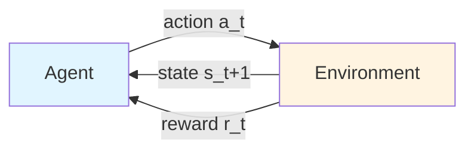

# Chapter 4 — The Reinforcement Learning Problem

> **Prerequisites:** [Chapters 1-3 — Foundations](01_linear_algebra.md).
> Specifically: expectations, the tower property, Markov chains.

> **Learning objectives:**
> 1. State the agent-environment interaction precisely.
> 2. Distinguish RL from supervised, unsupervised, and online learning.
> 3. Define the return $G_t$ and explain why discounting is needed.
> 4. State the exploration-exploitation dilemma.
> 5. Identify the agent-environment loop in the Simulator codebase.

> **Citations:** this chapter's framing draws on [S&B 2018, Ch. 1-2]
> for the agent-environment formulation and the bandit warm-up, and on
> [R&N 2020, Ch. 17] for the decision-theoretic motivation. Full
> bibliography at [`bibliography.md`](bibliography.md).

## 2.1 The agent-environment loop

Reinforcement learning studies an **agent** that interacts with an
**environment** over discrete time steps. The structure:

At each timestep $t$:

1. The agent observes the current state $s_t \in \mathcal{S}$.
2. The agent picks an action $a_t \in \mathcal{A}$ according to its
   **policy** $\pi$.
3. The environment transitions to a new state $s_{t+1}$ (possibly
   stochastically) and emits a reward $r_t \in \mathbb{R}$.
4. Go to step 1.

The agent's objective: choose actions so that the **cumulative reward**
over time is large.

That's it. **All of RL is variations on, and theoretical analysis of, that
loop.**

### Try it: step through the loop

Each step of the loop is one tuple $(s_t, a_t, r_{t+1}, s_{t+1})$ — the
unit of experience every RL algorithm consumes. The toy environment is
a 4-cell chain (goal at the right, +1 reward on arrival). The
dropdown switches between (a) a **Markov** state representation
(position only — what we *want* the state to be) and (b) a
**non-Markov** representation that also remembers the last action
(needed if dynamics depended on history). The trajectory shown is the
same in both modes; only the labels change.

### The trajectory

A sequence
$$
\tau = (s_0, a_0, r_0, s_1, a_1, r_1, s_2, a_2, r_2, \ldots)
$$
is a **trajectory** (also called a "rollout" or "episode" if it has a
defined end).

Some trajectories are **episodic** (they terminate at a "goal" or "death"
state); others are **continuing** (they go on indefinitely). The math is
slightly different in each case — discounting handles continuing
trajectories cleanly; episodic ones can either use $\gamma = 1$ (no
discount, finite return) or $\gamma < 1$ (discounted, same as continuing).

### What is the "state"?

The **state** $s_t$ is meant to be a sufficient statistic of the agent's
history for predicting the future. Formally, the environment satisfies the
**Markov property** if

$$
P(s_{t+1}, r_t \mid s_t, a_t, s_{t-1}, a_{t-1}, \ldots) = P(s_{t+1}, r_t \mid s_t, a_t)
$$

If true, $s_t$ contains *all the relevant information from the past*. We
don't need history.

In the Simulator, "state" usually means **the agent's observation** — a
251-dim vector built by [`crates/cognition/planner/src/perception.rs`](https://github.com/falahat/simulator/blob/main/crates/cognition/planner/src/perception.rs).
This observation may or may not be Markov: if the agent saw food briefly
and looks away, the observation no longer reflects "there's food back
there" unless episodic memory carries it. This makes the Simulator a
**partially-observable** MDP (POMDP) — see [Chapter 5](05_mdps_and_bellman_equations.md#partial-observability)
for details.

### Try it: cost of a non-Markov state

A toy "momentum chain" where the true dynamics depend on both the
current position *and* the last move. Two TD(0) predictors run on the
same trajectories: one whose state features are **position only**
(Markov-naive), one whose features include **the last move**
(history-aware). At μ = 0 the dynamics are memoryless and both agents
tie; as μ grows, the Markov-naive agent's RMSE floor rises because
"position alone" is no longer a sufficient statistic. The gap is the
*measured* cost of the Markov assumption being wrong.

## 2.2 What makes RL different

RL sits at the intersection of three other paradigms, but is none of them.

| Paradigm | Data setup | Feedback | Example |
|---|---|---|---|
| **Supervised learning** | Labeled $(x, y)$ pairs given by oracle | Direct ("right answer") | Image classification |
| **Unsupervised learning** | Unlabeled $x$ | None | Clustering, density estimation |
| **Online learning** | Sequential $x_t$, want low total loss | Loss after each prediction | Spam filter |
| **Reinforcement learning** | Trajectories of $(s_t, a_t, r_t)$ | **Scalar reward** | Game playing |

The decisive differences:

1. **Evaluative, not instructive, feedback.** In supervised learning, the
   loss tells you the right answer. In RL, the reward tells you "that was
   worth $r$" but not "you should have done $a^{\star}$ instead."

2. **Delayed credit assignment.** Today's action affects rewards far in
   the future. The reward at $t=100$ might be due to a decision at $t=10$.
   Figuring out *which* past decision deserves credit is the central
   technical problem.

3. **Active data collection.** The agent's policy determines what data it
   sees. A bad early policy means bad early data — possibly forever, if
   the agent never explores enough to discover better options. This is the
   **exploration-exploitation dilemma**.

4. **Non-stationarity.** As the agent's policy changes, the distribution
   of states it visits changes. The "training distribution" is a moving
   target.

Modern deep RL borrows tools from supervised learning (neural networks,
gradient descent, batch optimization) but the underlying problem
structure is fundamentally different.

### Why RL is also different from optimal control

Optimal control (a sibling field in operations research and engineering)
also studies sequential decisions but typically assumes:

- **Known dynamics** $P(s' \mid s, a)$ in closed form.
- **Known reward** $R(s, a, s')$ in closed form.

Under these assumptions, classic dynamic programming (Bellman 1957) solves
the problem exactly. *Reinforcement* learning drops these assumptions —
the agent must *learn* about dynamics and rewards from interaction. The
algorithms we'll meet (especially [Q-learning](08_temporal_difference_learning.md#q-learning))
explicitly avoid needing $P$ at all.

This is the **model-free** vs **model-based** distinction. RL spans both:

- Model-free: estimate value functions or policies directly from $(s, a, r, s')$.
- Model-based: learn $P$ and $R$, then use planning algorithms on the
  learned model.

We'll spend most of Chapters 3-8 on model-free. Chapter 15 returns to
model-based.

## 2.3 Returns and discounting

The **return** at time $t$ is the total future reward:

$$
G_t = r_t + r_{t+1} + r_{t+2} + \cdots
$$

But this can be unbounded for continuing tasks. We introduce a **discount
factor** $\gamma \in [0, 1)$:

$$
G_t = r_t + \gamma r_{t+1} + \gamma^2 r_{t+2} + \cdots = \sum_{k=0}^{\infty} \gamma^k r_{t+k}
$$

If rewards are bounded by some $R_{\max}$, then by the geometric series

$$
|G_t| \leq R_{\max} \cdot \sum_{k=0}^\infty \gamma^k = \frac{R_{\max}}{1 - \gamma}
$$

so $G_t$ is bounded and the RL problem is well-defined.

### Why discount?

Four reasons, each genuinely matters:

1. **Mathematical convergence.** As above.

2. **Uncertainty about the future.** Tomorrow's reward might not actually
   materialize (the agent might die, the environment might shift). $\gamma$
   reflects probabilistic discounting.

3. **Effective horizon.** Roughly, $\gamma^k$ is negligible for $k > 1/(1-\gamma)$.
   So $\gamma = 0.9$ gives an effective horizon of ~10 timesteps; $\gamma = 0.99$
   gives ~100; $\gamma = 0.999$ gives ~1000. **$\gamma$ tunes how
   far-sighted the agent is.**

4. **Computational tractability.** Convergence rates of value iteration
   (Chapter 6) scale as $\gamma^k$ — higher $\gamma$ means longer
   horizons means slower planning.

### Effective horizon table

| $\gamma$ | $1/(1-\gamma)$ (effective horizon, ticks) | Behavioural interpretation |
|---|---|---|
| 0.5 | 2 | Practically myopic |
| 0.9 | 10 | Short-term planner |
| 0.95 | 20 | Moderate planner |
| 0.99 | 100 | Long-term planner |
| 0.999 | 1000 | Very long-term planner |
| 0.9999 | 10000 | Multi-day strategist |

This table is the single most useful intuition for $\gamma$. The Simulator
uses $\gamma = 0.9$ (effective horizon 10 ticks). With cognition cadence
of 10 ticks per decision, the agent's effective "lookahead" is **about
one cognition cycle**. This is one of the reasons the L-suite's 500-tick
planting → harvest chain is unbridgeable by TD with default $\gamma$ — by
the time the reward arrives, $\gamma^{500} \approx 10^{-23}$, vanishing.

### Try it: discount factor explorer

γ (gamma) controls **how far the agent looks ahead**. The effective
horizon `1/(1-γ)` is the number of steps whose rewards meaningfully
contribute to a return. Slide γ from 0.5 (horizon ~2) up to 0.99
(horizon ~100) and watch the geometric weights spread out.

For more on this see [Chapter 19 — Long-Horizon Credit Assignment](19_long_horizon_credit.md)
when we get there, and [Chapter 17](17_fa_pathologies.md) on the Q-bias
bootstrap pathology for the explicit calculation.

### Try it: episodic vs continuing returns

Pick a reward profile (sparse +10 at $t=100$; constant +0.1 every step;
short burst; mixed; noisy). The top plot is $r_t$; the bottom plot is
$\gamma^t r_t$ (bars) and the cumulative return $G_0$ (line). Switch
between **continuing** (sum to $T = 200$) and **episodic** (cut at the
chosen $T$) horizons. The dashed line is the bound $R_{\max}/(1-\gamma)$
from the geometric series. Notice how the sparse $t=100$ reward
contributes ~$10\gamma^{100}$ — vanishing at $\gamma=0.9$, but
substantial at $\gamma=0.99$.

### Average reward (the discount-free alternative)

Discounting is *one* way to keep an infinite sum finite. The other is to
stop summing and instead maximise the long-run **reward *rate***:

$$
\bar{r}^\pi = \lim_{T \to \infty} \frac{1}{T} \sum_{t=0}^{T-1} r_t
\;=\; \sum_s \mu_\pi(s) \sum_a \pi(a\mid s)\sum_{s',r} p(s',r\mid s,a)\,r,
$$

a single scalar — the expected reward per step under the steady-state
distribution $\mu_\pi$ (assuming the chain is **ergodic**: that
steady state exists and doesn't depend on where you started).

**The differential return.** Because the total reward is infinite you
can't define values the usual way. Instead values are measured *relative
to the rate* — the **differential return**

$$
G_t = (R_{t+1} - \bar r^\pi) + (R_{t+2} - \bar r^\pi) + (R_{t+3} - \bar r^\pi) + \cdots
$$

which is finite because rewards fluctuate *around* $\bar r^\pi$. The
**differential value** $v_\pi(s) = \mathbb{E}_\pi[G_t \mid S_t = s]$ asks
"how much better-than-average is it to be here?" — a transient advantage,
not an absolute sum. (In the operations-research literature, $\bar r^\pi$
is the *gain* and $v_\pi$ the *bias*; Puterman Ch. 8–9, Bertsekas Vol. II.)

**The TD update has no $\gamma$.** The discount is replaced by subtracting
a running estimate $\bar R$ of the rate. With rate step-size $\beta$ (beta)
and the differential TD error $\delta_t$ (delta — "how much better than the
rate was this step"):

$$
\delta_t = R_{t+1} - \bar R_t + \hat v(S_{t+1}) - \hat v(S_t),
\qquad \bar R_{t+1} = \bar R_t + \beta\,\delta_t .
$$

You trade the horizon knob $\gamma$ for the rate step-size $\beta$ —
conventionally $\beta < \alpha$ (alpha, the value step-size), since $\bar R$
should track *slower* than the values it averages; too large and $\bar R$
chases per-decision noise. The tabular ancestor is **R-learning**
[Schwartz 1993]; see [Ch. 6 §TD](08_temporal_difference_learning.md).

**Why it's more than a curiosity.** Sutton & Barto (§10.4, "Deprecating the
Discounted Setting") show that with function approximation on *continuing*
tasks the discounted objective, averaged over the on-policy state
distribution, equals $\bar r^\pi/(1-\gamma)$ — so **$\gamma$ does not change
which policy is best.** For a continuing agent, average reward is arguably
the *more* principled objective, not the rarer one.

> **Project tie-in.** The Simulator's humanoid is a continuing,
> homeostatic survivor ([Ch. 18](18_homeostatic_rl.md)), and its production
> reward is an all-negative cost (`RewardMode::CostOnly`). That combination
> makes discounting actively hazardous: extending the horizon to "see" a
> distant payoff means pushing $\gamma \to 1$, which collides with the
> bootstrapping-+-tile-coding **deadly triad** ([Ch. 17](17_fa_pathologies.md)).
> A measured $\gamma$-sweep on the navigation task confirmed it — values
> were stable through $\gamma=0.98$ but **diverged to $\sim 10^{20}$ at
> $\gamma=0.99$ and crashed the run at $0.999$** ([Ch. 19](19_long_horizon_credit.md)
> owns the $\gamma$-decay/horizon problem). Average reward sidesteps the
> cliff entirely — there is *no* $\gamma$ to push toward 1. The catch:
> death is an absorbing state, which breaks the ergodicity the rate
> formulation assumes, so a survival agent must model death as a reset (or
> a recurrent rebirth) rather than a true terminal.
>
> The Simulator implements the rule as
> [`DifferentialSarsa`](https://github.com/falahat/simulator/blob/main/crates/engine/q_learning/src/td_algorithm.rs)
> — a swappable `TdAlgorithm` whose update is
> $\delta = (R - \bar R) + Q(s', a') - Q(s, a)$ with no $\gamma$. The rate
> $\bar R$ is held per-agent in an
> [`AverageReward`](https://github.com/falahat/simulator/blob/main/crates/engine/rl_core/src/value_function.rs)
> component and threaded into the rule through the `AgentTdState` scratch
> bundle — the same per-agent-component pattern `Sarsa0Lambda` uses for its
> eligibility trace, so there is no global mutable state.

> **Worked numerics (navigation A/B, 150 episodes, 1 seed).** Discounted
> SARSA(λ) at $\gamma = 0.9$: the agent idles — 81% of ticks "still",
> $Q(\text{Wait}) = -0.128 > Q(\text{Step-toward}) = -0.156$, toward-food
> margin $\approx 0$. Differential SARSA(λ) at $\beta = 0.01$: more movement
> (71% still) and the toward-food margin turns *positive* ($+0.003$) — a
> directional preference the discounted learner never formed — and it stays
> **bounded at every $\beta \in [0.01, 0.2]$ tried**, where $\gamma = 0.99$
> had diverged to $10^{20}$. But $Q(\text{Wait})$ still tops $Q(\text{Step})$
> and meals per episode don't rise: average reward removes the
> horizon/divergence problem but is **necessary, not sufficient** — without
> death-stakes and a *directional* reward the agent still idles. (Smaller
> $\beta$ tracked the rate more stably; $\beta = 0.2$ compressed the values
> as $\bar R$ chased noise.)

## 2.4 Policies

A **policy** $\pi$ specifies how the agent picks actions. Two cases:

- **Deterministic:** $\pi: \mathcal{S} \to \mathcal{A}$ — for each state, one
  specific action. Notation: $a = \pi(s)$.
- **Stochastic:** $\pi(a \mid s)$ — a probability distribution over actions
  for each state. Notation: $a \sim \pi(\cdot \mid s)$.

For finite MDPs there always exists an optimal deterministic policy
(Chapter 5 will prove this). For function-approximation settings,
*stochastic policies* are often easier to optimize via gradients
(Chapter 12).

The Simulator's policy is in [`crates/cognition/planner/src/policy.rs`](https://github.com/falahat/simulator/blob/main/crates/cognition/planner/src/policy.rs).
It's *almost* deterministic — uses argmax over a score function — except
for $\epsilon$-greedy exploration which introduces a random pick with
probability $\epsilon$. So technically stochastic, with most mass on the
greedy action.

## 2.5 The exploration-exploitation tension

You arrive at a new restaurant district. You can:

- **Exploit:** go to the highly-rated place you've been to and liked.
- **Explore:** try a new place that might be even better — or terrible.

This is the **exploration-exploitation dilemma**. Always exploiting means
you might miss better options forever. Always exploring means you never
collect the reward of your good choices. The optimal balance depends on
how confident you are in your current estimates, how much time you have,
and how big the potential upside is.

### A toy example: the multi-armed bandit

(Following [S&B 2018, Ch. 2]; the bandit literature is treated definitively
in [Lattimore & Szepesvári 2020].)

Imagine $K$ slot machines, each with an unknown probability $p_k$ of
paying out $1$. You play $T$ rounds. After each play you observe whether
that machine paid out. What's your strategy?

The math of this problem (the **multi-armed bandit**) is a stripped-down
version of the full RL problem — no states, just actions and rewards. It
isolates the exploration-exploitation dilemma without the complications
of state transitions.

Key insights from the bandit literature:

- **$\epsilon$-greedy:** play argmax with probability $1 - \epsilon$, else
  uniformly random. Simple. Achieves linear regret (suboptimal but works).
- **UCB1** [Auer, Cesa-Bianchi & Fischer 2002]: play
  $\arg\max_k \hat{p}_k + c\sqrt{\log(t)/n_k}$ where $n_k$ is the times
  you've pulled arm $k$. Optimistic in the face of uncertainty. Achieves
  $O(\log T)$ regret — optimal up to constants.
- **Thompson sampling** [Thompson 1933; modern reference Russo et al. 2018]:
  maintain a Bayesian posterior over each $p_k$, sample from each
  posterior, play the arm with the highest sample. Also $O(\log T)$
  regret.

These tools generalize to full MDPs (Chapter 14). The Simulator currently
uses $\epsilon$-greedy with $\epsilon = 0.1$ ([`policy.rs:485`](https://github.com/falahat/simulator/blob/main/crates/cognition/planner/src/policy.rs)).
Whether this is enough exploration to learn the things the validation
tests are trying to demonstrate is, as we've seen, a real engineering
question — the [Q-bias bootstrap pathology](17_fa_pathologies.md)
is partly a story about $\epsilon$-greedy being insufficient.

### Try it: UCB1 confidence intervals

A 5-arm Bernoulli bandit. Each arm is a thermometer: dark inner bar is
the empirical mean $\hat\mu_k$, translucent overlay is the confidence
half-width $c\sqrt{\log t / n_k}$. The **top** of the overlay is the
UCB1 score the policy argmaxes — outlined in blue. Dashed red ticks
mark the true means $\mu_k$ (unknown to the agent). Each step pulls
the argmax arm and shrinks its interval; watch the upper edge of a
bad-but-uncertain arm drop below a confident-but-mediocre arm and
flip the pick. Slide $c$ — small $c$ collapses to greedy (high
regret), large $c$ over-explores.

### Pure exploration can be the right answer too

In some settings (e.g. drug discovery), what you ultimately care about is
not "score across the experiment" but "the best treatment found by the
end." This is **best-arm identification** and has its own theory. RL
practice usually wants the during-learning behavior to be good as well,
which is why we exploit gradually.

## 2.6 Why the formulation is general — and where it strains

The agent-environment-reward formulation captures an astonishingly broad
range of problems:

- **Game playing:** state = board position, action = move, reward = win/loss.
- **Robotics:** state = sensor readings, action = motor commands, reward
  = task completion.
- **Recommender systems:** state = user history, action = item to recommend,
  reward = engagement.
- **Resource management:** state = inventory, action = order quantity,
  reward = profit.
- **Healthcare:** state = patient record, action = treatment, reward = outcome.

But the formulation strains in several places:

- **What is the reward?** In game playing it's obvious (win = +1, lose = -1).
  In conversation AI it's not (whose preferences? RLHF — Chapter 19 — is a
  whole subfield about learning reward functions from human comparisons.)
- **Where does the state come from?** Often you only have raw observations
  (pixels, audio). Building a useful state representation is the
  representation-learning problem (Chapter 10).
- **What's the action space?** Discrete, continuous, structured,
  parameterized, hierarchical? Each requires different algorithms.
  ([Chapter 20](20_action_spaces.md) covers this in depth.)
- **How long is a trajectory?** Atari episodes are minutes; a self-driving
  car's lifetime is years; a financial trader's never ends. Same math, very
  different practical considerations.

In the Simulator, you'll see all of these tensions:

- **Reward** is a hand-crafted homeostatic function ([`reward.rs`](https://github.com/falahat/simulator/blob/main/crates/sim/sim_config/src/reward.rs))
  combining drive costs, alive-bonus, body-temperature deviation. Whether
  this captures "good agent behavior" is itself a design question.
- **State** = the 251-dim observation, hand-engineered from drives,
  perception, memory, emotion, body. It's a hand-crafted representation
  ([Chapter 10 explores alternatives](10_function_approximation.md)).
- **Actions** include parameterized ones (`Strike { force }`,
  `Vocalize { volume }`) — not a clean discrete action space ([Chapter 20](20_action_spaces.md)).
- **Trajectory length** is the agent's lifetime, which in the Simulator
  can be tens of thousands of ticks.

## 2.7 Project tie-in

### The Simulator's agent-environment loop

Every tick:

1. **Environment** = the Bevy ECS world. State $s_t$ = the agent's `Observation`
   component, built fresh each tick by `planner::perception::build_perception` and
   `q_learning::observation::build_observation`.

2. **Agent** = the planner. Action $a_t$ = the `Action` it pushes to the agent's
   `Intent` queue. Selected by `planner::policy::plan` ([`policy.rs:297`](https://github.com/falahat/simulator/blob/main/crates/cognition/planner/src/policy.rs)).

3. **Transition $P$** = the rest of the Bevy systems firing: physics, metabolism,
   social, etc. They update the world. Then the next tick's perception sees the
   new state.

4. **Reward $r_t$** = computed by `affect::primary_reward` from
   [`reward.rs`](https://github.com/falahat/simulator/blob/main/crates/sim/sim_config/src/reward.rs). The agent
   never sees this reward directly — only its learner does, as part of TD
   updates.

5. **Discount $\gamma = 0.9$**, hard-coded in [`learning.rs`](https://github.com/falahat/simulator/blob/main/crates/sim/sim_config/src/learning.rs).

The agent doesn't have explicit `step()` calls — the agent-environment loop
is the Bevy schedule. But conceptually it is exactly the loop above.

### Why this matters for understanding the codebase

If you understand the agent-environment loop deeply, you can answer
questions like:

- **"Where is the Markov property in the Simulator?"** It's *assumed* —
  the observation is meant to be a sufficient statistic. Whether it
  actually is depends on whether enough memory is encoded in it.
- **"Where does $\gamma$ live operationally?"** In the TD update at
  [`learning_rate.rs:effective_alpha_gamma`](https://github.com/falahat/simulator/blob/main/crates/engine/q_learning/src/learning_rate.rs)
  and read by the Q-learning system.
- **"What is the Simulator's reward function exactly?"** Read
  [`reward.rs`](https://github.com/falahat/simulator/blob/main/crates/sim/sim_config/src/reward.rs)'s
  `RewardConfig` struct and `affect::primary_reward`. Decompose into
  $w_{\text{alive}}$, drive costs, bio costs.

### A subtle point: cognition cadence

The Simulator runs at one tick per Bevy schedule iteration, but cognition
(planner + Q-learning) only runs every 10 ticks (the **cognition cadence**).
So the agent's effective decision rate is 10× slower than the world's
clock. This matters because:

- The "state" that the agent decides on is sampled every 10 ticks; it
  doesn't see the intermediate ones.
- $\gamma$'s effective horizon, measured in *decisions*, is $1/(1-\gamma)$
  decisions, which is $10/(1-\gamma)$ ticks. So $\gamma = 0.9$ gives ~10
  decisions = ~100 ticks of effective foresight measured in world time,
  even though "100 cognition steps" would be $10\times100 = 1000$ ticks.

Be careful when reading the codebase about whether a tick is a world tick
or a cognition tick.

## 2.8 Exercises

1. **Loop annotation.** Open [`crates/cognition/planner/src/policy.rs`](https://github.com/falahat/simulator/blob/main/crates/cognition/planner/src/policy.rs).
   Identify lines that correspond to (a) reading the state, (b) picking
   the action, (c) committing the action to the world. Now read
   [`crates/engine/q_learning/src/learning_rate.rs`](https://github.com/falahat/simulator/blob/main/crates/engine/q_learning/src/learning_rate.rs).
   Where does the *reward* arrive in code? Where does the next state
   arrive? Trace one complete agent-environment loop iteration.

2. **Discount intuition.** A wolf agent kills prey worth $+100$ reward at
   $t = 50$. Compute the *current* (i.e. $t = 0$) value of that reward
   under $\gamma \in \{0.5, 0.9, 0.99\}$. Which $\gamma$ makes the wolf
   "willing to spend 50 ticks hunting" in a TD-bootstrap sense?

3. **Markov-ness of the Simulator's observation.** Suppose an agent
   perceives food briefly at time $t$, then walks away. At time $t + 50$,
   does its `Observation` still encode "there was food back there"?
   Find the relevant code. What does this say about the Markov property?

4. **Bandit warmup.** Implement a 10-armed Gaussian bandit (each arm $k$
   has true mean $\mu_k \sim \mathcal{N}(0,1)$, rewards $r_t \sim \mathcal{N}(\mu_k, 1)$).
   Code (a) pure greedy with optimistic initial values, (b) $\epsilon$-greedy
   with $\epsilon = 0.1$, (c) UCB1. Plot regret over 1000 plays.

5. **Where would a non-Markov representation hurt?** Pick a Simulator
   validation test (e.g. `learning_navigation.rs`). Describe a scenario
   where the agent's observation is *not* a Markov state — i.e. where the
   agent would benefit from history beyond what's encoded. (Hint: think
   about partially-observed food, recently-fled-from threats, etc.)

## 2.9 References cited in this chapter

Full bibliographic entries in [`bibliography.md`](bibliography.md):

- [S&B 2018] — Ch. 1-2 framing, bandit warm-up (§2.1, §2.5)
- [R&N 2020] — Ch. 17 decision-theoretic framing (§2.6)
- [Auer, Cesa-Bianchi & Fischer 2002] — UCB1 (§2.5)
- [Thompson 1933], [Russo et al. 2018] — Thompson sampling (§2.5)
- [Lattimore & Szepesvári 2020] — bandit theory reference (§2.5)
- [Brafman & Tennenholtz 2002] — R-MAX (§2.9)

## 2.10 Further reading

For deeper study of topics introduced here:

| Source | What to read | Why |
|---|---|---|
| [S&B 2018] | Ch. 1-2 | Their introduction to the same material |
| [R&N 2020] | Ch. 17 | The decision-theoretic framing |
| [Lattimore & Szepesvári 2020] | Ch. 1-4 | The full bandit story |
| [Brafman & Tennenholtz 2002] | R-MAX | Model-based explore-exploit, extended to MDPs |

---

**Next:** [Chapter 5 — Markov Decision Processes](05_mdps_and_bellman_equations.md) — formalize the MDP framework and prove the Bellman equations using the contraction-mapping machinery from Chapter 1.
