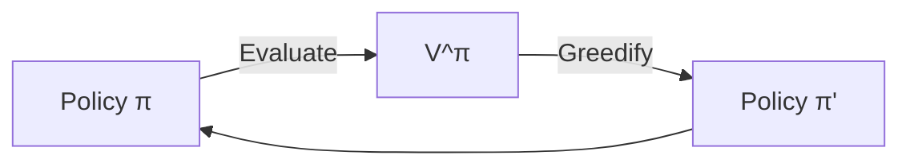
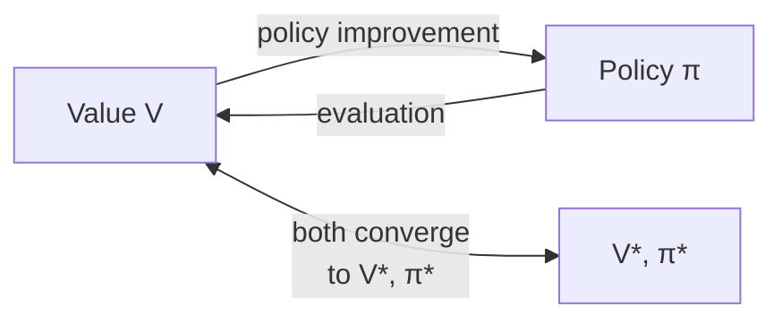

# Chapter 6 — Dynamic Programming

> **Prerequisites:** Chapters [1-3](01_linear_algebra.md) (contractions),
> [2](04_the_rl_problem.md), and [3](05_mdps_and_bellman_equations.md)
> (MDPs and Bellman operators).

> **Learning objectives:**
> 1. Implement policy evaluation, policy iteration, and value iteration.
> 2. Prove convergence using Chapter 1's Banach theorem.
> 3. Understand generalized policy iteration as a unifying view.
> 4. Recognize why DP doesn't apply directly to the Simulator —
>    and what that tells us about model-free RL.

> **Citations:** the chapter follows [S&B 2018, Ch. 4] for the textbook
> treatment of policy iteration and value iteration; [Bertsekas 2012,
> Ch. 1-2] for the rigorous operator-theoretic version; [Puterman 2005,
> Ch. 6] for the LP formulation and rigorous proofs; [Howard 1960] as
> the historical origin of policy iteration; [Bellman 1957] for the
> origin of dynamic programming. Jack's car rental is from
> [S&B 2018, Example 4.2]. The policy improvement theorem follows
> [S&B 2018, Sec. 4.2].

## 4.1 When DP applies, and when it doesn't

Dynamic programming solves an MDP **exactly** under two assumptions:

1. The MDP is **known** — you have $P(s' \mid s, a)$ and $R(s, a, s')$ in
   explicit form.
2. The state space is **enumerable** — you can iterate over all states.

When these hold, you can compute $V^{\star}$ and $\pi^{\star}$ in polynomial time
(per Banach + a few extra observations). This is the entire technology of
Bellman 1957's *Dynamic Programming*.

**When they don't hold**, you fall back on:

- Sampling (Monte Carlo, [Chapter 7](07_monte_carlo_methods.md))
- Bootstrapping (TD learning, [Chapter 8](08_temporal_difference_learning.md))
- Function approximation ([Chapter 10](10_function_approximation.md))

The Simulator's situation: **enormous (effectively continuous) state space, no
explicit $P$**. So DP can't be applied. But DP is the *gold standard* —
every later algorithm is approximating what DP would do exactly. You need
to understand DP to understand what the approximate methods are trying to
achieve.

## 4.2 Policy evaluation

**Problem:** given a policy $\pi$ (and the MDP), compute $V^\pi$.

**Approach:** apply the Bellman expectation operator $T^\pi$ iteratively.
By Chapter 5, $T^\pi$ is a $\gamma$-contraction in sup-norm, so by
Banach, iterating converges to the unique fixed point $V^\pi$.

### The iterative policy evaluation algorithm

```python
def policy_evaluation(pi, P, R, gamma, theta=1e-6):
    V = np.zeros(num_states)
    while True:
        delta = 0
        V_new = np.zeros_like(V)
        for s in range(num_states):
            v_s = 0
            for a in range(num_actions):
                for s_prime in range(num_states):
                    p = P[s, a, s_prime]
                    r = R[s, a, s_prime]
                    v_s += pi[s, a] * p * (r + gamma * V[s_prime])
            V_new[s] = v_s
            delta = max(delta, abs(V[s] - V_new[s]))
        V = V_new
        if delta < theta:
            return V
```

Cost: $O(|\mathcal{S}|^2 |\mathcal{A}|)$ per iteration. Iterations to
$\epsilon$ accuracy: $O(\log(1/\epsilon) / \log(1/\gamma))$ by Banach. So total
cost is $O\big(|\mathcal{S}|^2 |\mathcal{A}| \cdot \log(1/\epsilon) / \log(1/\gamma)\big)$.

### In-place updates (Gauss-Seidel)

In the algorithm above, we used a separate `V_new` array — this is the
**synchronous** version. The **asynchronous** version updates `V[s]` in
place:

```python
for s in range(num_states):
    V[s] = sum_over_(a, s_prime) ...
```

Asynchronous works too, often converges faster (uses fresh updates within
the iteration), but the convergence proof is messier — needs a careful
ordering argument (Bertsekas Vol II, Section 1.4).

### Practical considerations

- **Initial values matter** for the iteration count but not the limit.
  Initializing $V_0$ near $V^\pi$ converges fast; initializing $V_0 = 0$
  works but takes more steps.
- **Stopping criterion** uses the sup-norm change. $\theta = 10^{-6}$ is
  typical for didactic examples.
- **Numerical stability** is rarely an issue for tabular DP. For very
  small $\gamma$ ($< 0.01$) you can get cancellation issues; rarely seen.

## 4.3 Policy improvement

### Why this section is the crux

§4.2 gave us a way to *evaluate* a fixed policy — compute $V^\pi$
via Banach iteration. But evaluation alone is useless if we can't
*do something* with the result. The agent doesn't want a number per
state; it wants to behave better.

The policy improvement theorem is the bridge. It says: *given any
value function, the greedy policy w.r.t. that value function is
at least as good as the policy whose value function it was*. Two
algorithms fall out immediately:

- **Policy iteration** — alternate (evaluate, improve, evaluate,
  improve, …) until the policy stops changing. §4.4.
- **Value iteration** — interleave one improvement step inside each
  evaluation sweep. §4.5.

Without this theorem neither algorithm is sound. Read this proof
once; you don't need to re-derive it again for the rest of the
chapter.

### Statement and intuition

**Problem.** Given $V^\pi$ for some policy $\pi$, produce a *better*
policy $\pi'$.

**Theorem (Policy Improvement, [S&B 2018 Sec. 4.2]).** Define $\pi'$
greedy with respect to $V^\pi$:

$$
\pi'(s) = \arg\max_a \sum_{s'} P(s' \mid s, a) \big[R(s, a, s') + \gamma V^\pi(s')\big].
$$

Then $V^{\pi'}(s) \geq V^\pi(s)$ for every state $s$, with strict
inequality for at least one $s$ unless $\pi$ is already optimal.

**Read this in English first.** $\pi'$ is "do whatever $V^\pi$ says
is best at *this* step, then continue with $\pi$ as before."
Surprisingly, that one-step deviation from $\pi$ doesn't just
improve the *first* action — it improves the value function
*everywhere*. The reason is the recursive structure of $V$: a
single locally-better action compounds over the discounted future,
and the inequality propagates back to all reachable states.

If that surprises you, good. The naive expectation is "we only
improved one step, so the value should only be better at the start
state." Why does it cascade? Because $\pi'$ uses the
*better-everywhere-it-applies* value-function $V^\pi$ as its
recursion partner; the improvement gets re-applied at every state
$\pi'$ visits. The proof formalizes that compounding.

### Proof, step by step

**Step 1 — one-step improvement.** By the definition of $\pi'$ as
the $\arg\max$:

$$
\sum_{s'} P(s' \mid s, \pi'(s))\big[R + \gamma V^\pi(s')\big] \stackrel{(1)}{\geq} \sum_{s'} P(s' \mid s, \pi(s))\big[R + \gamma V^\pi(s')\big].
$$

Step (1) is the *definition* of $\arg\max$: the value at $\pi'(s)$
is the largest over all $a$, in particular at least as large as the
value at $\pi(s)$. The left side is $Q^\pi(s, \pi'(s))$; the right
side is $Q^\pi(s, \pi(s)) = V^\pi(s)$. So
$Q^\pi(s, \pi'(s)) \geq V^\pi(s)$ for every $s$.

**Step 2 — substitute and unroll.** Now plug the inequality back into
the Bellman expectation equation. For any state $s$,

$$
V^\pi(s) \stackrel{(2)}{\leq} Q^\pi(s, \pi'(s)) \stackrel{(3)}{=} \mathbb{E} _{\pi'}\big[r + \gamma V^\pi(s') \mid s\big].
$$

Step (2) is the inequality from Step 1. Step (3) writes
$Q^\pi(s, \pi'(s))$ as an expectation under the *one-step* mixture
"do $\pi'$ now, then follow $\pi$" — which is exactly what
$Q^\pi(s, a)$ is by definition. **Crucial subtlety:** the
expectation is over $r$ and $s'$ from taking action $\pi'(s)$ in
state $s$, but the value of $s'$ is still $V^\pi$ (because beyond
this one step we go back to $\pi$).

**Step 3 — recurse.** The right side has another $V^\pi(s')$ in it.
Apply the same inequality (Step 1) to $s'$:

$$
V^\pi(s') \leq Q^\pi(s', \pi'(s')) = \mathbb{E} _{\pi'}\big[r' + \gamma V^\pi(s'') \mid s'\big].
$$

Substitute back into Step 2's right side:

$$
V^\pi(s) \leq \mathbb{E} _{\pi'}\big[r + \gamma r' + \gamma^2 V^\pi(s'')\big].
$$

After $k$ such substitutions:

$$
V^\pi(s) \leq \mathbb{E} _{\pi'}\big[r_0 + \gamma r_1 + \gamma^2 r_2 + \cdots + \gamma^{k-1} r _{k-1} + \gamma^k V^\pi(s_k)\big].
$$

**Step 4 — take $k \to \infty$.** Because $V^\pi$ is bounded and
$\gamma < 1$, the $\gamma^k V^\pi(s_k)$ term vanishes. What's left
is the definition of $V^{\pi'}(s)$ — the expected return under
$\pi'$ from $s$. So

$$
V^\pi(s) \leq V^{\pi'}(s).
$$

The inequality is strict at some $s$ unless $\pi'(s) = \pi(s)$
everywhere — which means $\pi$ was *already* greedy w.r.t. its own
value function, i.e. optimal. ☐

**The compounding insight, re-stated.** The proof has a recursive
structure that mirrors the value function itself: a one-step
improvement at *every* visited state propagates through the
geometric discounting. The improvement at the first step contributes
$\gamma^0$; at the second step, $\gamma^1$; at the third,
$\gamma^2$; and so on. Sum them up — that's $V^{\pi'}(s) - V^\pi(s)$.

### Why greedification is sound — three equivalent readings

**1. As a fixed-point monotonicity argument.** The Bellman expectation
operator $T^\pi$ takes the policy $\pi$ as input; greedifying
$\pi$ to $\pi'$ creates a new operator $T^{\pi'}$. The inequality
$T^{\pi'} V^\pi \geq V^\pi$ means $V^\pi$ is a *subsolution* under
the new operator. Iterating $T^{\pi'}$ from $V^\pi$ converges to a
fixed point that's at least as large.

**2. As a value-function comparison.** The proof is direct:
substitute the one-step inequality recursively and discount.
$V^{\pi'}(s) \geq V^\pi(s)$ because each step under $\pi'$ is at
least as good as the corresponding step under $\pi$, and the gains
compound geometrically.

**3. As "greedy is at least as good as imitating".** $\pi'$ is the
deterministic policy that, when forced to play once and then revert
to $\pi$, picks the best one-step action. Since the agent only
sees its own actions through the lens of $V^\pi$, "the best
one-step action under $V^\pi$" can only help.

### What this theorem doesn't say

- **Greedy improvement is not gradient ascent.** PI is a discrete
  jumps-in-policy-space algorithm. There's no learning rate, no
  step size — every improvement step replaces $\pi$ wholesale with
  the greedy choice. (Policy gradient, Chapter 12, *is* gradient
  ascent — a smooth-parameterization analogue.)
- **It does not say convergence is monotone in $\|V\|$.** The
  inequality is pointwise — $V^{\pi'}(s) \geq V^\pi(s)$ for every
  state — but individual $V$ values can still change drastically
  in either direction during the next evaluation step. The
  *policy* converges monotonically through finite policies (§4.4),
  not the value function.
- **It requires $V^\pi$ to be exact.** If we improve with respect
  to an approximate $\widehat V \approx V^\pi$, the new policy's
  value can be *worse* than $\pi$'s — only by a bounded amount
  (Singh & Yee 1994; Chapter 6 §4.5 exercise 4 is the canonical
  bound), but worse is worse. This is why partial-evaluation
  variants like modified PI need the bound to be tight enough.

So greedification with respect to any *true* value function makes
the policy at least as good. **This is the entire reason policy
iteration works.**

## 4.4 Policy iteration

Combine evaluation and improvement:

```
1. Initialize π arbitrarily.
2. Loop:
   a. Evaluate: compute V^π by iterative policy evaluation.
   b. Improve: π_new ← greedy(V^π).
   c. If π_new == π, return π. (Policy unchanged ⇒ optimal.)
   d. π ← π_new.
```



> **Theorem (Policy iteration convergence).** For finite MDPs, policy
> iteration terminates in at most $|\mathcal{A}|^{|\mathcal{S}|}$ iterations
> with the optimal policy.

**Proof.** Each iteration strictly improves the policy (unless we're at
the optimum, in which case it returns). There are only finitely many
deterministic policies. So termination is forced. The terminal policy is
optimal because it satisfies the Bellman optimality equation (policy
unchanged ⇒ greedy w.r.t. its own value function).    $\blacksquare$

In practice, policy iteration converges in **a handful of iterations**
(often $O(|\mathcal{S}|)$ for typical MDPs) — much faster than the worst
case. Each iteration involves a full policy evaluation, though, which is
the dominant cost.

### Variants

- **Modified policy iteration:** don't run evaluation to full convergence —
  do only $k$ steps of $T^\pi$, then improve. Tradeoff: fewer evaluation
  steps per iteration, more iterations total. Often faster wall-clock.
- **Optimistic policy iteration:** $k = 1$ — one $T^\pi$ application per
  improvement. Identical to value iteration if we're careful about
  ordering.

### Try it: PI vs VI on the same gridworld

<div id="ch4-pi-vs-vi-widget" class="textbook-widget"></div>
<script type="module" src="./widgets/pi_vs_vi/widget.js"></script>

PI converges in a handful of *outer* iterations but spends most of its
work inside each policy evaluation; VI uses many cheap sweeps. The two
$V^\star$ heatmaps are identical (Banach guarantees it); the
iterations-vs-backups bars are where the tradeoff lives. Slide $\gamma$
upward and watch PI's backup count climb faster than VI's — long-horizon
evaluation is what makes PI iterations expensive.

### Try it: the modified-PI knob $k$ traces the GPI continuum

<div id="ch4-modified-pi-widget" class="textbook-widget"></div>
<script type="module" src="./widgets/modified_pi/widget.js"></script>

Sweep $k$ from 1 (VI) to $\infty$ (full PI). Most of the time the
*minimum-work* setting is one of the middle values — a few evaluation
sweeps per improvement, neither degenerate end. This is GPI made
concrete: value iteration and policy iteration are the two endpoints
of a one-dimensional family parameterised by $k$.

## 4.5 Value iteration

Skip the explicit policy. Directly iterate the Bellman optimality operator
$T^{\star}$:

```python
def value_iteration(P, R, gamma, theta=1e-6):
    V = np.zeros(num_states)
    while True:
        delta = 0
        V_new = np.zeros_like(V)
        for s in range(num_states):
            V_new[s] = max(
                sum(P[s, a, s_prime] * (R[s, a, s_prime] + gamma * V[s_prime])
                    for s_prime in range(num_states))
                for a in range(num_actions)
            )
            delta = max(delta, abs(V[s] - V_new[s]))
        V = V_new
        if delta < theta:
            break
    pi = greedy_policy(V, P, R, gamma)
    return V, pi
```

> **Theorem (Value iteration convergence).** Value iteration produces
> $V_k$ with $\|V_k - V^{\star}\| _\infty \leq \gamma^k \|V_0 - V^{\star}\| _\infty$, and
> the greedy policy w.r.t. $V_k$ is $\epsilon$-optimal after
> $k = O(\log(1/\epsilon) / \log(1/\gamma))$ iterations.

This is Banach + Chapter 5. The explicit error bound uses one extra
observation: if $\|V_k - V^{\star}\| _\infty \leq \epsilon$, then the greedy policy
w.r.t. $V_k$ has value within $2\gamma\epsilon/(1-\gamma)$ of optimal
(Bertsekas, "Performance of greedy policies").

### Try it: VI sweeping a 5x5 gridworld

<div id="ch4-value-iteration-widget" class="textbook-widget"></div>
<script type="module" src="./widgets/value_iteration/widget.js"></script>

Step through sweep-by-sweep. The cells fill in from the goal outward, the
greedy-policy arrows lock to their final direction within a few sweeps
even while $V$ keeps shrinking toward $V^\star$, and the residual
$\|V_k - V_{k-1}\|_\infty$ decays geometrically — the slope on the log
plot is $\log \gamma$, exactly the contraction rate the theorem
predicts.

### Try implementing it: one VI sweep on a 4-state chain

<div id="ch6-bellman-sweep-exercise"></div>
<script type="module" src="./widgets/bellman_sweep/exercise.js"></script>

The widget above runs the algorithm; here you write it. The chain
above the goal terminal is small enough that you can verify each
sweep on paper, but a working sweep over an arbitrary
`actionsPerState` shape is the same code that every value-iteration
implementation in this book uses.

### When to prefer VI vs PI

| | Policy Iteration | Value Iteration |
|---|---|---|
| Convergence rate | "Few" iterations, each expensive (full eval) | Many iterations, each cheap |
| Per-iteration cost | $O(\lvert\mathcal{S}\rvert^3)$ if you solve eval exactly | $O(\lvert\mathcal{S}\rvert^2 \lvert\mathcal{A}\rvert)$ |
| Wall-clock | Often faster on small MDPs | Often faster on large MDPs |
| Implementation | More complex | Simpler |

In practice both run fast on the textbook problems. The choice matters
when $|\mathcal{S}|$ is moderate (10³-10⁵).

### Try it: PI vs VI iteration counts across (γ, N)

<div id="ch4-pi-count-widget" class="textbook-widget"></div>
<script type="module" src="./widgets/pi_count/widget.js"></script>

The two heatmaps sweep a chain MDP (states 0..N−1, +1 at the right end,
two actions left/right) over $\gamma \in \{0.5, 0.7, 0.9, 0.95, 0.99\}$
and $N \in \{3, 5, 7, 9, 11, 15\}$. The left heatmap is *policy
iteration*; the right is *value iteration*. PI's count is essentially
flat — for this MDP it converges in 2-3 iterations regardless of γ or N —
while VI's count explodes as $\gamma \to 1$ because each sweep contracts
by only a factor of γ. This is the empirical shape of the
"PI: few expensive iterations / VI: many cheap iterations" tradeoff: PI
wins on iteration *count*, but each PI iteration runs a full policy
evaluation, so total backups are higher.

## 4.6 Generalized policy iteration (GPI)

Sutton & Barto introduce a beautiful unifying view: **almost every RL
algorithm is a form of generalized policy iteration.**

> **Generalized Policy Iteration:** alternate (partial) evaluation and
> (partial) improvement of a policy, regardless of order or completeness.



Examples:

- **Value iteration:** improvement is implicit (the max in $T^{\star}$); evaluation
  is one step of $T^\pi$ (vacuous since $\pi$ is greedy w.r.t. $V$).
- **Policy iteration:** explicit alternation, full evaluation per iteration.
- **Modified PI:** explicit alternation, $k$ steps of evaluation.
- **Monte Carlo control with exploring starts** (Chapter 7): evaluation =
  averaging returns; improvement = greedification on $Q$.
- **Q-learning** (Chapter 8): evaluation = TD step toward target;
  improvement = $\arg\max_a Q$.
- **Actor-critic** (Chapter 13): explicit separation of policy network
  (improvement) and value network (evaluation).

GPI is the lens that lets you see all these algorithms as instances of a
single pattern. Internalize this.

## 4.7 Asynchronous and prioritized DP

DP doesn't have to update every state every iteration. Asynchronous DP
permits arbitrary update orders, as long as every state is updated
infinitely often.

### Prioritized sweeping [Moore & Atkeson 1993; S&B 2018, Sec. 8.4]

If some states have larger Bellman errors $|V(s) - (T^{\star} V)(s)|$ than others,
update those first. This dramatically speeds up convergence on sparse
MDPs (only a few states change per iteration).

```
priority_queue ← every state with key |Bellman residual|
while not converged:
    s ← pop highest priority
    V[s] ← (T* V)(s)
    for each predecessor s' of s:
        push s' with new priority |Bellman residual at s'|
```

This is the DP version of what **prioritized experience replay** (Chapter
9) does for deep Q-learning.

### Try it: prioritized sweeping vs vanilla VI on a sparse-reward grid

<div id="ch4-prioritized-sweep-widget" class="textbook-widget"></div>
<script type="module" src="./widgets/prioritized_sweep/widget.js"></script>

The reward is sparse: $+1$ at the top-right goal, 0 elsewhere. Watch
vanilla VI grind through every state in row-major order — most of those
backups change nothing while the goal's value hasn't yet reached the
state being updated. Prioritized sweeping (right) pops the
highest-residual state, applies one backup, and pushes the predecessors
back onto the heap. After the same number of backups, PS has informed
far more states than VI; the priority-queue sidebar shows the frontier
of states still needing attention.

### Real-time DP (RTDP) [Barto, Bradtke & Singh 1995]

Update only states on the agent's trajectory. Combines planning with acting:
the agent visits states, you DP-update them, the agent picks the new
greedy action. **Closes the loop between planning and acting** — useful
for online settings. See [Barto, Bradtke & Singh 1995, *Learning to Act
using Real-Time Dynamic Programming*].

## 4.8 The linear programming formulation

Less famous but worth mentioning: $V^{\star}$ can be computed by solving a
linear program:

$$
\min_V \sum_s V(s) \quad \text{subject to} \quad V(s) \geq \sum_{s'} P(s' \mid s, a)[R + \gamma V(s')] \,\forall s, a
$$

The optimum is exactly $V^{\star}$. This gives a polynomial-time algorithm via
LP solvers. In practice rarely competitive with value iteration for
moderate $|\mathcal{S}|$, but conceptually clean and the foundation for
**dual LP** formulations used in modern offline RL.

### Try it: visualise the LP feasible region on a 2-state MDP

<div id="ch4-lp-duality-widget" class="textbook-widget"></div>
<script type="module" src="./widgets/lp_duality/widget.js"></script>

A 2-state MDP gives four constraints in the $(V(0), V(1))$ plane —
one per $(s, a)$. The shaded region is feasible: every point above all
four constraint lines satisfies the LP. The yellow dot is $V^{\star}$,
which lives at the *lower-left corner* of the feasible polytope (the LP
minimises the sum of values). Slide γ and the four reward sliders to
watch the constraint half-planes pivot; the feasible region shrinks as γ
rises. Flip **show dual** to highlight the two constraints that are
*tight* at $V^{\star}$ in green — those correspond to the actions the
optimal policy actually takes (dual variable $d(s, a) > 0$). The dual LP
solves for these occupancy measures directly; modern offline RL methods
like AlgaeDICE work in exactly this dual space.

## 4.9 Worked example: Jack's car rental

[S&B 2018, Example 4.2]. Two locations rent cars at €10 each.
Overnight, cars can be moved between locations at €2 each. Demand and
returns are Poisson. $\gamma = 0.9$. State = (cars at location 1, cars at
location 2). Action = number of cars to move overnight.

After 4 policy iterations, the optimal policy emerges: move cars from the
location with low expected demand to the one with high expected demand,
asymmetrically based on inventory.

We won't reproduce the full code here — it's in any RL textbook. The
point: **with explicit $P$ and $R$, policy iteration converges in a
handful of iterations** for an interesting non-trivial problem. The
difficulty is *getting* $P$ and $R$, not exploiting them.

## 4.10 The Simulator can't do this — and that's the point

The Simulator's MDP has:

- $\mathcal{S}$ continuous (251-dim real-valued vector).
- $P$ implicit (defined by the Bevy system schedule).
- $R$ explicit but a function of full world state, not just observation.

DP requires enumerable $\mathcal{S}$ and explicit $P$, $R$. The Simulator
has neither. Therefore:

1. **Iterate over states**: impossible (continuous). Must use function
   approximation ([Chapter 10](10_function_approximation.md)).
2. **Compute expectations under $P$**: impossible (no closed form). Must
   estimate from sampled transitions (Chapters 5-6).

This is **why the Simulator uses model-free RL**. It has no choice.

### What the deleted forward-search planner tried

The earlier session of this project killed a forward-search planner that
attempted a kind of online DP:

- From the current state, sample (or roll out) the next $k$ steps under
  several candidate first actions.
- Score each via a learned value function at the leaves.
- Pick the action with the highest score.

This is **Monte Carlo Tree Search** in spirit ([Chapter 15](15_model_based_rl.md))
— the planning equivalent of DP when you can sample $P$ but not enumerate
$\mathcal{S}$. It failed in the Simulator for two reasons:

1. **State propagation:** the rollout didn't actually evolve drives, so
   "in 50 ticks I'll be hungry" was unrepresentable. The planner saw
   "every state has the same hunger as now."
2. **Computational cost:** each rollout step is one Bevy tick — expensive.
   Depth-3 search × 16 actions = ~4000 sim ticks per agent per decision.

The decision to remove it was correct given those failures. **But model-based
RL is not categorically wrong** — it's just hard to do well. [Chapter 15](15_model_based_rl.md)
will cover modern approaches (Dyna, MuZero, world models) that solve
these problems with care.

## 4.11 Project tie-in

### Where DP-like thinking shows up

DP isn't used directly. But the *concepts* show up everywhere:

- **The Bellman operator** is what TD learning approximates per sample.
- **Greedy policy w.r.t. learned $Q$** ([`policy.rs:argmax_index`](https://github.com/falahat/simulator/blob/main/crates/cognition/planner/src/policy.rs))
  is the policy improvement step of GPI.
- **The score formula** `0.5·Q + recipe_bonus` is the improvement-step's
  "argmax over score" — Q approximates $Q^{\star}$, `recipe_bonus` is
  a hand-engineered prior.
- **Convergence verdicts** (`Converged`, `Drifting`, `Chaotic` — see
  [`crates/engine/observability/`](https://github.com/falahat/simulator/blob/main/crates/engine/observability)) measure
  whether the value-iteration-style fixed point has been reached
  empirically.

### What DP would look like if you could afford it

Imagine the Simulator's state space were small enough to enumerate. Then
you could:

1. Compute $P(s' \mid s, a)$ explicitly by enumerating Bevy world
   transitions (combinatorially huge but in principle deterministic).
2. Run value iteration to compute $V^{\star}$ exactly.
3. The greedy policy w.r.t. $V^{\star}$ would be optimal — no exploration needed,
   no Q-bias bootstrap pathology, nothing.

The Simulator's problems with the Q-bias bootstrap
and L-suite failures are *artifacts of having to approximate* DP with
samples and function approximation. DP would not have these problems.
Understanding this lets you recognize which problems are intrinsic to the
RL task vs. which are byproducts of the approximation method.

## 4.12 Exercises

1. **(Implement value iteration.)** Code value iteration on a 4×4
   gridworld with terminal cells (0,0) and (3,3). $R = -1$ for every step.
   $\gamma = 0.9$. Plot value function as a heatmap. Compare to the
   textbook solution.

2. **(Implement policy iteration on the same gridworld.)** How many
   iterations until convergence? Compare to value iteration.

3. **(Speed comparison.)** Generate a random MDP with $|\mathcal{S}| = 100$,
   $|\mathcal{A}| = 4$. Run both algorithms. Time them. Plot iterations
   vs. wall-clock.

4. **(Bellman error bound.)** Suppose $\|V - V^{\star}\| _\infty \leq \epsilon$.
   Prove that the greedy policy $\pi$ w.r.t. $V$ satisfies $\|V^\pi - V^{\star}\| _\infty \leq 2\gamma\epsilon / (1-\gamma)$.
   (Hint: use $V^{\star} = T^{\star} V^{\star} \geq T^\pi V^{\star} \geq T^\pi V - \epsilon \cdot \mathbf{1}$
   and recurse.)

5. **(Modified policy iteration.)** Implement modified PI with $k = 5$
   evaluation steps per improvement. Compare convergence to standard PI
   ($k = \infty$) and VI ($k = 1$).

6. **(LP formulation.)** Solve the gridworld MDP using `scipy.optimize.linprog`
   on the LP formulation. Verify the answer matches VI.

7. **(Simulator MDP, conceptual.)** Write down what $P$ and $R$ would
   need to look like for the Simulator to use DP. Estimate the size of
   $\mathcal{S}$ if you discretized each observation dimension at width
   0.1 (so 14 drives × 10 bins + 8 emotions × 10 bins + ...). Where does
   it become intractable?

## 4.13 References cited in this chapter

Full bibliographic entries in [`bibliography.md`](bibliography.md):

- [S&B 2018] — Ch. 4 (policy iteration, value iteration, GPI) — §4.2-§4.6
- [Bertsekas 2012] — Ch. 1-2 (operator-theoretic DP)
- [Puterman 2005] — Ch. 6 (LP formulation, discounted MDPs) — §4.8
- [Howard 1960] — original policy iteration — §4.4
- [Bellman 1957] — origin of dynamic programming — §4.1

(Additionally cited: Moore & Atkeson 1993, *Prioritized sweeping:
Reinforcement learning with less data and less time*,
*Machine Learning*, 13, 103–130; Barto, Bradtke & Singh 1995, *Learning
to Act using Real-Time Dynamic Programming*, *Artificial Intelligence*,
72, 81–138.)

## 4.14 Further reading

| Source | What to read | Why |
|---|---|---|
| [S&B 2018] | Ch. 4 | The canonical textbook chapter |
| [Bertsekas 2012] | Ch. 1-2 | Rigorous, operator-theoretic |
| [Puterman 2005] | Ch. 6 | Theorems with named conditions |
| [Howard 1960] | The whole book | Historical PI |
| [Bellman 1957] | The whole book | The origin |

---

**Next:** [Chapter 7 — Monte Carlo Methods](07_monte_carlo_methods.md) — when you don't know $P$ but you can sample trajectories, you can still estimate value functions. Different math (no contraction), different tradeoffs (unbiased but high variance).
