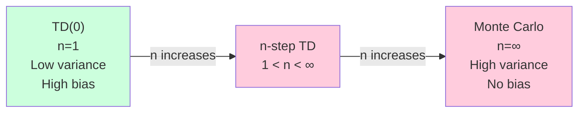
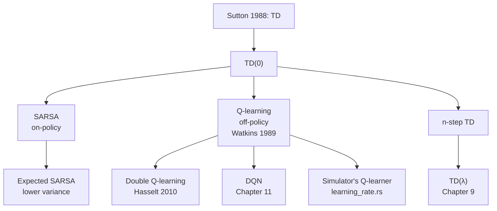

# Chapter 8 — Temporal Difference Learning

> **Prerequisites:** Chapters [1-3](01_linear_algebra.md)
> (contractions, stochastic approximation), [3](05_mdps_and_bellman_equations.md)
> (MDPs, Bellman equations), [4](06_dynamic_programming.md) (DP),
> [5](07_monte_carlo_methods.md) (MC).

> **Learning objectives:**
> 1. Derive the TD(0) update from the Bellman expectation equation.
> 2. Implement SARSA (on-policy) and Q-learning (off-policy).
> 3. Explain the maximization bias and double Q-learning.
> 4. Compare bias and variance of TD vs MC.
> 5. State the Watkins-Dayan convergence theorem and its conditions.
> 6. Trace the TD(0) update through the Simulator's
>    [`learning_rate.rs`](https://github.com/falahat/simulator/blob/main/crates/engine/q_learning/src/learning_rate.rs).

> **Citations:** the chapter follows [S&B 2018, Ch. 6-7] for the
> textbook presentation. The TD(0) origin is [Sutton 1988]. Q-learning
> is [Watkins 1989; Watkins & Dayan 1992]. Convergence theory is
> [Tsitsiklis 1994]. The maximization bias / Double Q-learning is
> [van Hasselt 2010]. Expected SARSA analysis is [van Seijen et al. 2009].
> The cliff-walking example is reproduced from [S&B 2018, Sec. 6.5].

This is **the chapter**. Temporal-difference learning is the single most
influential idea in reinforcement learning. Q-learning — a TD method — is
the foundation under the Simulator's entire cognition layer.

## 6.1 The TD insight [Sutton 1988]

### Why this chapter is THE chapter

The whole textbook so far has been working toward this section.
Chapter 5 (MDPs) gave us value functions and Bellman equations.
Chapter 6 (DP) gave us algorithms that compute them — but DP needs
the transition kernel $P$, which a real agent in a real world does
not have. Chapter 7 (Monte Carlo) gave us model-free estimation,
but only by waiting for episodes to terminate.

TD learning is the answer to both problems at once. It's
*model-free* (only needs sampled transitions, not $P$) AND *online*
(updates after every step, not just at the end of episodes). It's
the single algorithmic idea underneath Q-learning, SARSA, deep RL,
neural-net Atari, and the Simulator's actual cognition layer. If
you internalize one update rule in this book, make it the TD
update.

### The two prior approaches, side by side

To see what TD adds, contrast the two methods we already have for
estimating $V^\pi(s)$:

- **Monte Carlo** estimates $V^\pi(s)$ by averaging full returns
  $G_t$ from episodes — sample whole trajectories, sum their
  discounted rewards, average over many trajectories.
  **Strengths:** unbiased estimate of $V^\pi(s)$; no model needed.
  **Weaknesses:** requires complete episodes (won't work for
  continuing tasks); high variance (the whole trajectory's noise
  contaminates one state's estimate); slow learning (one update per
  episode).
- **Dynamic programming** computes $V^\pi(s)$ exactly using the
  Bellman equation $V^\pi(s) = \mathbb{E}[r + \gamma V^\pi(s')]$.
  **Strengths:** low variance (exact expectations, not samples);
  online (per-state updates). **Weaknesses:** requires the model
  $P$ to compute the expectation; agents don't have $P$.

MC has "right answer, slow" — DP has "fast, but needs the model."
The agent stuck in the world wants "right answer, fast, without
needing the model." TD is the synthesis.

### The TD insight

[Sutton 1988]'s key move: **what if we estimate $V^\pi(s)$ using
sampled $r + \gamma V(s')$ instead of either the whole-trajectory
return $G_t$ (MC) or the full expectation $\mathbb{E}[r + \gamma V^\pi(s')]$ (DP)?**

In other words — take DP's right-hand side, but replace the
*expectation* with a single Monte Carlo sample of $(r, s')$ drawn
from the environment, and use the *current value-function estimate*
$V$ in place of the true (unknown) $V^\pi$ on the RHS.

The update:

$$
V(s) \leftarrow V(s) + \alpha \big[\underbrace{r + \gamma V(s')}_{\text{TD target}} - V(s)\big]
$$

The quantity in brackets is the **TD error**:

$$
\delta_t = r_t + \gamma V(s _{t+1}) - V(s_t)
$$

**The TD error is the most important quantity in RL.** Three
intuitions for it, all valid:

1. **"How surprised am I?"** $\delta_t$ is the difference between
   what you predicted ($V(s_t)$) and what the transition + your
   updated prediction told you ($r_t + \gamma V(s _{t+1})$). Positive
   $\delta_t$ means the transition turned out better than your
   prediction said; negative means worse. Update $V(s_t)$ in the
   direction of the surprise, by a fraction $\alpha$.
2. **A noisy Bellman residual.** $\delta_t$ is a single Monte Carlo
   estimate of $T^\pi V(s_t) - V(s_t)$, the gap between the Bellman
   operator's output and the current value. If $V = V^\pi$, the
   expected $\delta_t$ is zero — that's the Bellman fixed-point
   property. If $V \neq V^\pi$, $\delta_t$ has nonzero mean and
   tells you which way to move.
3. **A neuromodulatory signal.** Empirical: midbrain dopamine
   neurons fire in proportion to a TD-error-shaped signal. (Schultz,
   Dayan & Montague 1997, this chapter's references.) The agent's
   reward-prediction error in software has a literal biological
   homolog. The Simulator's `appraisal` crate computes a TD-error
   variant per drive — this isn't a metaphor, it's the same math.

### Why "temporal difference"

The update uses the *difference between value estimates at
successive times*: $V(s _{t+1})$ (one step in the future) and
$V(s_t)$ (now). That difference — across time — is the "temporal
difference."

Contrast with MC, whose update uses the actual future return:

- **MC update:** $V(s_t) \leftarrow V(s_t) + \alpha[G_t - V(s_t)]$
  — uses the actual sum of future rewards.
- **TD update:** $V(s_t) \leftarrow V(s_t) + \alpha[r_t + \gamma V(s _{t+1}) - V(s_t)]$
  — uses an *estimate* of the future return ($r_t + \gamma V(s _{t+1})$).

This is **bootstrapping** — TD updates its estimate using its own
current estimate as input. The bootstrap is what makes TD online
and low-variance, and also what makes it dangerous: at the start,
your estimates are bad, and you're learning from your own bad
estimates. The convergence theorems (next subsection) show this
isn't fatal — but the bootstrap is also what creates the *deadly
triad* in deep RL (Chapter 17). Pay attention to where the
bootstrap is and what bounds keep it stable.

### Why TD works — the stochastic-approximation argument

Look at the TD update as a fixed-point iteration. The RHS,
$r + \gamma V(s')$, is a *random variable* whose expectation given
$s$ is

$$
\mathbb{E}\big[r + \gamma V(s') \mid s\big] \stackrel{(1)}{=} \sum _{a, s'} \pi(a|s) P(s'|s,a) \big[R(s, a, s') + \gamma V(s')\big] \stackrel{(2)}{=} (T^\pi V)(s).
$$

Step (1) is the law of total expectation conditioning on $(a, s')$.
Step (2) is the *definition* of the Bellman expectation operator
from Chapter 5 §3.3. **So the TD target is a noisy unbiased
estimate of $(T^\pi V)(s)$.**

The TD update then becomes

$$
V(s) \leftarrow (1 - \alpha) V(s) + \alpha \cdot \text{noisy sample of } (T^\pi V)(s),
$$

i.e. an exponential moving average toward $(T^\pi V)(s)$. The fixed
point of "average toward $T^\pi V$" is $V^\pi$ (the unique fixed
point of $T^\pi$ by Banach, Chapter 5 §3.3).

This is **stochastic approximation** (Chapter 1 §1.5) applied to
the operator $T^\pi$. By [Robbins & Monro 1951] + [Tsitsiklis 1994],
with the right conditions:

- **Robbins-Monro step sizes:** $\sum_t \alpha_t = \infty$ (enough
  total learning), $\sum_t \alpha_t^2 < \infty$ (eventually
  damping). Typical $\alpha_t = 1/t$ works; constant $\alpha$ does
  *not* (it converges to a neighborhood, not a point — see §6.2).
- **Every state visited infinitely often.** Exploration must be
  rich enough that no state is starved. Q-learning's
  $\epsilon$-greedy is one way; on-policy SARSA's policy
  distribution is another.
- **Bounded rewards.** Stochastic approximation needs finite
  variance.

Under these conditions, $V \to V^\pi$ with probability 1.

**The historical contribution.** [Sutton 1988] proposed the update
and proved convergence in linear settings. [Tsitsiklis & Van Roy
1997] extended to the full theory under linear function
approximation (the foundation of Chapter 10). [Tsitsiklis 1994] is
the cleanest statement of the tabular case stated above. Together
they're the analytical bedrock of TD learning.

### What this section doesn't say

- **TD doesn't bound $V$'s deviation from $V^\pi$ in finite time.**
  Convergence is asymptotic. For finite-time error bounds we'd need
  concentration inequalities (Chapter 2 §2.7) on the sampled
  $\delta_t$. The asymptotic guarantee is what you can prove
  cleanly; the rest is empirical.
- **TD requires the policy generating data to match the policy
  being evaluated** — for *on-policy* TD (this section, SARSA below).
  Q-learning relaxes this by replacing the bootstrap target with a
  $\max$, making it *off-policy*. §6.4.
- **TD doesn't directly tell you which policy to pick.** It
  estimates the value of a policy you already have. To do *control*
  (learn a good policy), you need either Q-learning's policy
  improvement structure (§6.4), policy iteration via DP (§4.4), or
  a separate policy-gradient method (Chapter 12).

## 6.2 TD(0) for prediction

The simplest TD algorithm. Estimate $V^\pi$ for a fixed policy $\pi$:

```python
def td_zero(pi, env, num_steps, alpha, gamma):
    V = defaultdict(float)
    s = env.reset()
    for t in range(num_steps):
        a = pi(s)
        s_next, r, done = env.step(a)
        td_error = r + gamma * V[s_next] - V[s]
        V[s] += alpha * td_error
        if done:
            s = env.reset()
        else:
            s = s_next
    return V
```

Things to notice:

- **Online**: updates happen after every step, not after every episode.
- **Single sample**: each update uses one $(s, a, r, s')$ transition.
- **No model**: only requires sampling from the environment.
- **No episode required**: works for continuing tasks (just keep ticking).

### Try implementing it: one TD(0) update

<div id="ch8-td-zero-exercise"></div>
<script type="module" src="./widgets/td_zero_update/exercise.js"></script>

The inner update — three lines — is the entire TD insight. Type the
target, the error, the step.

### Convergence (the rigorous statement)

> **Theorem** ([Tsitsiklis 1994]; see also [Dayan 1992; Jaakkola, Jordan & Singh 1994])**.** For TD(0) in the tabular setting, if
> 1. The step sizes $\alpha_t$ satisfy Robbins-Monro: $\sum_t \alpha_t = \infty$, $\sum_t \alpha_t^2 < \infty$.
> 2. Every state is visited infinitely often.
> 3. Rewards are bounded.
>
> then $V \to V^\pi$ with probability 1.

For **constant** $\alpha$, the second Robbins-Monro condition fails. TD
doesn't converge to a point — it converges to a *neighborhood* of $V^\pi$
with size $O(\sqrt{\alpha})$ around it. This is exactly the "TD noise
floor" the Simulator's calibration runs measure.

### Try it: the TD-error noise floor

<div id="ch6-td-error-microscope-widget" class="textbook-widget"></div>
<script type="module" src="./widgets/td_error_microscope/widget.js"></script>

After warming up TD(0) on a 5-state random-walk chain so $V$ sits at
$V^\pi$, we record 200 more steps of $\delta_t$. The faint blue trace
is the per-step error; the bold green line is its rolling mean
(window = 20). Slide $\alpha$ and watch the dashed orange envelope
$\pm\sqrt{2\alpha\sigma^2}$ widen linearly — the measured
$\operatorname{Var}(\delta)$ in the readout tracks the theoretical
$2\alpha\sigma^2$ scaling. The rolling mean stays near zero
(unbiased), but the band around it never closes — that's the noise
floor the calibration tests have to budget for.

### TD vs MC bias-variance

| | TD(0) | MC |
|---|---|---|
| Bias | Yes (bootstraps from estimates) | None |
| Variance | Low (single-step) | High (full return) |
| Updates | Every step | End of episode |
| Need episodes? | No | Yes |
| Online? | Yes | No |
| Markov requirement | Strong (need MDP) | Weak (just need episodes) |

**For Markov environments, TD almost always beats MC** in practice
because the variance reduction dominates the bias.

## 6.3 SARSA — on-policy TD control

To do *control* (find a good policy), we need $Q$-values, not just $V$.
The SARSA algorithm extends TD(0) to action values.

The name: **State, Action, Reward, State, Action** — the quintuple used
in the update.

```python
def sarsa(env, num_episodes, alpha, gamma, epsilon):
    Q = defaultdict(lambda: np.zeros(env.num_actions))
    for ep in range(num_episodes):
        s = env.reset()
        a = epsilon_greedy(Q, s, epsilon)
        while not done:
            s_next, r, done = env.step(a)
            a_next = epsilon_greedy(Q, s_next, epsilon)
            td_error = r + gamma * Q[s_next][a_next] - Q[s][a]
            Q[s][a] += alpha * td_error
            s, a = s_next, a_next
    return Q
```

The update:

$$
Q(s_t, a_t) \leftarrow Q(s_t, a_t) + \alpha\big[r_t + \gamma Q(s_{t+1}, a_{t+1}) - Q(s_t, a_t)\big]
$$

The key: $a_{t+1}$ is the **action actually taken** in $s_{t+1}$ — sampled
from the same policy. This makes SARSA **on-policy** — it learns the
value of the policy being followed.

### What "on-policy" means

If the behavior policy is $\epsilon$-greedy, SARSA learns $Q^{\epsilon\text{-greedy}}$,
not $Q^{\star}$. As $\epsilon \to 0$ (GLIE), $Q^{\epsilon\text{-greedy}} \to Q^{\star}$.

This is conservative: SARSA assumes future actions will continue to be
exploratory.

## 6.4 Q-learning — off-policy TD control

[Watkins 1989]. Same as SARSA, but use $\max_{a'} Q(s_{t+1}, a')$ instead
of $Q(s_{t+1}, a_{t+1})$.

```python
def q_learning(env, num_episodes, alpha, gamma, epsilon):
    Q = defaultdict(lambda: np.zeros(env.num_actions))
    for ep in range(num_episodes):
        s = env.reset()
        while not done:
            a = epsilon_greedy(Q, s, epsilon)
            s_next, r, done = env.step(a)
            td_error = r + gamma * np.max(Q[s_next]) - Q[s][a]
            Q[s][a] += alpha * td_error
            s = s_next
    return Q
```

The update:

$$
Q(s_t, a_t) \leftarrow Q(s_t, a_t) + \alpha\big[r_t + \gamma \max_{a'} Q(s_{t+1}, a') - Q(s_t, a_t)\big]
$$

The max makes Q-learning **off-policy**: it learns the value of the
*greedy* policy regardless of what the behavior policy actually does.

### Off-policy vs on-policy

The cliff-walking example [S&B 2018, Sec. 6.5] illustrates the difference:

- The optimal path runs along a cliff edge — one wrong step and you fall
  in (large negative reward).
- **Q-learning** learns the optimal path (along the cliff). It's optimal
  in expectation under the greedy policy.
- **SARSA** learns a path further from the cliff. It's optimal under the
  $\epsilon$-greedy policy actually being followed — and *that* policy
  occasionally explores off the cliff, so the safer path has higher
  return-under-current-policy.

Both are correct. **They answer different questions:** "what's optimal
if I behave greedily?" vs "what's optimal given my current exploration
rate?"

### Try it: SARSA vs Q-learning on the cliff

<div id="ch6-sarsa-vs-q-widget" class="textbook-widget"></div>
<script type="module" src="./widgets/sarsa_vs_q/widget.js"></script>

The two greedy policies above run on the same 4×12 environment, same
ε, same α, same γ — only the bootstrap target differs. SARSA's policy
hugs the top wall (the *safe* path); Q-learning's policy runs along
the cliff edge (the *optimal* path). The return curves tell the rest
of the story: Q-learning's mean tracks the optimal −13 but with deep
dips from the ε-greedy behaviour occasionally falling in; SARSA
settles higher (around −17) but more stably. Drop ε toward 0 and the
two policies converge.

### Watkins-Dayan convergence theorem

> **Theorem** ([Watkins & Dayan 1992])**.** In the tabular setting, Q-learning
> converges to $Q^{\star}$ with probability 1 if:
> 1. The step sizes $\alpha_t$ satisfy Robbins-Monro.
> 2. Every state-action pair is visited infinitely often.
> 3. Rewards are bounded.

**Crucial:** every $(s, a)$ pair must be visited infinitely often. Not
just every state — every state-action *combination*. This is why
exploration matters in Q-learning: $\epsilon$-greedy guarantees this in
the limit (for accessible states); other exploration schemes might not.

**Also crucial:** this is a *tabular* result. With function approximation
(Chapter 10), Q-learning can diverge — see [Chapter 17 on
the deadly triad](17_fa_pathologies.md). This will become very relevant for
the Simulator.

### Try it: starve one action and watch Q-learning fail

<div id="ch6-watkins-widget" class="textbook-widget"></div>
<script type="module" src="./widgets/watkins/widget.js"></script>

A 4-state chain with two actions at the start: a tempting "trap" that
pays $+1$ immediately, and an "explore" action that leads (after one
more step) to $+10$. The red curve is $\epsilon = 0$ greedy — the
first random tie-break takes the trap, $Q(s_0,\text{trap})$ pops above
zero, and the explore action is never sampled again. The green curve
is $\epsilon = 0.2$: every few episodes the exploratory roll picks
explore, the $+10$ payoff propagates back, and the policy flips to
optimal. Same MDP, same $\alpha$, same $\gamma$ — the Watkins-Dayan
"infinite visitation" condition is what separates the two outcomes.

### Implementation note on the max

The max operator is over $\mathcal{A}$, with size $|\mathcal{A}|$ in the
discrete case. In the Simulator:

```rust
// From crates/cognition/planner/src/policy.rs (paraphrased)
let argmax_q = action_value_roster()
    .iter()
    .map(|k| learner.value(observation, *k))
    .reduce(f32::max);
```

This is $O(|\mathcal{A}|)$ per max. For continuous or huge $|\mathcal{A}|$,
this becomes the bottleneck — see [Chapter 20 on action spaces](20_action_spaces.md).

### Try it: Q-learning on the cliff

The widget below runs vanilla ε-greedy tabular Q-learning on the
canonical 4×12 cliff-walking environment [S&B 2018, §6.5]. Start `S`
is bottom-left, goal `G` is bottom-right, the entire bottom row in
between is the cliff (✗) that respawns the agent at the start with a
−100 penalty. Every other step costs −1. The optimal return is **−13**
(11 right moves + 1 up + 1 down).

<div id="ch6-qlearning-cliff-widget" class="textbook-widget"></div>
<script type="module" src="./widgets/q_learning_cliff/widget.js"></script>

The heatmap shows $\max_a Q(s, a)$ per cell; arrows point in the
greedy direction. The return curve shows raw per-episode return
(grey dots) and a running mean (green). Things to try:

- **Drop ε to 0.02.** The agent latches onto a single trajectory; the
  return curve is smooth but off-path cells stay dark — Watkins-Dayan's
  every-(s,a)-pair-visited hypothesis is empirically violated.
- **Raise α to 0.8.** Faster early learning, noisier late. The
  $O(\sqrt{\alpha})$ noise band of constant-α TD shows up as a wider
  spread of the grey dots.
- **Raise ε to 0.3.** The greedy policy is still optimal, but the
  *behaviour* policy falls off the cliff often. Return averages
  plummet — even though Q is fine, the agent isn't.

### Try it: Q-learning on a 5×5 gridworld

The widget below runs the **same** `playground::run_episode` loop the
focused gridworld test runs — Watkins' Q-learning with tile-coded
function approximation — over a 5×5 grid (start `S` bottom-left, goal
`G` top-right, reward `+1` on reaching the goal, `0` otherwise).
Click **Train** to run the configured number of episodes from a fresh
$Q$. Each cell colours by $\max_a Q(s, a)$ and the white arrow points in
the greedy direction. The reachable cells should glow brightest near
the goal and dim toward the start as $\gamma^k$ damps long-horizon reward.

<div id="ch6-gridworld-widget"></div>

<script type="module">
  import init, { start } from './widgets/gridworld/pkg/widget_gridworld.js';
  await init();
  start('ch6-gridworld-widget');
</script>

What to look for as the sliders change:

- **Raise ε.** More uniform exploration → every cell gets visited →
  the heatmap fills in more uniformly, but the agent dawdles and the
  "last-5 avg steps" climbs.
- **Drop ε near zero.** The agent latches onto the first goal-reaching
  trajectory it finds. The off-path cells stay dark — the
  $(s, a)$-pair-coverage requirement of the Watkins-Dayan theorem is
  not satisfied in finite time.
- **Raise α.** Faster early learning, but later episodes get noisier:
  constant-α TD lives in a $O(\sqrt{\alpha})$ neighborhood of $Q^\star$
  (Section 6.2). The arrows can flicker between adjacent actions.
- **Drop γ to 0.8.** The geometric decay $\gamma^k$ shrinks the goal's
  reach. Cells far from `G` show near-zero value even after
  convergence — the agent isn't told the goal exists from far away.
- **Bump episodes to 100.** Watch convergence happen — the "first
  episode steps" stays at hundreds (random flailing) while "last-5 avg
  steps" drops to the Manhattan distance (≈8) plus an ε-exploration
  surcharge.

## 6.5 Expected SARSA — a middle path

Expected SARSA uses the *expected* value of $Q$ over actions:

$$
Q(s_t, a_t) \leftarrow Q(s_t, a_t) + \alpha\Big[r_t + \gamma \sum_{a'} \pi(a' \mid s_{t+1}) Q(s_{t+1}, a') - Q(s_t, a_t)\Big]
$$

Compare:

| Algorithm | TD target |
|---|---|
| SARSA | $r + \gamma Q(s', a')$, $a' \sim \pi$ |
| Q-learning | $r + \gamma \max_{a'} Q(s', a')$ |
| Expected SARSA | $r + \gamma \mathbb{E}_{a' \sim \pi}[Q(s', a')]$ |

- If $\pi$ is greedy, Expected SARSA = Q-learning.
- If $\pi$ is the behavior policy, Expected SARSA is on-policy with lower
  variance than SARSA.

Expected SARSA is often the right default — same convergence
guarantees, lower variance. But it costs $O(|\mathcal{A}|)$ per update
(needs to sum over actions). For most discrete-action problems this is
negligible.

### Try it: the three-way race on the cliff

<div id="ch6-expected-sarsa-widget" class="textbook-widget"></div>
<script type="module" src="./widgets/expected_sarsa/widget.js"></script>

SARSA, Q-learning, and Expected SARSA on the same cliff env. The
slider for ε is the punchline: at ε ≈ 0 the ε-greedy π collapses to
greedy and Expected SARSA's update *equals* Q-learning's. At large ε
the expectation under uniform-ish π is what SARSA's update averages
to over many samples — same target in expectation, just the variance
is gone. Expected SARSA's curve sits smoothly between the other two,
typically with the lowest variance of the three.

### Try it: which Q-values does each target use?

<div id="ch6-td-target-widget" class="textbook-widget"></div>
<script type="module" src="./widgets/td_target/widget.js"></script>

SARSA looks at the next action's Q. Q-learning looks at the max next
Q. Expected SARSA looks at a weighted average. Slide Q(s', a) values
and watch which entries each target depends on. The differences are
the chapter's TD-target table in one widget.

## 6.6 The maximization bias

A subtle but real problem with Q-learning. The $\max_{a'} Q(s', a')$
operator is biased upward when the $Q$ values are noisy.

**Why:** $\mathbb{E}[\max_a X_a] \geq \max_a \mathbb{E}[X_a]$ — the
maximum of a set of random variables, in expectation, exceeds the
maximum of their means (Jensen's inequality applied to the max function,
which is convex).

So even when $Q$ values are unbiased estimates of true values, the
**max of Q values is biased upward**. Q-learning systematically
overestimates the value of states.

In practice, this means Q-learning has a tendency to think mediocre
actions are great. On the famous *roulette example* (S&B), Q-learning
overestimates the value of betting by a wide margin.

### Double Q-learning [van Hasselt 2010]

Maintain *two* Q-tables, $Q_A$ and $Q_B$. Use one to select the action,
the other to evaluate it:

$$
Q_A(s, a) \leftarrow Q_A(s, a) + \alpha\big[r + \gamma Q_B(s', \arg\max_{a'} Q_A(s', a')) - Q_A(s, a)\big]
$$

The selection ($Q_A$) and evaluation ($Q_B$) noise are decoupled — no
shared overestimation. Update either $Q_A$ or $Q_B$ each step (with
probability 0.5).

[van Hasselt 2010] showed this reduces overestimation dramatically and
improves performance on hard MDPs. Deep RL adopted this idea as **Double
DQN** [van Hasselt, Guez & Silver 2016] — covered in [Chapter 11](11_deep_q_learning.md).

### Does the Simulator have this bug?

Yes, in principle. The Simulator uses vanilla Q-learning's max operator
in [`policy.rs:argmax_index`](https://github.com/falahat/simulator/blob/main/crates/cognition/planner/src/policy.rs).
Whether the bias matters depends on how noisy the Q estimates are. With
linear tile coding the noise is bounded; the bias is probably modest. But
it's a known issue, and Double Q-learning would be a defensible
extension.

## 6.7 n-step TD

A spectrum between TD(0) (1-step) and MC (full-return). The **n-step
return** is:

$$
G_t^{(n)} = r_t + \gamma r_{t+1} + \cdots + \gamma^{n-1} r_{t+n-1} + \gamma^n V(s_{t+n})
$$

For $n = 1$, this is TD(0). For $n = \infty$ (full episode), this is MC.

**n-step TD** updates:

$$
V(s_t) \leftarrow V(s_t) + \alpha\big[G_t^{(n)} - V(s_t)\big]
$$

### When to use what $n$

- Small $n$ (TD(0)): lower variance, more biased, faster propagation.
- Large $n$ (MC): higher variance, less biased, slower propagation.
- Intermediate $n$: tradeoff. Empirically the best $n$ is often 3-10 for
  practical problems.

Practical issue: you have to wait $n$ steps before you can update — adds
latency. For continuing tasks with no episode boundary, $n$ becomes a
hyperparameter.

n-step methods are the bridge to [eligibility traces](09_eligibility_traces.md)
in Chapter 9. Traces let you have a single algorithm that averages over
all $n$ values simultaneously.

### Try it: the n-step TD spectrum

<div id="ch6-nstep-td-widget" class="textbook-widget"></div>
<script type="module" src="./widgets/n_step_td/widget.js"></script>

The 5-state random-walk MRP from S&B Ch 6 Ex 1 — chain
$0\!-\!A\!-\!B\!-\!C\!-\!D\!-\!E\!-\!1$ under a uniform-random walk
with terminal rewards 0 (left) and 1 (right). The true value of state
$i$ is $i/6$, so we have a closed-form ground truth.

For each $n \in \{1, 2, 4, 8, 16, \infty\}$ the widget runs n-step TD
on the same set of trajectories, averages RMS error across multiple
seeds, and plots error-vs-episodes. The U-shape across the n axis is
the punchline:

- **n = 1 (TD(0))** — low variance, but biased early because every
  update bootstraps from the V-table's initial 0.5.
- **n = ∞ (MC)** — unbiased but high variance; one lucky episode of
  rights can shove every visited state's estimate far from truth.
- **n = 4ish** — empirical sweet spot for this α. The marked best-n
  ★ in the readout shifts as you change α: smaller α tolerates
  higher n.

## 6.8 The bias-variance tradeoff visualized



The choice of $n$ (or, more generally, the trace parameter $\lambda$ in
Chapter 9) is the most important hyperparameter you don't tune. For
$\lambda \in [0, 1]$ (Chapter 9), small $\lambda$ ≈ TD(0), large $\lambda$
≈ MC, intermediate gives the bias-variance sweet spot.

## 6.9 Worked example: Cliff Walking

Reproduced from [S&B 2018, Sec. 6.5]. A 4×12 gridworld with a cliff along the bottom
row. Start = bottom-left, goal = bottom-right. Stepping into the cliff =
−100 and reset to start. Other steps = −1.

| Algorithm | Path |
|---|---|
| Q-learning | Right along the cliff edge (4 cells away from goal). Optimal value but exploration occasionally falls in. |
| SARSA | Up first, then right, then down — a safer path. Worse asymptotic value but better during-learning return. |

After 500 episodes, both converge but to *different policies*. **SARSA learns
the policy that's optimal given its own exploration; Q-learning learns the
greedy-policy-is-optimal pretender.** Both perspectives are valid.

This example highlights:

- Algorithmic choice matters even when both algorithms converge.
- On-policy vs off-policy is a real distinction in practice.
- "Optimal" depends on what assumptions you make about future behavior.

## 6.10 The Simulator deep-dive

Now let's trace TD/Q-learning through the actual code.

### `crates/engine/q_learning/src/learning_rate.rs`

Contains the TD update logic:

```rust
// Paraphrased
pub fn apply_td_update_with_learning_rate_meme(
    learner: &mut Learner,
    observation: &Observation,
    action_key: ActionTemplateId,
    reward: f32,
    next_observation: &Observation,
    config: &SimConfig,
    memes: Option<&MemeStorage>,
) {
    let (alpha, gamma) = effective_alpha_gamma(config, memes);
    let max_next_q = next_observation
        .action_value_roster()
        .iter()
        .map(|k| learner.value(next_observation, *k))
        .reduce(f32::max)
        .unwrap_or(0.0);
    let q_current = learner.value(observation, action_key);
    let td_target = reward + gamma * max_next_q;
    let td_error = td_target - q_current;
    learner.update(observation, action_key, alpha * td_error);
}
```

This is exactly Q-learning, with the max in line `max_next_q`. The agent
selects actions ε-greedily but learns the *greedy* policy's value — that's
the off-policy character.

### `crates/cognition/planner/src/policy.rs`

The action selection (the "behavior policy"):

```rust
// Paraphrased — the relevant part
let scores: Vec<f32> = candidates
    .iter()
    .map(|c| {
        0.5 * learner.value(observation, c.action_value_key())
            + c.recipe_bonus
    })
    .collect();

let argmax = argmax_index(&scores);

let chosen_idx = if rng.gen() < epsilon {
    rng.gen_range(0..candidates.len()) // ε-greedy explore
} else {
    argmax // exploit
};
```

Note: the score function is `0.5·Q + recipe_bonus`, not just $Q$. This
is what creates the **Q-bias bootstrap pathology** — when $Q$ saturates
from the alive reward, it dominates argmax over actions that have never
been tried. See [Chapter 17](17_fa_pathologies.md).

### What happens per cognition tick

1. Compute observation (`build_observation` in
   [`crates/engine/q_learning/src/observation.rs`](https://github.com/falahat/simulator/blob/main/crates/engine/q_learning/src/observation.rs)).
2. Enumerate candidate actions ([`enumerate_first_step_actions`](https://github.com/falahat/simulator/blob/main/crates/cognition/planner/src/recipe.rs)
   and [`enumerate_perceived_interactions`](https://github.com/falahat/simulator/blob/main/crates/cognition/planner/src/recipe.rs)).
3. Score each: `0.5 * Q(obs, action) + recipe_bonus`.
4. Argmax (or explore via ε-greedy).
5. Commit action.
6. World ticks happen.
7. Next cognition tick: receive reward, observe next state.
8. Apply Q-learning update.
9. Repeat.

This is the agent-environment loop from [Chapter 4](04_the_rl_problem.md)
with Q-learning as the learner.

### Why this is Q-learning, not SARSA

The TD target uses $\max_{a'} Q(s', a')$, not $Q(s', a')$ where $a'$ is
the action actually picked next. **Off-policy.** This is a deliberate
choice — Q-learning is more sample-efficient because it learns the
greedy policy even from exploratory data.

### Validation tests as TD-learning experiments

Several tests in [`crates/sim/app/tests/{tasks,curricula,pathologies}/`](https://github.com/falahat/simulator/tree/main/crates/sim/app/tests)
are designed to exercise TD learning:

| Test | What it tests |
|---|---|
| `learning_homeostatic.rs` | Q-values for consume-vs-wait converge in a homeostatic loop |
| `learning_threat_response.rs` | Q-margin for safe-vs-toward-hazard direction climbs |
| `learning_navigation.rs` | Agent learns to navigate to food (chain closes) — partly broken by Q-bias bug |
| `learning_rate_meme_divergence.rs` | Per-agent α via memes; agents with high-α learn faster |

These are the TD-learning theorems of this chapter applied to the
Simulator's specific MDP. The bugs in the L-suite and elsewhere are
exactly the gap between "TD converges in theory" and "TD converges in
practice with our specific reward and function approximation."

## 6.11 The full TD family at a glance



## 6.12 Exercises

1. **(TD(0) implementation.)** Implement TD(0) for value prediction on
   the classic 5-state random walk (Sutton & Barto Example 6.2). Compare
   to first-visit MC. Plot RMS error vs episodes. Which converges faster?

2. **(SARSA vs Q-learning on cliff walking.)** Implement both on a 4×12
   cliff walking environment. Plot return per episode (under ε-greedy
   behavior) for both. Verify SARSA's safer path vs Q-learning's
   on-the-edge path.

3. **(Maximization bias demo.)** Construct an MDP where $\mathbb{E}[\max_a Q(s, a)] - \max_a \mathbb{E}[Q(s, a)]$
   is large. (Hint: many actions with mean 0 but high variance.) Run
   Q-learning and Double Q-learning. Compare $\mathbb{E}[\max_a Q]$ over
   time.

4. **(n-step TD.)** Implement n-step TD on the random walk. Sweep
   $n \in \{1, 2, 4, 8, 16\}$. Plot RMS error after 100 episodes. Which $n$
   is best for this problem?

5. **(Bias-variance.)** For the random walk, plot the *variance* of value
   estimates after 1000 episodes for TD(0), n-step TD with various $n$,
   and MC. Plot the *bias* (against a known $V^\pi$).

6. **(Watkins-Dayan convergence by simulation.)** Implement Q-learning
   on a small MDP. Use a constant $\alpha = 0.1$. After 10⁶ steps, compute
   $\|Q - Q^{\star}\|_\infty$. Repeat with $\alpha_t = 1/t$. Compare. Which
   matches the theorem?

7. **(Project: trace the Q-learning update through code.)** Set a
   breakpoint at the TD update in
   [`learning_rate.rs`](https://github.com/falahat/simulator/blob/main/crates/engine/q_learning/src/learning_rate.rs).
   Run `cargo test learning_homeostatic`. Step through one update. Verify
   for yourself that the values match the formula.

8. **(Modify the learner to use SARSA.)** What would change in
   [`learning_rate.rs`](https://github.com/falahat/simulator/blob/main/crates/engine/q_learning/src/learning_rate.rs)
   to make it on-policy? Sketch the diff. Why might this matter for the
   Simulator's "agent learns by doing dangerous things" scenarios?

## 6.13 References cited in this chapter

Full bibliographic entries in [`bibliography.md`](bibliography.md):

- [S&B 2018] — Ch. 6-7 (TD methods, n-step bootstrap) — throughout
- [Sutton 1988] — TD(λ) origin — §6.1
- [Watkins 1989], [Watkins & Dayan 1992] — Q-learning + convergence — §6.4
- [Tsitsiklis 1994] — asynchronous stochastic approximation — §6.2
- [Tsitsiklis & Van Roy 1997] — linear TD convergence — §6.1
- [Robbins & Monro 1951] — stochastic approximation — §6.2
- [van Hasselt 2010] — Double Q-learning — §6.6
- [van Hasselt, Guez & Silver 2016] — Double DQN extension — §6.6

(Additionally cited: Dayan 1992 — convergence of TD(λ); Jaakkola, Jordan
& Singh 1994 — convergence of stochastic iterative algorithms;
van Seijen et al. 2009, *A theoretical and empirical analysis of
Expected SARSA*, IEEE ADPRL — §6.5.)

## 6.14 Further reading

| Source | What to read | Why |
|---|---|---|
| [S&B 2018] | Ch. 6 | The canonical chapter |
| [Sutton 1988] | The whole paper | The original |
| [Watkins & Dayan 1992] | Convergence proof | The original convergence guarantee |
| [van Hasselt 2010] | The whole paper | Fixes the max bias |
| [Tsitsiklis 1994] | The convergence proof | Rigorous treatment |

---

**Next:** [Chapter 9 — Eligibility Traces and TD(λ)](09_eligibility_traces.md) — n-step TD generalized to a continuous tradeoff between TD(0) and MC. The key is the "eligibility trace" that records which states are responsible for current reward.
