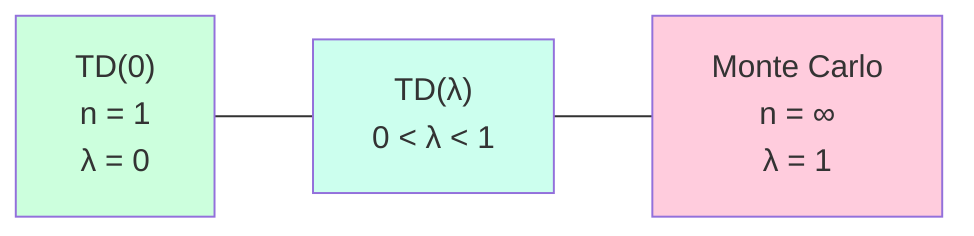

# Chapter 9 — Eligibility Traces and TD(λ)

> **Prerequisites:** Chapter [6](08_temporal_difference_learning.md) (TD,
> SARSA, Q-learning, n-step TD).

> **Learning objectives:**
> 1. Define the λ-return and its connection to n-step returns.
> 2. Derive TD(λ) in both the forward and backward views.
> 3. Implement true online TD(λ) using Dutch traces.
> 4. Choose λ for a given problem.
> 5. Understand why eligibility traces are conspicuously absent from the
>    Simulator's current learner — and what adding them would change.

> **Citations:** the chapter follows [S&B 2018, Ch. 12] for the textbook
> presentation. TD(λ) origin is [Sutton 1988]. Replacing vs accumulating
> traces is [Singh & Sutton 1996]. True online TD(λ) is [van Seijen et al.
> 2016]. Retrace(λ) is [Munos et al. 2016]. The five-state random walk
> is reproduced from [S&B 2018, Example 7.1].

## 7.1 The motivation: a unifying parameter

In [Chapter 8, Section 6.7](08_temporal_difference_learning.md#67-n-step-td)
we met n-step TD: a family of algorithms parameterized by $n$ that
interpolates between TD(0) ($n = 1$) and Monte Carlo ($n = \infty$). The
sweet spot for $n$ depends on the problem.

But choosing a single $n$ is wasteful — different states might benefit from
different effective horizons. **Eligibility traces** are the answer: a
continuous parameter $\lambda \in [0, 1]$ that mixes returns of all
horizons simultaneously.



TD(λ) was introduced by [Sutton 1988], where he also coined
"temporal-difference learning." It's both a generalization of TD(0) and
a unification of every multi-step method we've seen.

## 7.2 The λ-return (forward view)

### Why we need a forward view at all

Chapter 8's TD(0) used a 1-step lookahead; Chapter 7's Monte Carlo
used a full-trajectory return. Both are unbiased estimates of
$V^\pi(s_t)$ — but they sit at opposite ends of a bias-variance
trade-off:

- **1-step TD:** low variance (one sampled transition), high bias
  (uses the approximate $V$ at $s_{t+1}$).
- **MC return:** zero bias, high variance (entire random future).

The natural question: is there a middle? An "$n$-step return" that
bootstraps after $n$ steps would interpolate — but *which* $n$?
Different $n$ work best on different problems, and the choice is a
practical pain. **The $\lambda$-return is the principled solution:
mix all $n$-step returns with a geometric weighting, controlled by
a single knob $\lambda \in [0, 1]$.**

Why this matters downstream: TD($\lambda$) is the algorithm that
*implements* this weighted mixing efficiently (§7.3 backward view).
SARSA($\lambda$), Q($\lambda$), and the GAE($\lambda$) advantage
estimator from Chapter 13 are all the same idea applied to
different bootstrap targets. The $\lambda$ knob — bias vs variance
on a single dial — is the unifying parameter of modern RL.

### The construction

Recall the n-step return:

$$
G_t^{(n)} = r_t + \gamma r_{t+1} + \cdots + \gamma^{n-1} r_{t+n-1} + \gamma^n V(s_{t+n})
$$

For different $n$, this gives different estimates of $V^\pi(s_t)$. Why not
average them?

> **Definition.** The **λ-return** is a weighted average of all n-step
> returns, with weights $\lambda^{n-1}$:
>
> $$
> G_t^\lambda = (1 - \lambda) \sum_{n=1}^\infty \lambda^{n-1} G_t^{(n)}
> $$
>

For finite trajectories (episodes), the formula adjusts to use the actual
final return for incomplete portions. The exact form is in Sutton & Barto
12.1.

### Verify the weights sum to 1

$\sum_{n=1}^\infty (1-\lambda) \lambda^{n-1} = (1-\lambda) \cdot \frac{1}{1-\lambda} = 1$. ✓

### Special cases

- **λ = 0:** $G_t^\lambda = G_t^{(1)} = r_t + \gamma V(s_{t+1})$ — TD(0)'s target.
- **λ = 1:** $G_t^\lambda = G_t^{(\infty)} = G_t$ — Monte Carlo's target.
- **Intermediate:** weighted average.

The TD(λ) update (forward view) is then:

$$
V(s_t) \leftarrow V(s_t) + \alpha (G_t^\lambda - V(s_t))
$$

### Try it: how λ mixes the n-step horizons

<div id="ch7-lambda-return-widget" class="textbook-widget"></div>
<script type="module" src="./widgets/lambda_return/widget.js"></script>

λ = 0 collapses to TD(0) — one bar at n=1. λ → 1 spreads mass uniformly
toward Monte Carlo. The default λ = 0.9 concentrates mass around
n ∈ [3, 15] — making "λ-return is a weighted mix of n-step returns"
concrete.

### The forward view is impractical

To compute $G_t^\lambda$ exactly, you need to wait for the rest of
the episode — you can't update online. **The forward view is
theoretical machinery, not an algorithm.**

The miracle of eligibility traces: there's an algorithm that's
*equivalent* to the forward view but runs online and incrementally.
That equivalence — and why it's *miraculous* rather than obvious —
is what §7.3 builds.

### Three readings of the λ-return

**1. As a smooth bias-variance dial.** $\lambda = 0$ is pure
bootstrapping (low variance, high bias from the imperfect $V$).
$\lambda = 1$ is pure Monte Carlo (zero bias, high variance from the
random trajectory). Intermediate $\lambda$ sits on the curve between
them. In practice $\lambda \in [0.9, 0.97]$ is the sweet spot —
enough bootstrapping to be online, enough sample evidence to keep
the bias controlled.

**2. As a geometric weighting of horizon depths.** The weights
$(1 - \lambda)\lambda^{n-1}$ form a geometric distribution over
$n$. Higher $\lambda$ shifts mass toward longer $n$ (closer to
MC); lower $\lambda$ concentrates mass near $n = 1$ (closer to
TD(0)). The widget above visualises this.

**3. As exponential smoothing in the *time domain*.** §7.3 will
recast the same mathematics as exponentially-decaying *eligibility
traces* — a per-state record of "how recently was this state
visited?" weighted by $(\gamma \lambda)^k$ steps ago. The forward
view's geometric weighting of n-step returns and the backward
view's geometric weighting of past states are the *same series*
viewed from opposite ends of time.

### What the λ-return doesn't say

- **It doesn't tell you what $\lambda$ to pick.** The sweet spot
  is empirical and problem-dependent. §7.7 discusses heuristics.
- **It's not directly implementable online.** Computing $G_t^\lambda$
  requires the future, but value-function learning ideally happens
  per-step. §7.3 (backward view via eligibility traces) is the
  algorithm; §7.2 is the target.
- **With function approximation, the equivalence between forward
  and backward views breaks slightly.** §7.4's True Online TD(λ)
  fixes this with a more careful trace update. Until you reach
  that section, the equivalence is exact only in the tabular
  setting.

## 7.3 The backward view: eligibility traces

Instead of looking forward at returns, look backward at responsibility.
For each state, maintain a **trace** $e(s)$ that records how recently
(and how strongly) the state has been visited.

```
e(s) ← γ λ e(s)          for all s      (decay)
e(s_t) ← e(s_t) + 1                     (increment current state)
```

Then when a TD error $\delta_t = r_t + \gamma V(s_{t+1}) - V(s_t)$ occurs,
apply it to *every* state proportional to its trace:

$$
V(s) \leftarrow V(s) + \alpha \delta_t e(s) \quad \forall s
$$

The trace decays geometrically at rate $\gamma\lambda$. A state visited
recently has high trace and gets a big update; a state visited long ago
has small trace and gets little update.

**The remarkable fact:** this backward-view algorithm produces *exactly*
the same updates as the forward view (in the offline / sum-of-updates
sense). This is the **forward-backward equivalence theorem**
[S&B 2018, Sec. 12.4].

### Try it: see the equivalence on a 5-state random walk

<div id="ch7-fwd-bwd-widget" class="textbook-widget"></div>
<script type="module" src="./widgets/fwd_bwd_equivalence/widget.js"></script>

Press **next** to advance the backward view one tick at a time. Each
step shows the TD error δ_t and the per-state running ΔV = α Σ δ_τ
e_τ(s). The final frame computes the forward-view target G_t^λ for
every visit and overlays α(G_t^λ − V(s_t)) on the same axes — the red
dots line up with the bars to floating-point precision. This is
exercise 1 made visible.

### TD(λ) algorithm

```python
def td_lambda(pi, env, num_episodes, alpha, gamma, lambda_):
    V = defaultdict(float)
    for ep in range(num_episodes):
        e = defaultdict(float)
        s = env.reset()
        while not done:
            a = pi(s)
            s_next, r, done = env.step(a)
            delta = r + gamma * V[s_next] - V[s]
            e[s] += 1  # increment trace for visited state
            for state in V:  # in practice, only states with non-zero traces
                V[state] += alpha * delta * e[state]
                e[state] *= gamma * lambda_  # decay
            s = s_next
    return V
```

In practice, you only update states with non-zero traces, which is a
small subset.

### Accumulating vs replacing traces

Two variants of how to handle multiple visits to the same state:

- **Accumulating traces:** $e(s_t) \leftarrow e(s_t) + 1$ each visit.
  Counts how many times the state has been visited.
- **Replacing traces:** $e(s_t) \leftarrow 1$ each visit. The trace is "is
  this state in our recent window?"

Replacing traces have better convergence properties in practice
[Singh & Sutton 1996]. Use them unless you have a reason not to.

### Try it: accumulating vs replacing vs Dutch on a revisit pattern

<div id="ch7-trace-variants-widget" class="textbook-widget"></div>
<script type="module" src="./widgets/trace_variants/widget.js"></script>

Pick a visit pattern and watch all three trace rules race on the same
trajectory. Accumulating spikes stack (red climbs well above 1 in the
burst patterns); replacing saturates at 1 (green); Dutch (blue) sits
between the two and migrates from accumulating-like toward
replacing-like as α grows — at α = 1, Dutch matches replacing exactly.
This is §7.4's "true online dominates classical traces at large α"
claim made visual: at large α the three formulas disagree on shared
trajectories, and the disagreement is what the Dutch correction is
fixing.

## 7.4 True online TD(λ) [van Seijen et al. 2016]

The classical eligibility traces approximate the forward view in the *limit
of small step sizes* but aren't exactly equivalent at every step. For
large $\alpha$, accumulating or replacing traces drift from the true
λ-return target.

[van Seijen et al. 2016] introduced **true online TD(λ)** — a different
trace mechanism (**Dutch traces**) that gives exact step-by-step
equivalence to the forward view, even at large step sizes.

### Dutch trace formula

For linear function approximation $V(s) = \theta^\top \phi(s)$:

$$
\begin{aligned}
e_t &= \gamma \lambda e_{t-1} + (1 - \alpha \gamma \lambda e_{t-1}^\top \phi_t) \phi_t \\\\
\theta_{t+1} &= \theta_t + \alpha \big[\delta_t + V_t - V_{t-1}\big] e_t - \alpha \big[V_t - V_{t-1}\big] \phi_t
\end{aligned}
$$

It's gnarlier than classical traces but it's *exactly correct* and
empirically dominates on linear problems.

In tabular settings, true online TD(λ) reduces to a particular form of
replacing traces. For function approximation, the formula above is the
modern recommendation.

**The takeaway:** if you implement eligibility traces with linear function
approximation, use true online TD(λ). For neural-net TD, eligibility
traces are rare (replaced by experience replay + multi-step targets) and
the true-online machinery is less established.

## 7.5 SARSA(λ) and Q(λ)

The trace mechanism applies to action-value methods too.

**SARSA(λ):** maintain traces $e(s, a)$ over state-action pairs:

```
δ_t = r_t + γ Q(s_{t+1}, a_{t+1}) - Q(s_t, a_t)
e(s_t, a_t) ← e(s_t, a_t) + 1
For all (s, a):
    Q(s, a) ← Q(s, a) + α δ_t e(s, a)
    e(s, a) ← γ λ e(s, a)
```

SARSA(λ) is on-policy. The trace decays at $\gamma\lambda$.

**Watkins's Q(λ):** off-policy traces are trickier because the max
operator breaks the equivalence. Watkins's Q(λ) cuts traces whenever a
non-greedy action is taken — preserves off-policy correctness but
makes traces shorter.

**Peng's Q(λ):** a different cutting scheme that's less conservative. No
formal convergence guarantee but works better in practice.

The clean off-policy multi-step solution turns out to be **Retrace(λ)**
[Munos et al. 2016] — uses importance sampling with clipping. This is
the modern recommended approach for off-policy multi-step, used in
distributed deep RL systems like R2D2 and IMPALA.

## 7.6 Why the Simulator doesn't use eligibility traces — and what would change if it did

The Simulator uses **TD(0)** (λ = 0). No traces. Looking at
[`crates/engine/q_learning/src/learning_rate.rs`](https://github.com/falahat/simulator/blob/main/crates/engine/q_learning/src/learning_rate.rs):

```rust
// Paraphrased TD update
let td_target = reward + gamma * max_next_q;
let td_error = td_target - q_current;
learner.update(observation, action_key, alpha * td_error);
```

This is one-step. The TD error is applied only to the action just
committed, not to any previous actions.

### What this costs

Credit assignment over multi-tick chains is *very slow*. To propagate a
reward back 100 ticks via TD(0), you need:

- Tick 100: get reward, update $Q$ at tick 99.
- Tick 99 → 100: $Q(99)$ now reflects the reward.
- Next time we visit a similar state at tick 99: update $Q$ at tick 98.
- And so on, requiring ~100 visits to the *same* state sequence to
  propagate fully.

In practice, with a stochastic environment and function approximation,
each backward propagation is noisy and partial. **Real-world TD(0) takes
hundreds to thousands of visits to credit-assign over a 100-tick chain.**

### What TD(λ) would change

With $\lambda = 0.9$, the trace decays at $0.9 \gamma = 0.81$ per step.
Effective trace half-life: $\log(0.5) / \log(0.81) \approx 3.3$ steps. A
single reward updates ~7 preceding states meaningfully.

This is a dramatic speedup for any task with multi-step credit
assignment. The Simulator's L-suite (plant → 500 ticks → harvest →
consume) would still be too long ($\lambda^{500} \approx 0$) but
near-term chains (navigate 10-20 ticks to food) would propagate much
faster.

### Try it: the (γ, λ) joint horizon

<div id="ch7-effective-horizon-widget" class="textbook-widget"></div>
<script type="module" src="./widgets/effective_horizon/widget.js"></script>

The eligibility trace decays at rate γλ — so "λ near 1" is not the
same as "infinite horizon." Even at γ = 0.99, λ = 0.99, the product
γλ ≈ 0.98, half-life ≈ 35 steps, and (γλ)^500 ≈ 10⁻⁵ — still
unreachable for the L-suite scenarios. The widget makes this
arithmetic visible.

### Why hasn't it been added?

Probably engineering complexity. Eligibility traces require:

- Per-agent trace state: $|\mathcal{S}_{\text{tile}}| \times |\mathcal{A}|$
  trace values, sparsely maintained.
- Update at every step: each non-zero trace gets updated.
- Determinism: trace decay must be deterministic for the canary tests to
  pass.

None of these are *hard*, but they're work. Adding eligibility traces is
a viable improvement for the Simulator — see
[Chapter 19](19_long_horizon_credit.md) for the credit-assignment context.

## 7.7 Choosing λ in practice

Empirically:

- λ = 0: TD(0). Fast updates, but credit assignment is slow.
- λ ∈ [0.3, 0.7]: typical "sweet spot" for medium-horizon tasks.
- λ = 0.9-0.99: useful when reward is delayed many steps.
- λ = 1: Monte Carlo. Use only for episodic tasks with short episodes.

Don't tune λ unless you have a reason. The default λ = 0.7 or so is fine
for most problems. If you have intuition about your task's
reward-propagation horizon, set λ such that $1 / (1 - \gamma\lambda) \approx$
that horizon in steps.

## 7.8 Worked example: the random walk

Reproduced from [S&B 2018, Example 7.1]. A 5-state random walk. Starting in the
middle, equal probability of moving left or right. Terminal states at
each end with rewards $+1$ (right) and $0$ (left).

For TD prediction with linear function approximation, the optimal $V$ is:

$$
V^{\star} = (1/6, 2/6, 3/6, 4/6, 5/6)
$$

After 10 episodes of TD(λ) with various λ:

| λ | RMS error (5-state) |
|---|---|
| 0.0 | 0.183 |
| 0.4 | 0.135 |
| 0.8 | 0.117 |
| 0.9 | 0.109 |
| 0.95 | 0.118 |
| 1.0 (MC) | 0.184 |

The sweet spot around λ ≈ 0.9 gives the lowest error. Below this, TD(0)
is too biased; above, MC's variance dominates.

This is a small problem, but the qualitative shape — U-shape with
optimum in the middle — is typical.

### Try it: the U-curve live

<div id="ch7-lambda-sweep-widget" class="textbook-widget"></div>
<script type="module" src="./widgets/lambda_sweep_randomwalk/widget.js"></script>

Slide N (episode count) and α (step size) to see how the optimum
migrates. With N small, MC's variance (λ = 1) dominates and the
optimum sits near the middle of the range; with N large the curve
flattens and pushes the optimum toward λ ≈ 0.9. The lower panel
overlays the learned V against the true V^star = (1/6, 2/6, 3/6, 4/6,
5/6) for three λ values — TD(0), the current best, and MC — so the
"bias-vs-variance" trade is visible directly in the value function.
Serves exercise 2.

## 7.9 Project tie-in

### Where eligibility traces are absent

The Simulator uses TD(0). Specifically:

- [`crates/engine/q_learning/src/learning_rate.rs`](https://github.com/falahat/simulator/blob/main/crates/engine/q_learning/src/learning_rate.rs)
  has no trace state.
- The TD update applies only to the action just committed.
- No `EligibilityTrace` component on agents.

### What adding traces would look like

A first cut:

1. Add an `EligibilityTrace` component per agent: sparse map from
   `(observation_tile, action_key) -> trace_value`.
2. Each tick: decay all traces by $\gamma \lambda$; set the trace for
   the just-committed action to 1 (replacing traces).
3. When a TD update fires: apply $\alpha \delta_t \cdot e$ to every state-action
   pair with non-zero trace.

Caveat: with **off-policy** Q-learning, you need either Watkins's
trace-cutting or proper importance sampling (Retrace). Pure
non-truncated traces with Q-learning's max operator have weaker
convergence guarantees.

### Where eligibility traces would help most

The L-suite is the obvious target. Plant → wait 500 ticks → consume.
Even with λ = 0.99, $\lambda^{500} \approx 0$ — the credit doesn't reach
back. So eligibility traces help with **short-to-medium** horizons but
not the **very-long** horizon problem.

For very long horizons (Chapter 19): you need fundamentally different
algorithms — hindsight credit assignment, RUDDER's return decomposition,
or hierarchical RL.

## 7.10 Exercises

1. **(Forward-backward equivalence.)** Implement both forward-view TD(λ)
   (using the explicit λ-return) and backward-view TD(λ) (using traces).
   Verify on a small MDP that they produce the same offline updates.

2. **(Sweep λ.)** On the 5-state random walk, run TD(λ) for
   $\lambda \in \{0, 0.2, 0.4, 0.6, 0.8, 0.9, 0.95, 1.0\}$. Plot RMS
   error after 10 and 100 episodes. Find the optimal λ. Discuss.

3. **(True online TD(λ).)** Implement true online TD(λ) for linear FA.
   Compare to classical accumulating traces on a linear-FA mountain car.
   Show true online is more robust to large α.

4. **(SARSA(λ).)** Implement SARSA(λ) and apply to the cliff-walking
   environment. How does the path change as λ varies?

5. **(Project: eligibility traces in the Simulator.)** Sketch the data
   structures and code changes needed to add traces to
   [`learning_rate.rs`](https://github.com/falahat/simulator/blob/main/crates/engine/q_learning/src/learning_rate.rs).
   Estimate the memory overhead. How does this interact with the
   determinism canary?

6. **(Effective horizon.)** Compute the effective horizon of trace decay
   for various $(\gamma, \lambda)$ combinations. For $\gamma = 0.9$,
   what $\lambda$ gives a 50-tick effective trace? A 200-tick trace? Why
   is the 500-tick goal hard even with λ near 1?

## 7.11 References cited in this chapter

Full bibliographic entries in [`bibliography.md`](bibliography.md):

- [S&B 2018] — Ch. 12 (eligibility traces) — throughout
- [Sutton 1988] — TD(λ) origin — §7.1, §7.2
- [Singh & Sutton 1996] — replacing traces — §7.3
- [van Seijen et al. 2016] — true online TD(λ) — §7.4
- [Munos et al. 2016] — Retrace(λ) — §7.5

## 7.12 Further reading

| Source | What to read | Why |
|---|---|---|
| [S&B 2018] | Ch. 12 | The full classical treatment |
| [Sutton 1988] | The whole paper | The origin of TD(λ) |
| [van Seijen et al. 2016] | The whole paper | The modern fix |
| [Munos et al. 2016] | The whole paper | Off-policy multi-step with safety |

---

**Next:** [Chapter 10 — Function Approximation](10_function_approximation.md) — until now we assumed tabular $V$ or $Q$. The Simulator's 251-dim continuous observation forces parameterization. Tile coding deeply + the joint-tiling collapse problem your project actually has.
