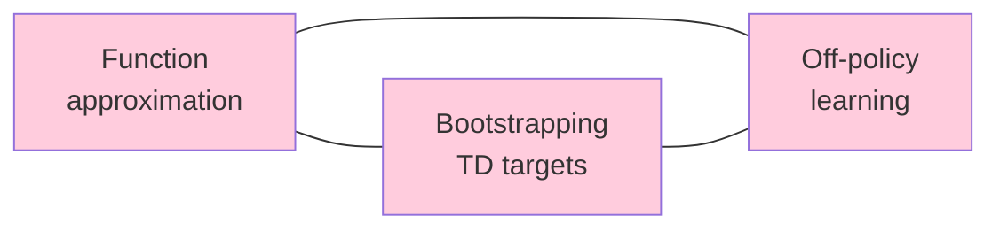

# Chapter 17 — Function Approximation Pathologies: When TD Goes Wrong

> **Prerequisites:** Chapters [6](08_temporal_difference_learning.md) (TD),
> [8](10_function_approximation.md) (FA), [9](11_deep_q_learning.md) (DQN),
> [11](13_actor_critic.md) (advantage).

> **Learning objectives:**
> 1. State the deadly triad and reproduce Baird's counterexample.
> 2. Diagnose the **Q-bias bootstrap pathology** in the Simulator.
> 3. Explain how the pathology was fixed by removing the `w_alive` baseline (reward is now the drive-delta).
> 4. Trace the bug through actual test failures (L1, L5, navigation).

> **Citations:** the chapter follows [S&B 2018, Ch. 11] on off-policy
> methods with FA. The deadly triad term is from [S&B 2018]; the
> theoretical foundation is [Tsitsiklis & Van Roy 1997]. Baird's
> counterexample is [Baird 1995]. Modern empirical analysis of the
> triad is [van Hasselt et al. 2018]. Gradient-TD methods are
> [Sutton, Szepesvári & Maei 2009]. Double Q-learning is
> [van Hasselt 2010]. The dueling architecture is [Wang et al. 2016].
> The project's specific bug story — the Q-bias bootstrap pathology —
> is told inline in this chapter (§15.2, §15.6).

This chapter is the synthesis of everything before it — the place where
RL theory meets the Simulator's specific engineering reality. It's the
chapter most worth your time.

## 15.1 The deadly triad

### Why this section is the failure mode of every previous chapter

The previous chapters built up techniques *one corner at a time*:
function approximation (Ch10, Ch11), bootstrapping (Ch8 TD), and
off-policy learning (Ch7 IS, Ch8 Q-learning). Each one alone is a
real win — but **combine all three and the resulting algorithm can
diverge.** Weights go to infinity, even when the true value
function lies inside the function-approximator's span.

This is *the* unsolved problem of deep RL. The DQN stabilising
tricks (Ch11 §9.2) are a *bound* on the divergence, not an
elimination of it. Every actor-critic variant after DQN (PPO, SAC,
DDPG) inherits the triad and adds yet another empirically-justified
patch. Understanding what makes the triad deadly — and what each
patch fixes — is what separates a practitioner who can debug
divergence from one who can only stare at NaN losses.

If you've ever wondered "why does TD work in tabular settings but
diverge in deep RL," **this section is the answer.** Then §15.2
shows the specific instance the Simulator hit, §15.3–15.5 enumerate
the fixes, and §15.6 walks through the actual debugging story.

[S&B 2018, Ch. 11] call out the **deadly triad** of RL: three
components, each useful, dangerous when combined.



| Component | What it is | Why useful |
|---|---|---|
| Function approximation | Parameterize V or Q with $\theta$ | Required for any non-tiny problem |
| Bootstrapping | TD targets $r + \gamma V(s'; \theta)$ — use estimate of future to update | Sample efficiency vs. MC |
| Off-policy | Learn about policy $\pi$ from data of $\mu$ | Q-learning, replay buffers, data reuse |

**Any two of these together work fine.** All three together: weights
can diverge.

### Why each pair-without-the-third works

The "any two are fine" claim isn't a coincidence. Each pairing
trips a different failure mode that's *bounded* without the third:

- **FA + bootstrapping, on-policy** — Tsitsiklis & Van Roy 1997.
  The on-policy stationary distribution gives a contraction in
  the corresponding weighted norm. Linear semi-gradient TD
  converges to the projected Bellman fixed point.
- **FA + off-policy, no bootstrapping** — Monte Carlo with
  importance sampling. The IS reweighting is unbiased and the
  variance is high but finite (Ch7 §5.4). No bootstrap → no
  bootstrap-amplification of error → convergence to the LSP
  projection of $V^\pi$.
- **Bootstrapping + off-policy, no FA** — tabular Q-learning.
  Each state-action's update is decoupled (table cells don't
  share parameters), so off-policy targets only affect one
  state's estimate at a time. Watkins-Dayan applies.

The triad becomes deadly when *all three* compound: FA shares
parameters across states (so an off-policy update on $s'$ moves
$V(s)$ via shared $\theta$), bootstrapping amplifies that
perturbation through the Bellman recursion, and off-policy data
removes the on-policy stationary-distribution stabilisation. The
result is a non-contraction operator on $\theta$-space.

### What this section doesn't say

- **It doesn't tell you when the triad will diverge in practice.**
  The Baird counterexample is hand-crafted; many real-world deep
  RL agents have all three corners and converge anyway. Whether
  divergence happens depends on the specific FA's geometry, the
  data distribution, and the step size. Empirical only.
- **It doesn't characterise the "deadly" region of hyperparameter
  space.** Reducing the learning rate helps; using target networks
  helps (Ch11 §9.2); using natural gradient helps. No general
  theory tells you *how much* of each is enough.
- **The Tsitsiklis & Van Roy 1997 convergence guarantee is
  on-policy-only.** Off-policy bootstrap + linear FA fails in the
  same way as deep RL — Baird's counterexample is its instance.

### Baird's counterexample [Baird 1995]

The classic divergence demonstration. Seven-state MDP with linear FA.
Q-learning with constant α produces weights $\theta_k$ that go to ±∞,
even though the true value function is in the span of the features.

The math: the projected Bellman operator is not a contraction in the
feature space induced by off-policy weighting. [Tsitsiklis & Van Roy
1997] characterized this — see the paper for the linear-algebraic root
cause.

### Try it: Baird's counterexample live

<div id="ch15-baird-widget" class="textbook-widget"></div>
<script type="module" src="./widgets/baird_counterexample/widget.js"></script>
Eight weight trajectories under off-policy semi-gradient TD on Baird's 7-state MDP. True value is zero, true weights are representable as zero — yet the curves blow up to ±∞ at any α > 0. Flip "on-policy" and the same algorithm on the same features stays bounded. That one toggle controls one corner of the deadly triad; the divergence isn't a bug, it's the failure mode that motivates Chapter 17.

### Why DQN doesn't always diverge

In principle, DQN has all three: NN function approximation, TD bootstrap,
off-policy replay buffer. Empirically it works. The reasons:

1. **Target network:** $Q_{\text{target}}$ updated only periodically. This
   stabilizes the bootstrap.
2. **Replay buffer:** breaks correlation between consecutive transitions,
   approximately on-policy in expectation.
3. **Careful hyperparameters:** learning rates, exploration rates, network
   architecture, all tuned over years.

But it *can* diverge. [van Hasselt et al. 2018], *Deep Reinforcement
Learning and the Deadly Triad*, shows empirically when DQN diverges and
why.

## 15.2 The Q-bias bootstrap pathology

A specific pathology that's exhibited by the Simulator's flat policy.
Different from Baird's classical counterexample but equally illuminating.

### Setup: the Simulator's score formula

The policy ([`crates/cognition/planner/src/policy.rs`](https://github.com/falahat/simulator/blob/main/crates/cognition/planner/src/policy.rs)) picks actions via:

```
score(action) = 0.5·Q(action) + recipe_bonus(action)
```

The agent's reward is:

```
R(s) = w_alive · 1.0 − drive_cost(s) − bio_cost(s)
```

with $w_\text{alive} = 1.0$ and the drive/bio costs typically small.

### The math of the bootstrap

In a steady state with reward $r \approx w_\text{alive} = 1.0$, the
Bellman fixed point for *every* action $a$ satisfies:

$$
Q^{\star}(s, a) = r + \gamma \cdot V^{\star}(s) \approx 1.0 + \gamma \cdot Q^{\star}(s, a)
$$

(in steady state, $V^{\star}$ ≈ $Q^{\star}$ for any committed action). Solving:

$$
Q^{\star}(s, a) \approx \frac{1.0}{1 - \gamma} = 10
$$

at $\gamma = 0.9$. **This is the same value for every action.** Because
all actions in steady state give the same per-step alive reward.

### Try it: Q drifts toward w_alive/(1−γ)

<div id="ch15-qbias-widget" class="textbook-widget"></div>
<script type="module" src="./widgets/q_bias_bootstrap/widget.js"></script>

The score-formula contribution:

$$
0.5 \cdot Q^{\star}(s, a) \approx 5
$$

for any committed action. Recipe-bonus values are typically in $[0, 1]$.

### Why this is a problem for argmax

Action selection is $\arg\max_a [0.5 \cdot Q(s, a) + \text{recipe\_bonus}(a)]$.

For an action that has been committed many times, $Q$ has converged to
~10 and the Q-bias contribution is ~5. For an action that has *never*
been committed, $Q$ is at the prior (0) and the Q-bias contribution is 0.

The committed action's score: 5 + recipe_bonus(small).
The untried action's score: 0 + recipe_bonus.

**The 5-unit gap is unbridgeable by recipe_bonus alone.** The first
action the agent commits wins argmax forever. ε-greedy at 0.1 with ~10
candidates tries each untried action ~1% of the time — far below the
hundreds of trials needed for $Q_\text{untried}$ to climb past
$Q_\text{tried}$'s lead.

### Try it: the score-formula decomposition

<div id="ch15-score-decomposer-widget" class="textbook-widget"></div>
<script type="module" src="./widgets/score_formula_decomposer/widget.js"></script>
Stacked bars per candidate action: bottom = 0.5·Q, top = recipe_bonus, with an arrow above the current argmax. Scrub tick t forward. The "committed" action's Q-bar grows toward 0.5·w_alive/(1−γ) because it's the action being sampled — and once it tops out, the argmax locks in forever, even though "neutral" had a higher recipe_bonus prior. This is the Q-bias bootstrap pathology, decomposed into its two additive parts on screen.

### Empirical confirmation

Three Simulator validation tests, all from the same scenario family:

| Test | Action that locks | Action that should win | Result over 40k ticks × 4 seeds |
|---|---|---|---|
| L1 (planting) | Plant | Consume | Plant = **716**, Consume = **0** |
| L5 (near vs far food) | Step (East tiebreak) | Consume | Step ≫ Consume = **0** |
| Navigation rewrite | Step | Consume | Step ≫ Consume = **0** |

The agent never tries Consume even when food is in reach. This is the
"Plant-lock-in" or "Step-lock-in" failure mode.

### Why the wider RL literature doesn't usually hit this

Standard RL benchmarks (Atari, MuJoCo) have:

- **Bounded or zero baseline reward**: alive doesn't give +1/tick. Often,
  rewards are 0 except at goal/penalty events.
- **Dueling architectures or actor-critic**: subtract V(s) baseline.
- **Optimistic initialization**: $Q_\text{init} > 0$ so untried actions
  start attractive.

The Simulator has none of these by default. Hence the bug surfaces here
and not in typical RL papers.

## 15.3 The three candidate fixes (and their tradeoffs)

Three fixes were considered. The pathology was ultimately resolved by
the first — removing the `w_alive` baseline, so reward is now the
per-tick drive-delta. The other two are kept here for contrast.

### Fix 1 (shipped): Zero `w_alive`

Reframe `PrimaryReward` to be **delta-based**:
```
R(s) = delta_drive_relief − delta_drive_cost − bio_cost
```
with `w_alive = 0`.

**Effect:** $Q^{\star}$ no longer has the universal positive baseline; Q-values
discriminate actions by their actual effect on drives.

**Tradeoff:**
- ✓ Cleanest fix, smallest code surface.
- ✗ Changes the semantics of $R$ — "absolute well-being" becomes "marginal
  well-being delta."
- ✗ Existing tests asserting reward floors need reinterpretation.

### Fix 2: Per-action act cost

Add a small constant cost per action:
```
R(s, a, s') = w_alive − drive_cost − bio_cost − act_cost(a)
```

**Effect:** alive baseline is offset by act cost; actions with no useful
payoff produce a negative net.

**Tradeoff:**
- ✓ Doesn't change `R`'s sign.
- ✗ Needs `act_cost(a)` table — substrate design.
- ✗ Doesn't fully solve: each committed action's $Q$ still bootstraps to
  $w_\text{alive} - \text{act\_cost(a)}/(1-\gamma)$. Discriminates better
  but the bootstrap effect remains.

### Fix 3: Advantage learning (dueling)

Architecturally separate $V(s)$ and $A(s, a)$ in the learner; use $A$
(not $Q$) for argmax decisions.

**Effect:** the baseline alive-reward is subtracted out at decision time.

**Tradeoff:**
- ✓ The principled, modern RL answer.
- ✓ Doesn't require changing $R$ at all.
- ✗ Bigger engineering: need a separate weight vector for $V$ and a
  decomposition `Q = V + A`.
- ✗ Needs convergent linear FA for both $V$ and $A$.

## 15.4 The shipped path: Fix 1

The pathology was fixed with **Fix 1** — removing the `w_alive`
baseline so reward is the per-tick drive-delta. Reasons:
- Simplest implementation (one config change + a `delta` computation).
- Reinterpreting `R` as delta is conceptually clean.
- Existing tests can be re-blessed to reflect the new semantics.

Pseudocode:

```rust
// crates/sim/sim_config/src/reward.rs (paraphrased)
pub struct RewardConfig {
    pub w_alive: f32, // Set to 0.0
    pub drive_weight: f32, // unchanged
    pub bio_weight: f32, // unchanged
}

// New PrimaryReward computation:
pub fn primary_reward(
    prev_drives: &Drives,
    curr_drives: &Drives,
    body: &Body,
    cfg: &RewardConfig,
) -> f32 {
    let drive_delta = drive_cost(prev_drives, cfg) - drive_cost(curr_drives, cfg);
    let bio_cost = bio_cost(body, cfg);
    drive_delta - bio_cost  // No w_alive
}
```

With this, an action that doesn't change drives produces $r = 0$; one
that relieves hunger produces $r > 0$; one that incurs bio cost produces
$r < 0$. Q-values now genuinely discriminate actions.

### Try it: side-by-side fix comparison

<div id="ch15-qbias-fix-widget" class="textbook-widget"></div>
<script type="module" src="./widgets/q_bias_fix/widget.js"></script>
Q(Hungry, Wait) vs Q(Hungry, Consume) over time, per fix. Baseline w_alive: both Q's saturate near w_alive/(1−γ) and the *gap* between them is tiny — argmax is fragile. Fix 1 (delta reward): only Consume's Q is positive; the gap is the whole signal. Fix 3 (dueling A): V absorbs the alive-bonus and the advantages cleanly separate Wait from Consume. Same environment, three reward parameterisations, three very different argmax behaviours.

## 15.5 Other FA pathologies worth knowing

### Overestimation in Q-learning (Chapter 8)
- The $\max$ operator is biased upward.
- Fix: Double Q-learning [van Hasselt 2010] or Double DQN
  [van Hasselt, Guez & Silver 2016].

#### Try it: max bias under linear FA

<div id="ch15-max-bias-fa-widget" class="textbook-widget"></div>
<script type="module" src="./widgets/max_bias_fa/widget.js"></script>
E[max_a Q̂(a)] − Q*(best) vs feature_overlap, averaged across seeds, for three estimators. At overlap = 0 (one-hot, tabular) vanilla Q-learning shows the classic max-bias overshoot — Double Q halves it; optimistic init under-shoots. Slide overlap up and the picture changes: shared features correlate the arms' noise, so bias can amplify or damp. The widget makes "max bias is a feature-sharing problem too" visible, not just a tabular one.

### Catastrophic forgetting
- Neural networks overwrite old knowledge when trained on new data.
- Fix: experience replay, regularization.

#### Try it: catastrophic interference on a sine target

<div id="ch15-catastrophic-widget" class="textbook-widget"></div>
<script type="module" src="./widgets/catastrophic_interference/widget.js"></script>
The approximator learns sin(2π·x) on Region A (x ∈ [0, 0.5]) then is retrained on Region B (x ∈ [0.5, 1]) — the faded line shows what it knew before Region B started, the solid line what it knows now. Region A has been overwritten. The MSE-on-A inset sawtooths up every time the phase switches. Slide tile_width down toward one tile per point: no interference, but also no generalisation. That tradeoff is *the* problem with neural FA.

### Hard-to-discover sparse rewards
- TD propagation over $K$ steps requires $K$ visits to the same chain.
- Fix: HER, RUDDER, hierarchical RL — Chapter 19.

### The "primacy bias" [Nikishin et al. 2022]
- Early training data has outsized influence on the final policy.
- Fix: periodically reset the agent's parameters.

#### Try it: parameter resets vs. lock-in

<div id="ch15-primacy-widget" class="textbook-widget"></div>
<script type="module" src="./widgets/primacy_bias/widget.js"></script>
The bandit's best arm swaps at "swap at step". Three Q-learners on the same seeds: never-reset, reset-every-k, reset-every-2k. The locked-in baseline keeps preferring the old arm long after the swap — that's primacy bias. The reset curves are jagged (each reset starts cold) but climb back to the new optimum within a fraction of the un-reset agent's recovery time. Periodic forgetting beats indelible memory when the world changes.

## 15.6 Project debug story: how the bug was found

(Summary of the actual development arc.)

1. **Original symptom:** L-suite tests (L1-L5) consistently failed. The agent
   never consumed matured crops despite Plant→growth→food chain being
   in place.

2. **First hypothesis:** the agent walks away from the plant cell during
   the 500-tick growth and never returns. Fixed by auto-delivering food
   to agent's cell. Result: Plant = 716, Consume = 0 — still doesn't
   close.

3. **Second hypothesis:** maybe ε-greedy is too weak. Examined: even with
   ε = 0.5, Consume never picked.

4. **Third hypothesis:** maybe Q(Plant) saturates so high that nothing
   else wins argmax. Computed: yes, $Q \approx w_\text{alive}/(1-\gamma) = 10$ per action.

5. **Diagnosis:** the score formula `0.5·Q + recipe_bonus`
   weights $Q$ at 0.5; 0.5 × 10 = 5 swamps recipe_bonus ≤ 1.

6. **Verification:** L5 fails the same way (Step locks in instead of
   Plant), navigation fails the same way. **Same root cause across three
   tests.**

7. **The fix that shipped:** remove the `w_alive` baseline so reward is
   the per-tick drive-delta (Fix 1, §15.3–15.4). With no universal
   positive baseline, committed actions' Q-values stop saturating to a
   common value and start discriminating by their actual effect on drives.

This debug story is **the value of theory in practice**. Each hypothesis
was informed by theory: TD bootstrap, ε-greedy regret, Banach contractions,
advantage decomposition. Without the theory, the bug looks like "L1
doesn't pass" — a flat empirical failure with no obvious next move.

## 15.7 Project tie-in: where to read in the code

Files relevant to this chapter:

- [`crates/cognition/planner/src/policy.rs`](https://github.com/falahat/simulator/blob/main/crates/cognition/planner/src/policy.rs)
  — the score formula at line ~466.
- [`crates/sim/sim_config/src/reward.rs`](https://github.com/falahat/simulator/blob/main/crates/sim/sim_config/src/reward.rs)
  — `RewardConfig` with `w_alive: f32`.
- [`crates/engine/q_learning/src/learning_rate.rs`](https://github.com/falahat/simulator/blob/main/crates/engine/q_learning/src/learning_rate.rs)
  — the TD update that drives Q toward the saturating bootstrap.
- [`crates/sim/app/tests/curricula/long_horizon_harvest.rs`](https://github.com/falahat/simulator/blob/main/crates/sim/app/tests/curricula/long_horizon_harvest.rs)
  — the L-suite tests that surface the bug.

## 15.8 Exercises

1. **Reproduce Baird.** Implement the seven-state Baird counterexample
   and watch linear off-policy Q-learning's weights diverge.

2. **Derive Q-bootstrap.** For a single-action steady-state MDP with
   $r = c$ constant, what is $Q^{\star}$? Verify the $c/(1-\gamma)$ formula.

3. **Implement Fix 1.** In a fork of the project, set $w_\text{alive} = 0$
   and add the delta-drive-relief computation. Run `learning_homeostatic.rs`
   and `learning_suite_l::l1_agent_learns_to_plant`. Does the chain
   close?

4. **Implement Fix 3 (dueling).** Sketch a linear dueling-style learner:
   maintain two weight vectors $\theta_V$ (for state-value) and $\theta_A$
   (for action advantage). Update both via separate TD targets.

5. **Trace the bug.** Using the debug story in §15.6, trace the actual L1
   failure: set $\epsilon = 0$ in the policy, run L1 in isolation, and
   confirm the agent commits Plant repeatedly but never Consume. Why
   does setting $\epsilon = 0$ help isolate the bug?

## 15.9 References cited in this chapter

Full bibliographic entries in [`bibliography.md`](bibliography.md):

- [S&B 2018] — Ch. 11 (off-policy with FA, deadly triad) — §15.1, §15.5
- [Baird 1995] — Baird's counterexample — §15.1
- [Tsitsiklis & Van Roy 1997] — linear TD convergence + divergence — §15.1
- [van Hasselt et al. 2018] — modern empirical deadly triad — §15.1
- [Sutton, Szepesvári & Maei 2009] — Gradient-TD methods — §15.9
- [van Hasselt 2010] — Double Q-learning — §15.5
- [van Hasselt, Guez & Silver 2016] — Double DQN — §15.5
- [Wang et al. 2016] — dueling architecture (Fix 3) — §15.3

(Additionally cited: Nikishin et al. 2022, *The Primacy Bias in Deep
Reinforcement Learning*, ICML — §15.5.)

## 15.10 Further reading

| Source | What to read | Why |
|---|---|---|
| [S&B 2018] | Ch. 11 | The deadly triad textbook chapter |
| [Baird 1995] | The whole paper | The counterexample |
| [Tsitsiklis & Van Roy 1997] | The whole paper | The convergence theory |
| [van Hasselt et al. 2018] | The whole paper | Empirical deadly triad in DQN |
| [Sutton, Szepesvári & Maei 2009] | GTD/TDC | Provably convergent off-policy linear |

---

**Next:** [Chapter 18 — Homeostatic RL](18_homeostatic_rl.md) — the Simulator's reward design philosophically: drives as convex cost, wanting vs liking, MORL.
